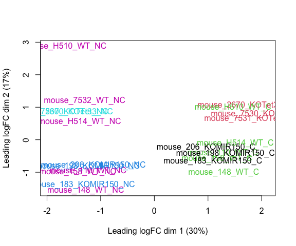
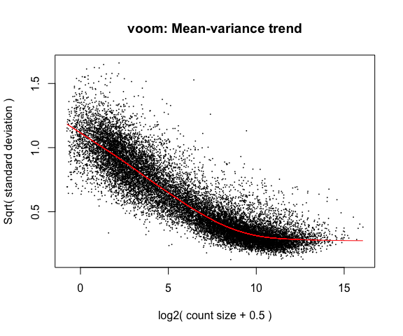
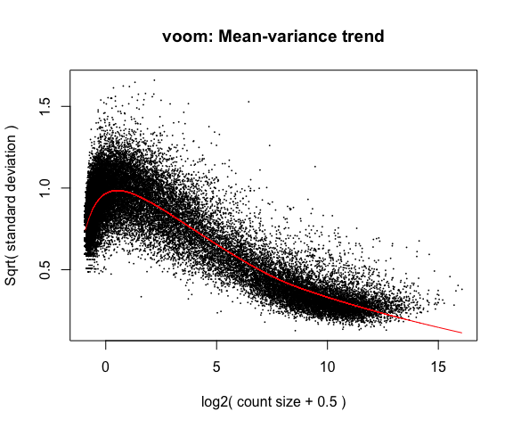
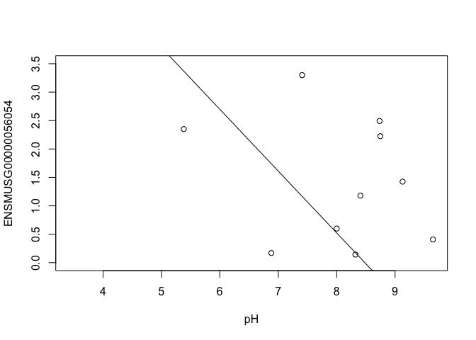
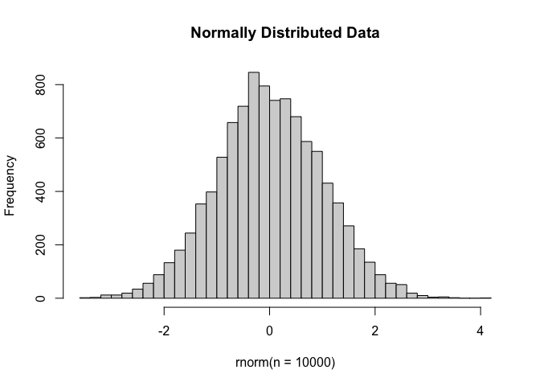
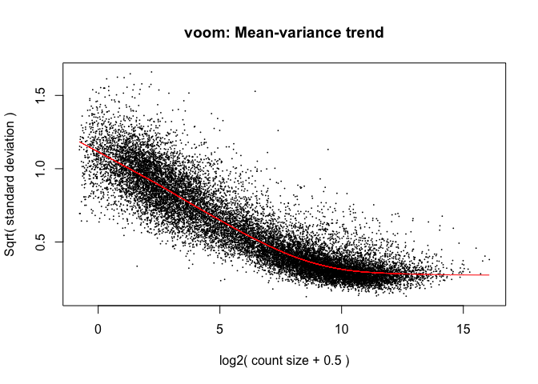
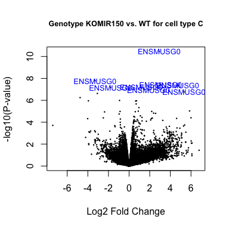
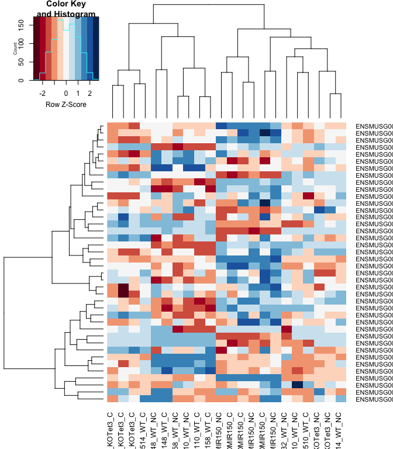
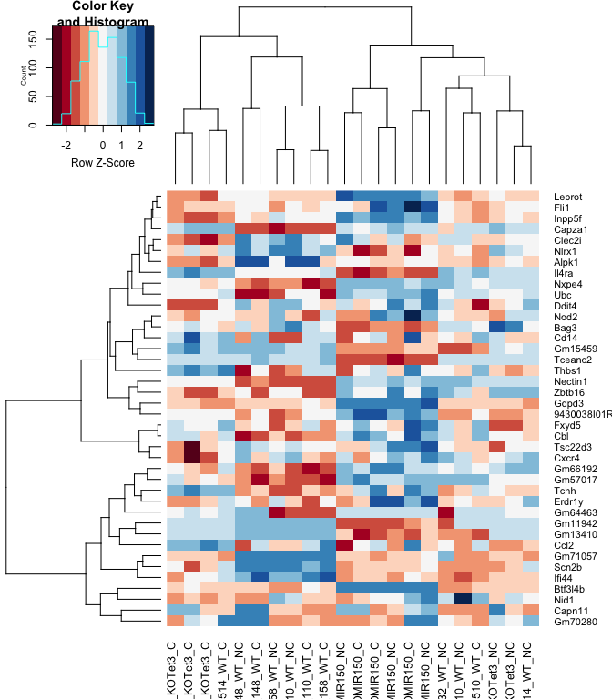
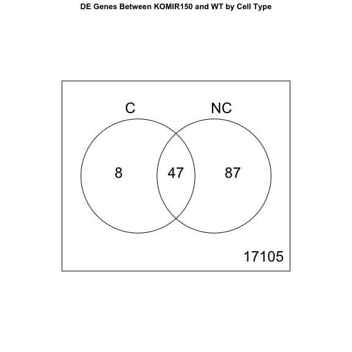

<script>
function buildQuiz(myq, qc){
  // variable to store the HTML output
  const output = [];

  // for each question...
  myq.forEach(
    (currentQuestion, questionNumber) => {

      // variable to store the list of possible answers
      const answers = [];

      // and for each available answer...
      for(letter in currentQuestion.answers){

        // ...add an HTML radio button
        answers.push(
          `<label>
            <input type="radio" name="question${questionNumber}" value="${letter}">
            ${letter} :
            ${currentQuestion.answers[letter]}
          </label><br/>`
        );
      }

      // add this question and its answers to the output
      output.push(
        `<div class="question"> ${currentQuestion.question} </div>
        <div class="answers"> ${answers.join('')} </div><br/>`
      );
    }
  );

  // finally combine our output list into one string of HTML and put it on the page
  qc.innerHTML = output.join('');
}

function showResults(myq, qc, rc){

  // gather answer containers from our quiz
  const answerContainers = qc.querySelectorAll('.answers');

  // keep track of user's answers
  let numCorrect = 0;

  // for each question...
  myq.forEach( (currentQuestion, questionNumber) => {

    // find selected answer
    const answerContainer = answerContainers[questionNumber];
    const selector = `input[name=question${questionNumber}]:checked`;
    const userAnswer = (answerContainer.querySelector(selector) || {}).value;

    // if answer is correct
    if(userAnswer === currentQuestion.correctAnswer){
      // add to the number of correct answers
      numCorrect++;

      // color the answers green
      answerContainers[questionNumber].style.color = 'lightgreen';
    }
    // if answer is wrong or blank
    else{
      // color the answers red
      answerContainers[questionNumber].style.color = 'red';
    }
  });

  // show number of correct answers out of total
  rc.innerHTML = `${numCorrect} out of ${myq.length}`;
}
</script>

# Differential Gene Expression Analysis in R

* Differential Gene Expression (DGE) between conditions is determined from count data
* Generally speaking differential expression analysis is performed in a very similar manner to metabolomics, proteomics, or DNA microarrays, once normalization and transformations have been performed.

A lot of RNA-seq analysis has been done in R and so there are many packages available to analyze and view this data. Two of the most commonly used are:
* DESeq2, developed by Simon Anders (also created htseq) in Wolfgang Huber’s group at EMBL
* edgeR and Voom (extension to Limma [microarrays] for RNA-seq), developed out of Gordon Smyth’s group from the Walter and Eliza Hall Institute of Medical Research in Australia

http://bioconductor.org/packages/release/BiocViews.html#___RNASeq

## Differential Expression Analysis with Limma-Voom

**limma** is an R package that was originally developed for differential expression (DE) analysis of gene expression microarray data.

**voom** is a function in the limma package that transforms RNA-Seq data for use with limma.

Together they allow fast, flexible, and powerful analyses of RNA-Seq data.  Limma-voom is _our_ tool of choice for DE analyses because it:

* Allows for incredibly flexible model specification (you can include multiple categorical and continuous variables, allowing incorporation of almost any kind of metadata).

* Based on simulation studies, maintains the false discovery rate at or below the nominal rate, unlike some other packages.

* Empirical Bayes smoothing of gene-wise standard deviations provides increased power.  

### Basic Steps of Differential Gene Expression
1. Read count data and annotation into R and preprocessing.
2. Calculate normalization factors (sample-specific adjustments)
3. Filter genes (uninteresting genes, e.g. unexpressed)
4. Account for expression-dependent variability by transformation, weighting, or modeling
5. Fitting a linear model
6. Perform statistical comparisons of interest (using contrasts)
7. Adjust for multiple testing, Benjamini-Hochberg (BH) or q-value
8. Check results for confidence
9. Attach annotation if available and write tables


## 1. Read in the counts table and create our DGEList


``` r
counts <- read.delim("rnaseq_workshop_counts.txt", row.names = 1)
head(counts)
```

```
##                      mouse_110_WT_C mouse_110_WT_NC mouse_148_WT_C
## ENSMUSG00000102693.2              0               0              0
## ENSMUSG00000064842.3              0               0              0
## ENSMUSG00000051951.6              1               0              0
## ENSMUSG00000102851.2              0               0              0
## ENSMUSG00000103377.2              0               0              0
## ENSMUSG00000104017.2              0               0              0
##                      mouse_148_WT_NC mouse_158_WT_C mouse_158_WT_NC
## ENSMUSG00000102693.2               0              0               0
## ENSMUSG00000064842.3               0              0               0
## ENSMUSG00000051951.6               2              1               0
## ENSMUSG00000102851.2               0              0               0
## ENSMUSG00000103377.2               0              0               0
## ENSMUSG00000104017.2               0              0               0
##                      mouse_183_KOMIR150_C mouse_183_KOMIR150_NC
## ENSMUSG00000102693.2                    0                     0
## ENSMUSG00000064842.3                    0                     0
## ENSMUSG00000051951.6                    1                     1
## ENSMUSG00000102851.2                    0                     0
## ENSMUSG00000103377.2                    0                     0
## ENSMUSG00000104017.2                    0                     0
##                      mouse_198_KOMIR150_C mouse_198_KOMIR150_NC
## ENSMUSG00000102693.2                    0                     0
## ENSMUSG00000064842.3                    0                     0
## ENSMUSG00000051951.6                    1                     0
## ENSMUSG00000102851.2                    0                     0
## ENSMUSG00000103377.2                    0                     0
## ENSMUSG00000104017.2                    0                     0
##                      mouse_206_KOMIR150_C mouse_206_KOMIR150_NC
## ENSMUSG00000102693.2                    0                     0
## ENSMUSG00000064842.3                    0                     0
## ENSMUSG00000051951.6                    1                     0
## ENSMUSG00000102851.2                    0                     0
## ENSMUSG00000103377.2                    0                     0
## ENSMUSG00000104017.2                    0                     0
##                      mouse_2670_KOTet3_C mouse_2670_KOTet3_NC
## ENSMUSG00000102693.2                   0                    0
## ENSMUSG00000064842.3                   0                    0
## ENSMUSG00000051951.6                   0                    1
## ENSMUSG00000102851.2                   0                    0
## ENSMUSG00000103377.2                   0                    0
## ENSMUSG00000104017.2                   0                    0
##                      mouse_7530_KOTet3_C mouse_7530_KOTet3_NC
## ENSMUSG00000102693.2                   0                    0
## ENSMUSG00000064842.3                   0                    0
## ENSMUSG00000051951.6                   0                    1
## ENSMUSG00000102851.2                   0                    0
## ENSMUSG00000103377.2                   0                    0
## ENSMUSG00000104017.2                   0                    0
##                      mouse_7531_KOTet3_C mouse_7532_WT_NC mouse_H510_WT_C
## ENSMUSG00000102693.2                   0                0               0
## ENSMUSG00000064842.3                   0                0               0
## ENSMUSG00000051951.6                   1                0               0
## ENSMUSG00000102851.2                   0                0               0
## ENSMUSG00000103377.2                   0                0               0
## ENSMUSG00000104017.2                   0                0               0
##                      mouse_H510_WT_NC mouse_H514_WT_C mouse_H514_WT_NC
## ENSMUSG00000102693.2                0               0                0
## ENSMUSG00000064842.3                0               0                0
## ENSMUSG00000051951.6                1               0                1
## ENSMUSG00000102851.2                0               0                0
## ENSMUSG00000103377.2                0               0                0
## ENSMUSG00000104017.2                0               0                0
```

Create Differential Gene Expression List Object (DGEList) object 

A DGEList is an object in the package edgeR for storing count data, normalization factors, and other information


``` r
d0 <- DGEList(counts)
```
  
**1a\.** Read in Annotation

``` r
anno <- read.delim("ensembl_mm_115.txt",as.is=T)
dim(anno)
```

```
## [1] 278396     12
```

``` r
head(anno)
```

```
##       Gene.stable.ID Gene.stable.ID.version Transcript.stable.ID
## 1 ENSMUSG00000064336   ENSMUSG00000064336.1   ENSMUST00000082387
## 2 ENSMUSG00000064337   ENSMUSG00000064337.1   ENSMUST00000082388
## 3 ENSMUSG00000064338   ENSMUSG00000064338.1   ENSMUST00000082389
## 4 ENSMUSG00000064339   ENSMUSG00000064339.1   ENSMUST00000082390
## 5 ENSMUSG00000064340   ENSMUSG00000064340.1   ENSMUST00000082391
## 6 ENSMUSG00000064341   ENSMUSG00000064341.1   ENSMUST00000082392
##   Transcript.stable.ID.version
## 1         ENSMUST00000082387.1
## 2         ENSMUST00000082388.1
## 3         ENSMUST00000082389.1
## 4         ENSMUST00000082390.1
## 5         ENSMUST00000082391.1
## 6         ENSMUST00000082392.1
##                                                                  Gene.description
## 1   mitochondrially encoded tRNA phenylalanine [Source:MGI Symbol;Acc:MGI:102487]
## 2             mitochondrially encoded 12S rRNA [Source:MGI Symbol;Acc:MGI:102493]
## 3          mitochondrially encoded tRNA valine [Source:MGI Symbol;Acc:MGI:102472]
## 4             mitochondrially encoded 16S rRNA [Source:MGI Symbol;Acc:MGI:102492]
## 5       mitochondrially encoded tRNA leucine 1 [Source:MGI Symbol;Acc:MGI:102482]
## 6 mitochondrially encoded NADH dehydrogenase 1 [Source:MGI Symbol;Acc:MGI:101787]
##   Chromosome.scaffold.name Gene.start..bp. Gene.end..bp. Gene.name
## 1                       MT               1            68     mt-Tf
## 2                       MT              70          1024   mt-Rnr1
## 3                       MT            1025          1093     mt-Tv
## 4                       MT            1094          2675   mt-Rnr2
## 5                       MT            2676          2750    mt-Tl1
## 6                       MT            2751          3707    mt-Nd1
##   Transcript.count Gene...GC.content      Gene.type
## 1                1             30.88        Mt_tRNA
## 2                1             35.81        Mt_rRNA
## 3                1             39.13        Mt_tRNA
## 4                1             35.40        Mt_rRNA
## 5                1             44.00        Mt_tRNA
## 6                1             37.62 protein_coding
```

``` r
tail(anno)
```

```
##            Gene.stable.ID Gene.stable.ID.version Transcript.stable.ID
## 278391 ENSMUSG00000128341   ENSMUSG00000128341.1   ENSMUST00000286904
## 278392 ENSMUSG00000026833  ENSMUSG00000026833.19   ENSMUST00000152415
## 278393 ENSMUSG00000026833  ENSMUSG00000026833.19   ENSMUST00000113920
## 278394 ENSMUSG00000026833  ENSMUSG00000026833.19   ENSMUST00000100244
## 278395 ENSMUSG00000026833  ENSMUSG00000026833.19   ENSMUST00000102879
## 278396 ENSMUSG00000026833  ENSMUSG00000026833.19   ENSMUST00000028177
##        Transcript.stable.ID.version
## 278391         ENSMUST00000286904.1
## 278392         ENSMUST00000152415.2
## 278393         ENSMUST00000113920.8
## 278394        ENSMUST00000100244.10
## 278395         ENSMUST00000102879.4
## 278396        ENSMUST00000028177.11
##                                                 Gene.description
## 278391 predicted gene, 74850 [Source:MGI Symbol;Acc:MGI:7832428]
## 278392        olfactomedin 1 [Source:MGI Symbol;Acc:MGI:1860437]
## 278393        olfactomedin 1 [Source:MGI Symbol;Acc:MGI:1860437]
## 278394        olfactomedin 1 [Source:MGI Symbol;Acc:MGI:1860437]
## 278395        olfactomedin 1 [Source:MGI Symbol;Acc:MGI:1860437]
## 278396        olfactomedin 1 [Source:MGI Symbol;Acc:MGI:1860437]
##        Chromosome.scaffold.name Gene.start..bp. Gene.end..bp. Gene.name
## 278391                        2        27998249      28083647   Gm74850
## 278392                        2        28083004      28120748     Olfm1
## 278393                        2        28083004      28120748     Olfm1
## 278394                        2        28083004      28120748     Olfm1
## 278395                        2        28083004      28120748     Olfm1
## 278396                        2        28083004      28120748     Olfm1
##        Transcript.count Gene...GC.content      Gene.type
## 278391               13             49.39         lncRNA
## 278392                5             52.31 protein_coding
## 278393                5             52.31 protein_coding
## 278394                5             52.31 protein_coding
## 278395                5             52.31 protein_coding
## 278396                5             52.31 protein_coding
```

``` r
any(duplicated(anno$Gene.stable.ID))
```

```
## [1] TRUE
```

**1b\.** Derive experiment metadata from the sample names

Our experiment has two factors, genotype ("WT", "KOMIR150", or "KOTet3") and cell type ("C" or "NC").

The sample names are "mouse" followed by an animal identifier, followed by the genotype, followed by the cell type.

``` r
sample_names <- colnames(counts)
metadata <- as.data.frame(strsplit2(sample_names, c("_"))[,2:4], row.names = sample_names)
colnames(metadata) <- c("mouse", "genotype", "cell_type")
```

Create a new variable "group" that combines genotype and cell type.

``` r
metadata$group <- interaction(metadata$genotype, metadata$cell_type)
table(metadata$group)
```

```
## 
##  KOMIR150.C    KOTet3.C        WT.C KOMIR150.NC   KOTet3.NC       WT.NC 
##           3           3           5           3           2           6
```

``` r
table(metadata$mouse)
```

```
## 
##  110  148  158  183  198  206 2670 7530 7531 7532 H510 H514 
##    2    2    2    2    2    2    2    2    1    1    2    2
```

Note: you can also enter group information manually, or read it in from an external file.  If you do this, it is $VERY, VERY, VERY$ important that you make sure the metadata is in the same order as the column names of the counts table.


## Quiz 1

<div id="quiz1" class="quiz"></div>
<button id="submit1">Submit Quiz</button>
<div id="results1" class="output"></div>
<script>
quizContainer1 = document.getElementById('quiz1');
resultsContainer1 = document.getElementById('results1');
submitButton1 = document.getElementById('submit1');

myQuestions1 = [
  {
    question: "How many genes are in the counts table",
    answers: {
      a: "22",
      b: "78,275",
      c: "368,125,139",
    },
    correctAnswer: "b"
  },
  {
    question: "How many samples are in the counts table",
    answers: {
      a: "22",
      b: "78,275",
      c: "368,125,139",
    },
    correctAnswer: "a"
  },
  {
    question: "What is the total count across all genes for sample mouse_110_WT_C",
    answers: {
      a: "10,000",
      b: "19,301,871",
      c: "12,298,872"
    },
    correctAnswer: "c"
  },
  {
    question: "'Extra-credit' question: How many genes have a count of 0 in every sample?",
    answers: {
      a: "36,966",
      b: "41,309",
      c: "78,275"
    },
    correctAnswer: "b"
  }
];

buildQuiz(myQuestions1, quizContainer1);
submitButton1.addEventListener('click', function() {showResults(myQuestions1, quizContainer1, resultsContainer1);});
</script>

## 2. Preprocessing and Normalization factors

In differential expression analysis, only sample-specific effects need to be normalized, we are NOT concerned with comparisons and quantification of absolute expression.

* Sequence depth – is a sample specific effect and needs to be adjusted for.
* RNA composition - finding a set of scaling factors for the library sizes that minimize the log-fold changes between the samples for most genes (edgeR uses a trimmed mean of M-values between each pair of sample)
* GC content – is NOT sample-specific (except when it is)
* Gene Length – is NOT sample-specific (except when it is)

In edgeR/limma, you calculate normalization factors to scale the raw library sizes (number of reads) using the function calcNormFactors, which by default uses TMM (weighted trimmed means of M values to the reference). Assumes most genes are not DE.

Proposed by Robinson and Oshlack (2010).


``` r
d0 <- calcNormFactors(d0)
d0$samples
```

```
##                       group lib.size norm.factors
## mouse_110_WT_C            1 12298872    0.9945246
## mouse_110_WT_NC           1 19301871    0.9861110
## mouse_148_WT_C            1 12572143    1.0056293
## mouse_148_WT_NC           1 14806702    1.0025388
## mouse_158_WT_C            1 28618183    1.0108604
## mouse_158_WT_NC           1 17165844    0.9685022
## mouse_183_KOMIR150_C      1  9740520    0.9969860
## mouse_183_KOMIR150_NC     1  6198686    0.9889737
## mouse_198_KOMIR150_C      1 18776098    1.0049975
## mouse_198_KOMIR150_NC     1 22297828    0.9711273
## mouse_206_KOMIR150_C      1  4213604    0.9494100
## mouse_206_KOMIR150_NC     1  2666494    0.9450449
## mouse_2670_KOTet3_C       1 27341488    1.0185502
## mouse_2670_KOTet3_NC      1 24381353    0.9928146
## mouse_7530_KOTet3_C       1 16655136    1.0250198
## mouse_7530_KOTet3_NC      1 36700953    1.0155220
## mouse_7531_KOTet3_C       1 22865927    1.0462934
## mouse_7532_WT_NC          1 15575527    1.0137927
## mouse_H510_WT_C           1 13944360    1.0352875
## mouse_H510_WT_NC          1 17858034    1.0502773
## mouse_H514_WT_C           1  8103791    0.9763722
## mouse_H514_WT_NC          1 16041725    1.0093725
```

**Note:** calcNormFactors doesn't _normalize_ the data, it just calculates normalization factors for use downstream.

## 3. Filtering genes

We filter genes based on non-experimental factors to reduce the number of genes/tests being conducted and therefor do not have to be accounted for in our transformation or multiple testing correction. Commonly we try to remove genes that are either a) unexpressed, or b) unchanging (low-variability).

Common filters include:
1. to remove genes with a max value (X) of less then Y.
2. to remove genes that are less than X normalized read counts (cpm) across a certain number of samples. Ex: rowSums(cpms <=1) < 3 , require at least 1 cpm in at least 3 samples to keep.
3. A less used filter is for genes with minimum variance across all samples, so if a gene isn't changing (constant expression) its inherently not interesting therefor no need to test. 

We will use the built in function filterByExpr() to filter low-expressed genes.  filterByExpr uses the experimental design to determine how many samples a gene needs to be expressed in to stay.  Importantly, once this number of samples has been determined, the group information is not used in filtering.

Using filterByExpr requires specifying the model we will use to analysis our data.  

* The model you use will change for every experiment, and this step should be given the most time and attention.*

We use a model that includes group and (in order to account for the paired design) mouse.


``` r
group <- metadata$group
mouse <- metadata$mouse
mm <- model.matrix(~0 + group + mouse)
head(mm)
```

```
##   groupKOMIR150.C groupKOTet3.C groupWT.C groupKOMIR150.NC groupKOTet3.NC
## 1               0             0         1                0              0
## 2               0             0         0                0              0
## 3               0             0         1                0              0
## 4               0             0         0                0              0
## 5               0             0         1                0              0
## 6               0             0         0                0              0
##   groupWT.NC mouse148 mouse158 mouse183 mouse198 mouse206 mouse2670 mouse7530
## 1          0        0        0        0        0        0         0         0
## 2          1        0        0        0        0        0         0         0
## 3          0        1        0        0        0        0         0         0
## 4          1        1        0        0        0        0         0         0
## 5          0        0        1        0        0        0         0         0
## 6          1        0        1        0        0        0         0         0
##   mouse7531 mouse7532 mouseH510 mouseH514
## 1         0         0         0         0
## 2         0         0         0         0
## 3         0         0         0         0
## 4         0         0         0         0
## 5         0         0         0         0
## 6         0         0         0         0
```


``` r
keep <- filterByExpr(d0, mm)
sum(keep) # number of genes retained
```

```
## [1] 17247
```

``` r
d <- d0[keep,]
```
"Low-expressed" depends on the dataset and can be subjective.

Visualizing your data with a Multidimensional scaling (MDS) plot.

``` r
plotMDS(d, col = as.numeric(metadata$group), cex=1)
```

<!-- -->

The MDS plot tells you **A LOT** about what to expect from your experiment.

**3a\.** Extracting "normalized" expression table

### RPKM vs. FPKM vs. CPM and Model Based
* RPKM - Reads per kilobase per million mapped reads
* FPKM - Fragments per kilobase per million mapped reads
* logCPM – log Counts per million [ good for producing MDS plots, estimate of normalized values in model based ]
* Model based - original read counts are not themselves transformed, but rather correction factors are used in the DE model itself. 

We use the `cpm` function with log=TRUE to obtain log-transformed normalized expression data.  On the log scale, the data has less mean-dependent variability and is more suitable for plotting.

``` r
logcpm <- cpm(d, prior.count=2, log=TRUE)
write.table(logcpm,"rnaseq_workshop_normalized_counts.txt",sep="\t",quote=F)
```

## Quiz 2

<div id="quiz2" class="quiz"></div>
<button id="submit2">Submit Quiz</button>
<div id="results2" class="output"></div>
<script>
quizContainer2 = document.getElementById('quiz2');
resultsContainer2 = document.getElementById('results2');
submitButton2 = document.getElementById('submit2');

myQuestions2 = [
  {
    question: "Which sample has the largest normalization factor?",
    answers: {
      a: "mouse_206_KOMIR150_NC",
      b: "mouse_H510_WT_NC",
      c: "mouse_148_WT_C",
    },
    correctAnswer: "b"
  },
  {
    question: "Is the sample with the largest normalization factor the sample with the smallest total counts?",
    answers: {
      a: "TRUE",
      b: "FALSE"
    },
    correctAnswer: "b"
  },
  {
    question: "Based on the MDS plot, what is the biggest source of between-sample differences?",
    answers: {
      a: "Genotype",
      b: "Mouse",
      c: "Cell type"
    },
    correctAnswer: "c"
  },
  {
    question: "Make an MDS plot of the unfiltered data.  How does it differ from the MDS plot of the filtered data?",
    answers: {
      a: "The axis ranges are larger",
      b: "There is less separation",
      c: "The plots are nearly identical"
    },
    correctAnswer: "c"
  }
];

buildQuiz(myQuestions2, quizContainer2);
submitButton2.addEventListener('click', function() {showResults(myQuestions2, quizContainer2, resultsContainer2);});
</script>

## 4. Voom transformation and calculation of variance weights

**4a\.** **Voom**

``` r
y <- voom(d, mm, plot = T)
```

```
## Coefficients not estimable: mouse206 mouse7531
```

```
## Warning: Partial NA coefficients for 17247 probe(s)
```

<!-- -->

What is voom doing?

1. Counts are transformed to log2 counts per million reads (CPM), where "per million reads" is defined based on the normalization factors we calculated earlier.
2. A linear model is fitted to the log2 CPM for each gene, and the residuals are calculated.
3. A smoothed curve is fitted to the sqrt(residual standard deviation) by average expression.
(see red line in plot above)
4. The smoothed curve is used to obtain weights for each gene and sample that are passed into limma along with the log2 CPMs.

More details at "[voom: precision weights unlock linear model analysis tools for RNA-seq read counts](https://genomebiology.biomedcentral.com/articles/10.1186/gb-2014-15-2-r29)"

If your voom plot looks like the below (performed on the raw data), you might want to filter more:

``` r
tmp <- voom(d0, mm, plot = T)
```

```
## Coefficients not estimable: mouse206 mouse7531
```

```
## Warning: Partial NA coefficients for 78275 probe(s)
```

<!-- -->


## 5. Fitting linear models in limma

lmFit fits a linear model using weighted least squares for each gene:

``` r
fit <- lmFit(y, mm)
```

```
## Coefficients not estimable: mouse206 mouse7531
```

```
## Warning: Partial NA coefficients for 17247 probe(s)
```

``` r
head(coef(fit))
```

```
##                       groupKOMIR150.C groupKOTet3.C  groupWT.C groupKOMIR150.NC
## ENSMUSG00000098104.2        0.6560371    0.03429482  0.6544773        0.2363245
## ENSMUSG00000033845.14       5.0014478    4.88820902  4.9762041        4.9539603
## ENSMUSG00000102275.2       -1.6209700   -0.62621871 -1.1721122       -1.1617605
## ENSMUSG00000136002.1       -1.7461067   -3.99545252 -4.6131303       -0.7318289
## ENSMUSG00000025903.15       5.0173060    5.35253787  5.3640383        5.0940948
## ENSMUSG00000033813.16       5.8352236    5.70902755  5.9065746        5.9006884
##                       groupKOTet3.NC groupWT.NC    mouse148    mouse158
## ENSMUSG00000098104.2      -0.2822734  0.1134245 -1.33898270 -0.42883028
## ENSMUSG00000033845.14      4.5265610  4.7763237 -0.13984160 -0.02919056
## ENSMUSG00000102275.2      -1.4265845 -0.9891223 -0.38537293  0.23836966
## ENSMUSG00000136002.1      -4.4575453 -3.6651306 -0.66251211 -0.15424681
## ENSMUSG00000025903.15      5.2085615  5.1371754  0.09181363  0.07260540
## ENSMUSG00000033813.16      5.7608657  5.8638175 -0.05969482 -0.08713153
##                          mouse183    mouse198 mouse206   mouse2670   mouse7530
## ENSMUSG00000098104.2   0.05193844 -0.87582847       NA  0.09414792 -0.20972853
## ENSMUSG00000033845.14 -0.31858410  0.01671850       NA  0.29766405  0.16221108
## ENSMUSG00000102275.2   1.12910684  0.11780842       NA -0.29575034 -0.24662238
## ENSMUSG00000136002.1  -1.93474800 -4.12230910       NA -1.47703923 -1.43537658
## ENSMUSG00000025903.15  0.26701828  0.27392227       NA  0.12941984  0.04124329
## ENSMUSG00000033813.16 -0.12534302  0.04655322       NA  0.24614711  0.17252327
##                       mouse7531   mouse7532   mouseH510   mouseH514
## ENSMUSG00000098104.2         NA -0.84646876 -0.49821442 -0.21328852
## ENSMUSG00000033845.14        NA -0.03448799 -0.02760486 -0.02368168
## ENSMUSG00000102275.2         NA  1.05254458 -0.14143274 -0.21432284
## ENSMUSG00000136002.1         NA  1.00608684  1.50357063 -0.46603361
## ENSMUSG00000025903.15        NA  0.09981047  0.10133438  0.09990292
## ENSMUSG00000033813.16        NA -0.01427406 -0.01832439 -0.02792657
```

Comparisons between groups (log fold-changes) are obtained as _contrasts_ of these fitted linear models:

## 6. Specify which groups to compare using contrasts:

Comparison between cell types for genotype WT.

``` r
contr <- makeContrasts(groupWT.C - groupWT.NC, levels = colnames(coef(fit)))
contr
```

```
##                   Contrasts
## Levels             groupWT.C - groupWT.NC
##   groupKOMIR150.C                       0
##   groupKOTet3.C                         0
##   groupWT.C                             1
##   groupKOMIR150.NC                      0
##   groupKOTet3.NC                        0
##   groupWT.NC                           -1
##   mouse148                              0
##   mouse158                              0
##   mouse183                              0
##   mouse198                              0
##   mouse206                              0
##   mouse2670                             0
##   mouse7530                             0
##   mouse7531                             0
##   mouse7532                             0
##   mouseH510                             0
##   mouseH514                             0
```

**6a\.** Estimate contrast for each gene

``` r
tmp <- contrasts.fit(fit, contr)
```

The variance characteristics of low expressed genes are different from high expressed genes, if treated the same, the effect is to over represent low expressed genes in the DE list. This is corrected for by the log transformation and voom. However, some genes will have increased or decreased variance that is not a result of low expression, but due to other random factors. We are going to run empirical Bayes to adjust the variance of these genes.

Empirical Bayes smoothing of standard errors (shifts standard errors that are much larger or smaller than those from other genes towards the average standard error) (see "[Linear Models and Empirical Bayes Methods for Assessing Differential Expression in Microarray Experiments](https://www.degruyter.com/doi/10.2202/1544-6115.1027)"

**6b\.** Apply EBayes

``` r
tmp <- eBayes(tmp)
```

## 7. Multiple Testing Adjustment

The TopTable. Adjust for multiple testing using method of Benjamini & Hochberg (BH), or its 'alias' fdr. "[Controlling the false discovery rate: a practical and powerful approach to multiple testing](http://www.jstor.org/stable/2346101).

here `n=Inf` says to produce the topTable for **all** genes. 

``` r
top.table <- topTable(tmp, adjust.method = "BH", sort.by = "P", n = Inf)
```

### Multiple Testing Correction

Simply a must! Best choices are:
  * [FDR](http://www.jstor.org/stable/2346101) (false discovery rate), such as Benjamini-Hochberg (1995).
  * [Qvalue](https://rss.onlinelibrary.wiley.com/doi/abs/10.1111/1467-9868.00346) - Storey (2002)

The FDR (or qvalue) is a statement about the list and is no longer about the gene (pvalue). So a FDR of 0.05, says you expect 5% false positives among the list of genes with an FDR of 0.05 or less.

The statement “Statistically significantly different” means FDR of 0.05 or less.

**7a\.** How many DE genes are there (false discovery rate corrected)?

``` r
length(which(top.table$adj.P.Val < 0.05))
```

```
## [1] 8642
```

## 8. Check your results for confidence.

You've conducted an experiment, you've seen a phenotype. Now check which genes are most differentially expressed (show the top 50)? Look up these top genes, their description and ensure they relate to your experiment/phenotype. 

``` r
head(top.table, 50)
```

```
##                           logFC   AveExpr         t      P.Value    adj.P.Val
## ENSMUSG00000020608.8  -2.258712  7.932239 -48.95237 4.109222e-16 6.291544e-12
## ENSMUSG00000051177.17  3.084665  5.208911  46.54613 7.877908e-16 6.291544e-12
## ENSMUSG00000033530.9  -2.006122  5.738811 -45.37570 1.094372e-15 6.291544e-12
## ENSMUSG00000027215.14 -2.446067  6.924080 -42.94815 2.224431e-15 7.093569e-12
## ENSMUSG00000027508.16 -1.767470  8.248818 -42.90086 2.256262e-15 7.093569e-12
## ENSMUSG00000049103.15  2.024618  9.789045  42.60381 2.467758e-15 7.093569e-12
## ENSMUSG00000023827.9  -1.885285  6.558337 -41.78873 3.165681e-15 7.799786e-12
## ENSMUSG00000028885.9  -2.224818  7.157246 -41.01288 4.030662e-15 8.689604e-12
## ENSMUSG00000020212.15 -2.094849  6.948277 -39.72488 6.080437e-15 1.165214e-11
## ENSMUSG00000025701.13 -2.493539  5.532559 -39.38424 6.793785e-15 1.171724e-11
## ENSMUSG00000038147.15  1.614627  7.236932  38.54763 8.957737e-15 1.404492e-11
## ENSMUSG00000021614.17  5.632398  5.869198  37.46686 1.291771e-14 1.772238e-11
## ENSMUSG00000030342.9  -3.271770  6.049595 -37.36934 1.335832e-14 1.772238e-11
## ENSMUSG00000028497.13  1.640009  6.280253  36.69806 1.686738e-14 2.077940e-11
## ENSMUSG00000041268.18  2.508880  5.023334  36.23871 1.983431e-14 2.280549e-11
## ENSMUSG00000038807.20 -1.475783  9.084101 -35.82974 2.295142e-14 2.474020e-11
## ENSMUSG00000023809.12 -3.201238  5.027938 -35.61991 2.475204e-14 2.511168e-11
## ENSMUSG00000024548.12 -4.724467  3.910886 -35.24820 2.832605e-14 2.714107e-11
## ENSMUSG00000042700.17 -1.789312  6.244766 -34.74684 3.405320e-14 3.091134e-11
## ENSMUSG00000054676.18  2.233592  6.252724  34.57515 3.629144e-14 3.129592e-11
## ENSMUSG00000024193.9  -1.507601  6.226163 -34.20702 4.164278e-14 3.420062e-11
## ENSMUSG00000111792.2  -1.861067  5.927993 -34.06060 4.400208e-14 3.449563e-11
## ENSMUSG00000052212.7   4.365162  6.439880  33.68608 5.071715e-14 3.803125e-11
## ENSMUSG00000009739.19 -3.439300  3.339534 -33.10932 6.330944e-14 4.549574e-11
## ENSMUSG00000030203.18 -4.034041  7.095270 -32.65324 7.564846e-14 5.218836e-11
## ENSMUSG00000022637.12 -1.317551  7.420380 -31.94983 1.000373e-13 6.461632e-11
## ENSMUSG00000102418.2  -2.505949  5.508368 -31.87186 1.032224e-13 6.461632e-11
## ENSMUSG00000068329.13 -1.451052  6.841535 -31.81898 1.054446e-13 6.461632e-11
## ENSMUSG00000044783.17 -1.582424  7.100040 -31.74480 1.086492e-13 6.461632e-11
## ENSMUSG00000094626.2  -3.617866  3.554349 -30.71393 1.659029e-13 9.342846e-11
## ENSMUSG00000045671.19 -3.190749  4.850229 -30.68485 1.679296e-13 9.342846e-11
## ENSMUSG00000053559.14 -3.189753  3.975328 -30.37700 1.910923e-13 1.018320e-10
## ENSMUSG00000102037.2  -3.091456  3.442990 -30.30455 1.970291e-13 1.018320e-10
## ENSMUSG00000016498.11 -4.371675  2.399295 -30.26036 2.007472e-13 1.018320e-10
## ENSMUSG00000008496.20 -1.332957  9.506884 -29.79697 2.446225e-13 1.193351e-10
## ENSMUSG00000034731.12 -1.723808  6.782529 -29.75488 2.490905e-13 1.193351e-10
## ENSMUSG00000033705.18  1.666956  7.294146  29.35688 2.959616e-13 1.372476e-10
## ENSMUSG00000059325.15  2.349054  5.340871  29.30761 3.023952e-13 1.372476e-10
## ENSMUSG00000020272.9  -1.145956 10.393677 -29.12497 3.275843e-13 1.393041e-10
## ENSMUSG00000030413.8  -2.315161  6.646511 -28.99521 3.468499e-13 1.393041e-10
## ENSMUSG00000020437.13 -1.033195 10.158225 -28.91105 3.599930e-13 1.393041e-10
## ENSMUSG00000037820.16 -3.906758  7.273426 -28.89476 3.625989e-13 1.393041e-10
## ENSMUSG00000021728.9   1.561025  8.263769  28.89349 3.628036e-13 1.393041e-10
## ENSMUSG00000026923.16  1.969918  6.821046  28.85435 3.691510e-13 1.393041e-10
## ENSMUSG00000024164.16  1.660368  9.850125  28.84785 3.702167e-13 1.393041e-10
## ENSMUSG00000060044.9  -3.206799  5.180667 -28.83979 3.715422e-13 1.393041e-10
## ENSMUSG00000000440.13 -3.184084  5.413320 -28.35393 4.617371e-13 1.694379e-10
## ENSMUSG00000041754.6  -1.907904  5.511528 -28.26578 4.804940e-13 1.726475e-10
## ENSMUSG00000021322.9   4.383952  4.278166  28.07561 5.238095e-13 1.843702e-10
## ENSMUSG00000093739.2  -4.501288  1.975320 -27.97951 5.472804e-13 1.860122e-10
##                              B
## ENSMUSG00000020608.8  27.46936
## ENSMUSG00000051177.17 26.43737
## ENSMUSG00000033530.9  26.35957
## ENSMUSG00000027215.14 25.78243
## ENSMUSG00000027508.16 25.80754
## ENSMUSG00000049103.15 25.71906
## ENSMUSG00000023827.9  25.43657
## ENSMUSG00000028885.9  25.21342
## ENSMUSG00000020212.15 24.81234
## ENSMUSG00000025701.13 24.59361
## ENSMUSG00000038147.15 24.43141
## ENSMUSG00000021614.17 23.80123
## ENSMUSG00000030342.9  23.97152
## ENSMUSG00000028497.13 23.79785
## ENSMUSG00000041268.18 23.49463
## ENSMUSG00000038807.20 23.46685
## ENSMUSG00000023809.12 23.23792
## ENSMUSG00000024548.12 22.21907
## ENSMUSG00000042700.17 23.09635
## ENSMUSG00000054676.18 23.03454
## ENSMUSG00000024193.9  22.89752
## ENSMUSG00000111792.2  22.82391
## ENSMUSG00000052212.7  22.69831
## ENSMUSG00000009739.19 21.65612
## ENSMUSG00000030203.18 22.30120
## ENSMUSG00000022637.12 21.98713
## ENSMUSG00000102418.2  21.98001
## ENSMUSG00000068329.13 21.95198
## ENSMUSG00000044783.17 21.91386
## ENSMUSG00000094626.2  21.11826
## ENSMUSG00000045671.19 21.41665
## ENSMUSG00000053559.14 21.06910
## ENSMUSG00000102037.2  20.79644
## ENSMUSG00000016498.11 19.62246
## ENSMUSG00000008496.20 21.02367
## ENSMUSG00000034731.12 21.07845
## ENSMUSG00000033705.18 20.86540
## ENSMUSG00000059325.15 20.91856
## ENSMUSG00000020272.9  20.71009
## ENSMUSG00000030413.8  20.75066
## ENSMUSG00000020437.13 20.61369
## ENSMUSG00000037820.16 20.72186
## ENSMUSG00000021728.9  20.63626
## ENSMUSG00000026923.16 20.65504
## ENSMUSG00000024164.16 20.58863
## ENSMUSG00000060044.9  20.70540
## ENSMUSG00000000440.13 20.49562
## ENSMUSG00000041754.6  20.45645
## ENSMUSG00000021322.9  20.08922
## ENSMUSG00000093739.2  18.59223
```
Columns are
* logFC: log2 fold change of WT.C/WT.NC
* AveExpr: Average expression across all samples, in log2 CPM
* t: logFC divided by its standard error
* P.Value: Raw p-value (based on t) from test that logFC differs from 0
* adj.P.Val: Benjamini-Hochberg false discovery rate adjusted p-value
* B: log-odds that gene is DE (arguably less useful than the other columns)

ENSMUSG00000030203.18 has higher expression at WT NC than at WT C (logFC is negative).  ENSMUSG00000026193.16 has higher expression at WT C than at WT NC (logFC is positive).

## 9. Write top.table to a file, adding in cpms and annotation

``` r
top.table$Gene <- rownames(top.table)
top.table <- top.table[,c("Gene", names(top.table)[1:6])]
top.table <- data.frame(top.table,anno[match(top.table$Gene,anno$Gene.stable.ID.version),],logcpm[match(top.table$Gene,rownames(logcpm)),])

head(top.table)
```

```
##                                        Gene     logFC  AveExpr         t
## ENSMUSG00000020608.8   ENSMUSG00000020608.8 -2.258712 7.932239 -48.95237
## ENSMUSG00000051177.17 ENSMUSG00000051177.17  3.084665 5.208911  46.54613
## ENSMUSG00000033530.9   ENSMUSG00000033530.9 -2.006122 5.738811 -45.37570
## ENSMUSG00000027215.14 ENSMUSG00000027215.14 -2.446067 6.924080 -42.94815
## ENSMUSG00000027508.16 ENSMUSG00000027508.16 -1.767470 8.248818 -42.90086
## ENSMUSG00000049103.15 ENSMUSG00000049103.15  2.024618 9.789045  42.60381
##                            P.Value    adj.P.Val        B     Gene.stable.ID
## ENSMUSG00000020608.8  4.109222e-16 6.291544e-12 27.46936 ENSMUSG00000020608
## ENSMUSG00000051177.17 7.877908e-16 6.291544e-12 26.43737 ENSMUSG00000051177
## ENSMUSG00000033530.9  1.094372e-15 6.291544e-12 26.35957 ENSMUSG00000033530
## ENSMUSG00000027215.14 2.224431e-15 7.093569e-12 25.78243 ENSMUSG00000027215
## ENSMUSG00000027508.16 2.256262e-15 7.093569e-12 25.80754 ENSMUSG00000027508
## ENSMUSG00000049103.15 2.467758e-15 7.093569e-12 25.71906 ENSMUSG00000049103
##                       Gene.stable.ID.version Transcript.stable.ID
## ENSMUSG00000020608.8    ENSMUSG00000020608.8   ENSMUST00000020931
## ENSMUSG00000051177.17  ENSMUSG00000051177.17   ENSMUST00000131552
## ENSMUSG00000033530.9    ENSMUSG00000033530.9   ENSMUST00000062957
## ENSMUSG00000027215.14  ENSMUSG00000027215.14   ENSMUST00000099696
## ENSMUSG00000027508.16  ENSMUSG00000027508.16   ENSMUST00000161949
## ENSMUSG00000049103.15  ENSMUSG00000049103.15   ENSMUST00000171719
##                       Transcript.stable.ID.version
## ENSMUSG00000020608.8          ENSMUST00000020931.6
## ENSMUSG00000051177.17         ENSMUST00000131552.5
## ENSMUSG00000033530.9          ENSMUST00000062957.8
## ENSMUSG00000027215.14         ENSMUST00000099696.8
## ENSMUSG00000027508.16         ENSMUST00000161949.8
## ENSMUSG00000049103.15         ENSMUST00000171719.8
##                                                                                                          Gene.description
## ENSMUSG00000020608.8                          structural maintenance of chromosomes 6 [Source:MGI Symbol;Acc:MGI:1914491]
## ENSMUSG00000051177.17                                           phospholipase C, beta 1 [Source:MGI Symbol;Acc:MGI:97613]
## ENSMUSG00000033530.9                               tetratricopeptide repeat domain 7B [Source:MGI Symbol;Acc:MGI:2144724]
## ENSMUSG00000027215.14                                                     CD82 antigen [Source:MGI Symbol;Acc:MGI:104651]
## ENSMUSG00000027508.16 phosphoprotein associated with glycosphingolipid microdomains 1 [Source:MGI Symbol;Acc:MGI:2443160]
## ENSMUSG00000049103.15                                   C-C motif chemokine receptor 2 [Source:MGI Symbol;Acc:MGI:106185]
##                       Chromosome.scaffold.name Gene.start..bp. Gene.end..bp.
## ENSMUSG00000020608.8                        12        11315887      11369786
## ENSMUSG00000051177.17                        2       134627987     135317178
## ENSMUSG00000033530.9                        12       100267029     100487085
## ENSMUSG00000027215.14                        2        93249456      93293485
## ENSMUSG00000027508.16                        3         9752539       9898739
## ENSMUSG00000049103.15                        9       123901987     123913594
##                       Gene.name Transcript.count Gene...GC.content
## ENSMUSG00000020608.8       Smc6               12             38.40
## ENSMUSG00000051177.17     Plcb1                8             40.03
## ENSMUSG00000033530.9      Ttc7b               10             46.68
## ENSMUSG00000027215.14      Cd82               11             53.35
## ENSMUSG00000027508.16      Pag1                5             44.66
## ENSMUSG00000049103.15      Ccr2                4             38.86
##                            Gene.type mouse_110_WT_C mouse_110_WT_NC
## ENSMUSG00000020608.8  protein_coding       6.909511        9.093702
## ENSMUSG00000051177.17 protein_coding       6.665280        3.539107
## ENSMUSG00000033530.9  protein_coding       4.889113        6.880247
## ENSMUSG00000027215.14 protein_coding       5.634094        8.004024
## ENSMUSG00000027508.16 protein_coding       7.384965        9.115730
## ENSMUSG00000049103.15 protein_coding      10.846543        8.785040
##                       mouse_148_WT_C mouse_148_WT_NC mouse_158_WT_C
## ENSMUSG00000020608.8        7.109168        9.376378       7.021856
## ENSMUSG00000051177.17       6.594182        3.418889       6.544532
## ENSMUSG00000033530.9        4.841584        6.817042       4.851939
## ENSMUSG00000027215.14       5.767057        8.154524       5.828054
## ENSMUSG00000027508.16       7.262699        9.094496       7.565630
## ENSMUSG00000049103.15      11.003273        8.923699      10.777910
##                       mouse_158_WT_NC mouse_183_KOMIR150_C
## ENSMUSG00000020608.8         9.124142             7.009398
## ENSMUSG00000051177.17        3.602728             6.769051
## ENSMUSG00000033530.9         6.878375             4.840090
## ENSMUSG00000027215.14        8.257295             5.776053
## ENSMUSG00000027508.16        9.336078             7.407865
## ENSMUSG00000049103.15        8.733009            10.947833
##                       mouse_183_KOMIR150_NC mouse_198_KOMIR150_C
## ENSMUSG00000020608.8               9.327547             6.663031
## ENSMUSG00000051177.17              3.422466             6.967922
## ENSMUSG00000033530.9               6.769309             4.828718
## ENSMUSG00000027215.14              8.029447             5.713617
## ENSMUSG00000027508.16              8.884740             7.267913
## ENSMUSG00000049103.15              8.782631            10.518603
##                       mouse_198_KOMIR150_NC mouse_206_KOMIR150_C
## ENSMUSG00000020608.8               8.970116             6.698459
## ENSMUSG00000051177.17              4.089234             6.638187
## ENSMUSG00000033530.9               6.886812             4.888280
## ENSMUSG00000027215.14              8.183328             5.703572
## ENSMUSG00000027508.16              8.913487             7.241765
## ENSMUSG00000049103.15              8.529684            10.793135
##                       mouse_206_KOMIR150_NC mouse_2670_KOTet3_C
## ENSMUSG00000020608.8               8.917254            6.780866
## ENSMUSG00000051177.17              3.383547            7.145287
## ENSMUSG00000033530.9               6.882372            4.763290
## ENSMUSG00000027215.14              8.007117            5.820963
## ENSMUSG00000027508.16              8.933738            7.902269
## ENSMUSG00000049103.15              8.807813           11.061024
##                       mouse_2670_KOTet3_NC mouse_7530_KOTet3_C
## ENSMUSG00000020608.8              9.387104            6.532186
## ENSMUSG00000051177.17             3.272284            7.063817
## ENSMUSG00000033530.9              6.964879            4.606986
## ENSMUSG00000027215.14             8.934063            5.880906
## ENSMUSG00000027508.16             9.484503            7.644134
## ENSMUSG00000049103.15             7.551769           10.938499
##                       mouse_7530_KOTet3_NC mouse_7531_KOTet3_C mouse_7532_WT_NC
## ENSMUSG00000020608.8              9.202651            6.317310         8.872508
## ENSMUSG00000051177.17             3.249369            7.211090         3.711642
## ENSMUSG00000033530.9              6.849625            4.416314         6.450395
## ENSMUSG00000027215.14             8.659369            5.382250         7.866036
## ENSMUSG00000027508.16             9.400048            7.435641         8.993779
## ENSMUSG00000049103.15             7.357562           11.003926         9.501190
##                       mouse_H510_WT_C mouse_H510_WT_NC mouse_H514_WT_C
## ENSMUSG00000020608.8         6.520912         8.915900        6.697032
## ENSMUSG00000051177.17        7.074442         4.107131        6.733472
## ENSMUSG00000033530.9         4.346627         6.357781        4.652085
## ENSMUSG00000027215.14        5.271740         7.855944        5.581723
## ENSMUSG00000027508.16        7.003783         8.773934        7.353454
## ENSMUSG00000049103.15       11.154497         9.349717       11.066168
##                       mouse_H514_WT_NC
## ENSMUSG00000020608.8          9.075693
## ENSMUSG00000051177.17         3.497872
## ENSMUSG00000033530.9          6.649826
## ENSMUSG00000027215.14         8.046490
## ENSMUSG00000027508.16         9.082447
## ENSMUSG00000049103.15         8.929493
```

``` r
write.table(top.table, file = "WT.C_v_WT.NC.txt", row.names = F, sep = "\t", quote = F)
```

## Quiz 3

<div id="quiz3" class="quiz"></div>
<button id="submit3">Submit Quiz</button>
<div id="results3" class="output"></div>
<script>
quizContainer3 = document.getElementById('quiz3');
resultsContainer3 = document.getElementById('results3');
submitButton3 = document.getElementById('submit3');

myQuestions3 = [
  {
      question: "Based on the above model, how many genes are significantly differentially expressed between WT C and WT NC? (Significant = adjusted P < 0.05)",
    answers: {
      a: "9,552",
      b: "0",
      c: "8,642",
    },
    correctAnswer: "c"
  },
  {
    question: "Based on the above model, and without taking significance into account, how many genes have higher expression in WT C than in WT NC",
    answers: {
      a: "8,364",
      b: "4,234",
      c: "8,883",
    },
    correctAnswer: "a"
  },
  {
    question: "How many genes have an unadjusted p-value less than 0.05 for the comparison of WT C to WT NC in the above model",
    answers: {
      a: "9,552",
      b: "0",
      c: "8,642",
    },
    correctAnswer: "a"
  },
  {
    question: "What is the adjusted p-value for the last gene with unadjusted P < 0.05?  (This is the proportion of the genes with unadjusted P < 0.05 that, on average, would be expected to be false discoveries.)",
    answers: {
      a: "0.050",
      b: "0.511",
      c: "0.09"
    },
    correctAnswer: "c"
  },
  {
    question: "Which of these conditions is LEAST likely to indicate a problem with your analysis code?",
    answers: {
      a: "Every gene is differentially expressed",
      b: "No gene is differentially expressed",
      c: "The top of your gene list is dominated by antisense transcripts"
    },
    correctAnswer: "b"
  }
];

buildQuiz(myQuestions3, quizContainer3);
submitButton3.addEventListener('click', function() {showResults(myQuestions3, quizContainer3, resultsContainer3);});
</script>

# Linear models and contrasts

Let's say we want to compare genotypes for cell type C.  The only thing we have to change is the call to makeContrasts:

``` r
contr <- makeContrasts(groupWT.C - groupKOMIR150.C, levels = colnames(coef(fit)))
tmp <- contrasts.fit(fit, contr)
tmp <- eBayes(tmp)
top.table <- topTable(tmp, sort.by = "P", n = Inf)
head(top.table, 20)
```

```
##                            logFC   AveExpr          t      P.Value    adj.P.Val
## ENSMUSG00000030703.9  -2.9184408  4.674336 -20.154635 3.532201e-11 6.091987e-07
## ENSMUSG00000141370.1   3.2923388  3.418957  12.254542 1.650179e-08 1.423032e-04
## ENSMUSG00000044229.10 -3.0634049  7.010473 -11.437907 3.762894e-08 1.858610e-04
## ENSMUSG00000032012.10 -4.7181778  5.272115 -11.307774 4.310570e-08 1.858610e-04
## ENSMUSG00000008348.10 -1.1966495  6.062840 -10.922569 6.494842e-08 1.938766e-04
## ENSMUSG00000030748.10  1.8001176  7.188642  10.887646 6.744708e-08 1.938766e-04
## ENSMUSG00000066687.6  -1.8783939  5.116244 -10.411293 1.140150e-07 2.809166e-04
## ENSMUSG00000121395.2  -5.3228895  2.119605 -10.040498 1.739024e-07 3.749117e-04
## ENSMUSG00000028619.16  3.0720910  4.788141   9.769637 2.385855e-07 4.572093e-04
## ENSMUSG00000028037.14  4.7474251  2.890467   9.049705 5.721792e-07 9.868375e-04
## ENSMUSG00000028028.12  0.9253128  7.335330   8.582233 1.038758e-06 1.445487e-03
## ENSMUSG00000070372.12 -0.7168124  7.400887  -8.530352 1.111442e-06 1.445487e-03
## ENSMUSG00000094344.2   3.9405203  2.096236   8.522333 1.123150e-06 1.445487e-03
## ENSMUSG00000035212.15 -0.6378864  7.171750  -8.488932 1.173353e-06 1.445487e-03
## ENSMUSG00000042105.19 -0.6855997  7.561410  -8.035822 2.150069e-06 2.472149e-03
## ENSMUSG00000055994.16 -0.9520195  6.023635  -7.476958 4.691447e-06 5.057086e-03
## ENSMUSG00000142665.1  -5.8603549 -1.721250  -7.004072 9.358438e-06 8.986704e-03
## ENSMUSG00000045382.7  -0.8931394  8.267726  -6.972988 9.802909e-06 8.986704e-03
## ENSMUSG00000141229.1  -2.1945919  2.961001  -6.933211 1.040454e-05 8.986704e-03
## ENSMUSG00000030847.9   0.8748088  5.792532   6.932146 1.042118e-05 8.986704e-03
##                               B
## ENSMUSG00000030703.9  15.788910
## ENSMUSG00000141370.1   8.904686
## ENSMUSG00000044229.10  9.205518
## ENSMUSG00000032012.10  8.933763
## ENSMUSG00000008348.10  8.650834
## ENSMUSG00000030748.10  8.684318
## ENSMUSG00000066687.6   8.165414
## ENSMUSG00000121395.2   4.921320
## ENSMUSG00000028619.16  6.797334
## ENSMUSG00000028037.14  5.859906
## ENSMUSG00000028028.12  5.737760
## ENSMUSG00000070372.12  5.662515
## ENSMUSG00000094344.2   3.902140
## ENSMUSG00000035212.15  5.592687
## ENSMUSG00000042105.19  4.912592
## ENSMUSG00000055994.16  4.323918
## ENSMUSG00000142665.1   1.003976
## ENSMUSG00000045382.7   3.271628
## ENSMUSG00000141229.1   3.589869
## ENSMUSG00000030847.9   3.683359
```

``` r
length(which(top.table$adj.P.Val < 0.05)) # number of DE genes
```

```
## [1] 55
```

``` r
top.table$Gene <- rownames(top.table)
top.table <- top.table[,c("Gene", names(top.table)[1:6])]
top.table <- data.frame(top.table,anno[match(top.table$Gene,anno$Gene.stable.ID.version),],logcpm[match(top.table$Gene,rownames(logcpm)),])

write.table(top.table, file = "WT.C_v_KOMIR150.C.txt", row.names = F, sep = "\t", quote = F)
```

### More complicated models
Specifying a different model is simply a matter of changing the calls to model.matrix (and possibly to contrasts.fit).

What if we want to adjust for a continuous variable like some health score?
(We are making this data up here, but it would typically be a variable in your metadata.)

``` r
# Generate example health data
set.seed(99)
HScore <- rnorm(n = 22, mean = 7.5, sd = 1)
HScore
```

```
##  [1] 7.713963 7.979658 7.587829 7.943859 7.137162 7.622674 6.636155 7.989624
##  [9] 7.135883 6.205758 6.754231 8.421550 8.250054 4.991446 4.459066 7.500266
## [17] 7.105981 5.754972 7.998631 7.770954 8.598922 8.252513
```

Model adjusting for HScore score:

``` r
mm <- model.matrix(~0 + group + mouse + HScore)
y <- voom(d, mm, plot = F)
```

```
## Coefficients not estimable: mouse206 mouse7531
```

```
## Warning: Partial NA coefficients for 17247 probe(s)
```

``` r
fit <- lmFit(y, mm)
```

```
## Coefficients not estimable: mouse206 mouse7531
```

```
## Warning: Partial NA coefficients for 17247 probe(s)
```

``` r
contr <- makeContrasts(groupKOMIR150.NC - groupWT.NC,
                       levels = colnames(coef(fit)))
tmp <- contrasts.fit(fit, contr)
tmp <- eBayes(tmp)
top.table <- topTable(tmp, sort.by = "P", n = Inf)
head(top.table, 20)
```

```
##                            logFC    AveExpr          t      P.Value
## ENSMUSG00000030703.9   3.3691994  4.6743364  28.354613 1.379455e-12
## ENSMUSG00000044229.10  2.9566364  7.0104732  23.820931 1.136274e-11
## ENSMUSG00000032012.10  4.9846867  5.2721151  19.713225 1.104372e-10
## ENSMUSG00000121395.2   5.3563601  2.1196052  17.672210 4.062539e-10
## ENSMUSG00000008348.10  1.5306941  6.0628400  16.501813 9.147228e-10
## ENSMUSG00000030847.9  -1.2202600  5.7925324 -14.833763 3.202814e-09
## ENSMUSG00000070372.12  0.9134937  7.4008866  14.381782 4.597791e-09
## ENSMUSG00000141370.1  -2.8769770  3.4189571 -13.594773 8.847086e-09
## ENSMUSG00000028619.16 -2.8359738  4.7881413 -13.151792 1.297994e-08
## ENSMUSG00000035212.15  0.7948377  7.1717496  12.830068 1.726989e-08
## ENSMUSG00000066687.6   1.8827185  5.1162445  11.843660 4.316068e-08
## ENSMUSG00000028028.12 -0.9771871  7.3353303 -11.625898 5.329837e-08
## ENSMUSG00000142665.1   6.8374412 -1.7212501  11.594968 5.493457e-08
## ENSMUSG00000060802.9   0.8054444 10.4905056  10.666629 1.407116e-07
## ENSMUSG00000042105.19  0.6551924  7.5614100  10.639851 1.447249e-07
## ENSMUSG00000028173.11 -1.7031428  6.7673701 -10.436373 1.795459e-07
## ENSMUSG00000094344.2  -3.3139261  2.0962361 -10.405677 1.855366e-07
## ENSMUSG00000141229.1   1.9369185  2.9610015  10.217245 2.273431e-07
## ENSMUSG00000042396.11 -0.8450831  6.6100960  -9.819333 3.527149e-07
## ENSMUSG00000096255.3   5.2173781  0.3405843   9.637726 4.330343e-07
##                          adj.P.Val         B
## ENSMUSG00000030703.9  2.379146e-08 18.103846
## ENSMUSG00000044229.10 9.798662e-08 17.287358
## ENSMUSG00000032012.10 6.349034e-07 14.814351
## ENSMUSG00000121395.2  1.751665e-06 10.600662
## ENSMUSG00000008348.10 3.155245e-06 12.978857
## ENSMUSG00000030847.9  9.206488e-06 11.738020
## ENSMUSG00000070372.12 1.132830e-05 11.305475
## ENSMUSG00000141370.1  1.907321e-05  9.835385
## ENSMUSG00000028619.16 2.487390e-05  9.833637
## ENSMUSG00000035212.15 2.978538e-05  9.957074
## ENSMUSG00000066687.6  6.767203e-05  9.155066
## ENSMUSG00000028028.12 7.288127e-05  8.793299
## ENSMUSG00000142665.1  7.288127e-05  4.237831
## ENSMUSG00000060802.9  1.664046e-04  7.677507
## ENSMUSG00000042105.19 1.664046e-04  7.729340
## ENSMUSG00000028173.11 1.882323e-04  7.597094
## ENSMUSG00000094344.2  1.882323e-04  6.244400
## ENSMUSG00000141229.1  2.178326e-04  7.362543
## ENSMUSG00000042396.11 3.201723e-04  6.887958
## ENSMUSG00000096255.3  3.734272e-04  4.954769
```

``` r
length(which(top.table$adj.P.Val < 0.05))
```

```
## [1] 1265
```

What if we want to look at the correlation of gene expression with a continuous variable like pH?

``` r
# Generate example pH data
set.seed(99)
pH <- rnorm(n = 22, mean = 8, sd = 1.5)
pH
```

```
##  [1] 8.320944 8.719487 8.131743 8.665788 7.455743 8.184011 6.704232 8.734436
##  [9] 7.453825 6.058637 6.881346 9.382326 9.125082 4.237169 3.438599 8.000399
## [17] 7.408972 5.382459 8.747947 8.406431 9.648382 9.128770
```

Specify model matrix:

``` r
mm <- model.matrix(~pH)
head(mm)
```

```
##   (Intercept)       pH
## 1           1 8.320944
## 2           1 8.719487
## 3           1 8.131743
## 4           1 8.665788
## 5           1 7.455743
## 6           1 8.184011
```


``` r
y <- voom(d, mm, plot = F)
fit <- lmFit(y, mm)
tmp <- contrasts.fit(fit, coef = 2) # test "pH" coefficient
tmp <- eBayes(tmp)
top.table <- topTable(tmp, sort.by = "P", n = Inf)
head(top.table, 20)
```

```
##                             logFC    AveExpr         t      P.Value adj.P.Val
## ENSMUSG00000056054.10 -1.08619171  1.0238092 -4.793353 8.074339e-05 0.9999306
## ENSMUSG00000015312.10 -0.12352145  3.3720392 -4.159606 3.877487e-04 0.9999306
## ENSMUSG00000056071.13 -1.04406447  0.9189572 -4.061735 4.939323e-04 0.9999306
## ENSMUSG00000038331.16  0.13188068  3.5729036  3.868512 7.955029e-04 0.9999306
## ENSMUSG00000094497.2  -1.03764050 -1.7317220 -3.785617 9.752655e-04 0.9999306
## ENSMUSG00000023031.9  -0.32370912 -1.5409098 -3.770437 1.012282e-03 0.9999306
## ENSMUSG00000024222.19 -0.19667336  4.0027681 -3.662375 1.318908e-03 0.9999306
## ENSMUSG00000026822.15 -1.03832005  1.2810295 -3.638338 1.398651e-03 0.9999306
## ENSMUSG00000038539.16 -0.12585563  2.5045600 -3.596826 1.547668e-03 0.9999306
## ENSMUSG00000095457.4   0.47513240 -1.6979028  3.494632 1.984053e-03 0.9999306
## ENSMUSG00000039196.3  -0.57638112 -4.0577484 -3.480291 2.054222e-03 0.9999306
## ENSMUSG00000039168.16 -0.06703208  6.6873541 -3.459287 2.161387e-03 0.9999306
## ENSMUSG00000056673.15 -1.06498999  1.2014056 -3.455575 2.180885e-03 0.9999306
## ENSMUSG00000020311.18 -0.05826226  4.9175092 -3.452088 2.199355e-03 0.9999306
## ENSMUSG00000034723.12 -0.09565057  5.4403355 -3.409737 2.436290e-03 0.9999306
## ENSMUSG00000085337.3   0.12789750  3.3314678  3.306099 3.125923e-03 0.9999306
## ENSMUSG00000023903.9  -0.45887258 -0.4025828 -3.305502 3.130403e-03 0.9999306
## ENSMUSG00000029648.14  0.30724334  6.3762885  3.250105 3.573989e-03 0.9999306
## ENSMUSG00000068457.15 -1.05927987 -0.4391390 -3.244053 3.626000e-03 0.9999306
## ENSMUSG00000031843.3  -0.14208220  3.8273211 -3.189756 4.126566e-03 0.9999306
##                                 B
## ENSMUSG00000056054.10  0.75580190
## ENSMUSG00000015312.10  0.01303842
## ENSMUSG00000056071.13 -0.60067591
## ENSMUSG00000038331.16 -0.62310829
## ENSMUSG00000094497.2  -2.07221857
## ENSMUSG00000023031.9  -2.54943443
## ENSMUSG00000024222.19 -0.91380735
## ENSMUSG00000026822.15 -1.23521031
## ENSMUSG00000038539.16 -1.26383551
## ENSMUSG00000095457.4  -3.40908897
## ENSMUSG00000039196.3  -3.50183167
## ENSMUSG00000039168.16 -1.35754250
## ENSMUSG00000056673.15 -1.49614726
## ENSMUSG00000020311.18 -1.34938657
## ENSMUSG00000034723.12 -1.45055290
## ENSMUSG00000085337.3  -1.72856671
## ENSMUSG00000023903.9  -2.47228526
## ENSMUSG00000029648.14 -1.79218785
## ENSMUSG00000068457.15 -2.25882586
## ENSMUSG00000031843.3  -1.87831564
```

``` r
length(which(top.table$adj.P.Val < 0.05))
```

```
## [1] 0
```

In this case, limma is fitting a linear regression model, which here is a straight line fit, with the slope and intercept defined by the model coefficients:

``` r
ENSMUSG00000056054 <- y$E["ENSMUSG00000056054.10",]
plot(ENSMUSG00000056054 ~ pH, ylim = c(0, 3.5))
intercept <- coef(fit)["ENSMUSG00000056054.10", "(Intercept)"]
slope <- coef(fit)["ENSMUSG00000056054.10", "pH"]
abline(a = intercept, b = slope)
```

<!-- -->

``` r
slope
```

```
## [1] -1.086192
```

In this example, the log fold change logFC is the slope of the line, or the change in gene expression (on the log2 CPM scale) for each unit increase in pH.

Here, a logFC of 0.20 means a 0.20 log2 CPM increase in gene expression for each unit increase in pH, or a 15% increase on the CPM scale (2^0.20 = 1.15).

### A bit more on linear models

Limma fits a linear model to each gene.

Linear models include analysis of variance (ANOVA) models, linear regression, and any model of the form

Y = &beta;<sub>0</sub> + &beta;<sub>1</sub>X<sub>1</sub> + &beta;<sub>2</sub>X<sub>2</sub> + ... + &beta;<sub>p</sub>X<sub>p</sub> + &epsilon;

The covariates X can be:

* a continuous variable (pH, HScore score, age, weight, temperature, etc.)
* Dummy variables coding a categorical covariate (like cell type, genotype, and group)

The &beta;'s are unknown parameters to be estimated.

In limma, the &beta;'s are the log fold changes.  

The error (residual) term &epsilon; is assumed to be normally distributed with a variance that is constant across the range of the data.

Normally distributed means the residuals come from a distribution that looks like this:
<!-- -->

The log2 transformation that voom applies to the counts makes the data "normal enough", but doesn't completely stabilize the variance:

``` r
mm <- model.matrix(~0 + group + mouse)
tmp <- voom(d, mm, plot = T)
```

```
## Coefficients not estimable: mouse206 mouse7531
```

```
## Warning: Partial NA coefficients for 17247 probe(s)
```

<!-- -->

The log2 counts per million are more variable at lower expression levels.  The variance weights calculated by voom address this situation.

### Both edgeR and limma have VERY comprehensive user manuals

The limma users' guide has great details on model specification.

* [Limma voom](https://bioconductor.org/packages/release/bioc/vignettes/limma/inst/doc/usersguide.pdf)

* [edgeR](http://bioconductor.org/packages/release/bioc/vignettes/edgeR/inst/doc/edgeRUsersGuide.pdf)


# Simple plotting


``` r
mm <- model.matrix(~0 + group + mouse)
colnames(mm) <- make.names(colnames(mm))
y <- voom(d, mm, plot = F)
```

```
## Coefficients not estimable: mouse206 mouse7531
```

```
## Warning: Partial NA coefficients for 17247 probe(s)
```

``` r
fit <- lmFit(y, mm)
```

```
## Coefficients not estimable: mouse206 mouse7531
```

```
## Warning: Partial NA coefficients for 17247 probe(s)
```

``` r
contrast.matrix <- makeContrasts(groupKOMIR150.C - groupWT.C, levels=colnames(coef(fit)))
fit2 <- contrasts.fit(fit, contrast.matrix)
fit2 <- eBayes(fit2)
top.table <- topTable(fit2, coef = 1, sort.by = "P", n = 40)
```

## Volcano plot


``` r
volcanoplot(fit2, coef=1, highlight=8, names=rownames(fit2), main="Genotype KOMIR150 vs. WT for cell type C", cex.main = 0.8)
```

<!-- -->

``` r
head(anno[match(rownames(fit2), anno$Gene.stable.ID.version),
     c("Gene.stable.ID.version", "Gene.name") ])
```

```
##        Gene.stable.ID.version Gene.name
## 110586   ENSMUSG00000098104.2    Gm6085
## 111459  ENSMUSG00000033845.14    Mrpl15
## 111619   ENSMUSG00000102275.2   Gm37144
## 226393   ENSMUSG00000136002.1   Gm70766
## 112356  ENSMUSG00000025903.15    Lypla1
## 113517  ENSMUSG00000033813.16     Tcea1
```

``` r
identical(anno[match(rownames(fit2), anno$Gene.stable.ID.version),
     c("Gene.stable.ID.version")], rownames(fit2))
```

```
## [1] TRUE
```

``` r
volcanoplot(fit2, coef=1, highlight=8, names=anno[match(rownames(fit2), anno$Gene.stable.ID.version), "Gene.name"], main="Genotype KOMIR150 vs. WT for cell type C", cex.main = 0.8)
```

<!-- -->

## Heatmap

``` r
#using a red and blue color scheme without traces and scaling each row
heatmap.2(logcpm[rownames(top.table),],col=brewer.pal(11,"RdBu"),scale="row", trace="none")
```

<!-- -->

``` r
anno[match(rownames(top.table), anno$Gene.stable.ID.version),
     c("Gene.stable.ID.version", "Gene.name")]
```

```
##        Gene.stable.ID.version     Gene.name
## 168163   ENSMUSG00000030703.9         Gdpd3
## 229867   ENSMUSG00000141370.1       Gm71057
## 226077  ENSMUSG00000044229.10         Nxpe4
## 37094   ENSMUSG00000032012.10       Nectin1
## 55219   ENSMUSG00000008348.10           Ubc
## 226028  ENSMUSG00000030748.10         Il4ra
## 226356   ENSMUSG00000066687.6        Zbtb16
## 152447   ENSMUSG00000121395.2       Gm64463
## 8059    ENSMUSG00000028619.16       Tceanc2
## 5517    ENSMUSG00000028037.14         Ifi44
## 31897   ENSMUSG00000028028.12         Alpk1
## 63884   ENSMUSG00000070372.12        Capza1
## 216821   ENSMUSG00000094344.2       Gm11942
## 51618   ENSMUSG00000035212.15        Leprot
## 215798  ENSMUSG00000042105.19        Inpp5f
## 39721   ENSMUSG00000055994.16          Nod2
## 213492   ENSMUSG00000142665.1       Gm70280
## 42856    ENSMUSG00000045382.7         Cxcr4
## 178390   ENSMUSG00000141229.1       Gm66192
## 215762   ENSMUSG00000030847.9          Bag3
## 27890   ENSMUSG00000031431.14       Tsc22d3
## 231555   ENSMUSG00000100801.2       Gm15459
## 2246    ENSMUSG00000096768.11        Erdr1y
## 204885   ENSMUSG00000120036.2       Gm57017
## 139344  ENSMUSG00000030365.12        Clec2i
## 216658  ENSMUSG00000040139.15 9430038I01Rik
## 88077   ENSMUSG00000009687.15         Fxyd5
## 10892   ENSMUSG00000016087.14          Fli1
## 60741    ENSMUSG00000051439.8          Cd14
## 84528   ENSMUSG00000058626.17        Capn11
## 158305  ENSMUSG00000070304.14         Scn2b
## 217841   ENSMUSG00000035385.6          Ccl2
## 48287    ENSMUSG00000005397.9          Nid1
## 189623   ENSMUSG00000052415.6          Tchh
## 196972   ENSMUSG00000083116.2       Gm13410
## 42889   ENSMUSG00000032109.16         Nlrx1
## 117273   ENSMUSG00000020108.5         Ddit4
## 41903   ENSMUSG00000034342.10           Cbl
## 150342   ENSMUSG00000040152.9         Thbs1
## 57492    ENSMUSG00000114133.2       Btf3l4b
```

``` r
identical(anno[match(rownames(top.table), anno$Gene.stable.ID.version), "Gene.stable.ID.version"], rownames(top.table))
```

```
## [1] TRUE
```

``` r
heatmap.2(logcpm[rownames(top.table),],col=brewer.pal(11,"RdBu"),scale="row", trace="none", labRow = anno[match(rownames(top.table), anno$Gene.stable.ID.version), "Gene.name"])
```

<!-- -->

## 2 factor venn diagram


``` r
mm <- model.matrix(~0 + group + mouse)
colnames(mm) <- make.names(colnames(mm))
y <- voom(d, mm, plot = F)
```

```
## Coefficients not estimable: mouse206 mouse7531
```

```
## Warning: Partial NA coefficients for 17247 probe(s)
```

``` r
fit <- lmFit(y, mm)
```

```
## Coefficients not estimable: mouse206 mouse7531
```

```
## Warning: Partial NA coefficients for 17247 probe(s)
```

``` r
contrast.matrix <- makeContrasts(groupKOMIR150.C - groupWT.C, groupKOMIR150.NC - groupWT.NC, levels=colnames(coef(fit)))
fit2 <- contrasts.fit(fit, contrast.matrix)
fit2 <- eBayes(fit2)
top.table <- topTable(fit2, coef = 1, sort.by = "P", n = 40)

results <- decideTests(fit2)
vennDiagram(results, names = c("C", "NC"), main = "DE Genes Between KOMIR150 and WT by Cell Type", cex.main = 0.8)
```

<!-- -->

## Download the Enrichment Analysis R Markdown document

``` r
download.file("https://raw.githubusercontent.com/ucdavis-bioinformatics-training/2024-June-RNA-Seq-Analysis/master/data_analysis/enrichment_mm.Rmd", "enrichment_mm.Rmd")
```


``` r
sessionInfo()
```

```
## R version 4.5.2 (2025-10-31)
## Platform: aarch64-apple-darwin20
## Running under: macOS Tahoe 26.0.1
## 
## Matrix products: default
## BLAS:   /System/Library/Frameworks/Accelerate.framework/Versions/A/Frameworks/vecLib.framework/Versions/A/libBLAS.dylib 
## LAPACK: /Library/Frameworks/R.framework/Versions/4.5-arm64/Resources/lib/libRlapack.dylib;  LAPACK version 3.12.1
## 
## locale:
## [1] en_US.UTF-8/en_US.UTF-8/en_US.UTF-8/C/en_US.UTF-8/en_US.UTF-8
## 
## time zone: America/Los_Angeles
## tzcode source: internal
## 
## attached base packages:
## [1] stats     graphics  grDevices utils     datasets  methods   base     
## 
## other attached packages:
## [1] gplots_3.3.0       RColorBrewer_1.1-3 edgeR_4.8.2        limma_3.66.0      
## 
## loaded via a namespace (and not attached):
##  [1] cli_3.6.5          knitr_1.51         rlang_1.1.7        xfun_0.56         
##  [5] KernSmooth_2.23-26 otel_0.2.0         jsonlite_2.0.0     gtools_3.9.5      
##  [9] statmod_1.5.1      htmltools_0.5.9    sass_0.4.10        locfit_1.5-9.12   
## [13] rmarkdown_2.30     grid_4.5.2         caTools_1.18.3     evaluate_1.0.5    
## [17] jquerylib_0.1.4    bitops_1.0-9       fastmap_1.2.0      yaml_2.3.12       
## [21] lifecycle_1.0.5    compiler_4.5.2     rstudioapi_0.18.0  lattice_0.22-9    
## [25] digest_0.6.39      R6_2.6.1           bslib_0.10.0       tools_4.5.2       
## [29] cachem_1.1.0
```
