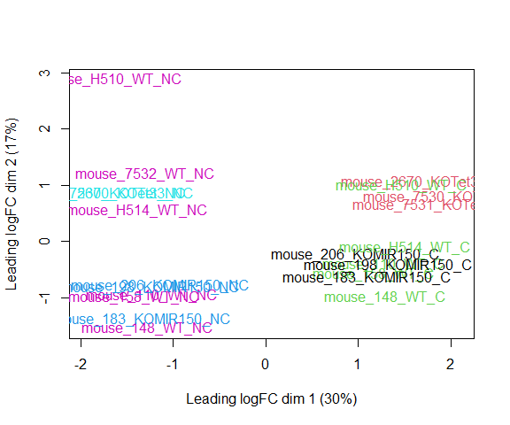
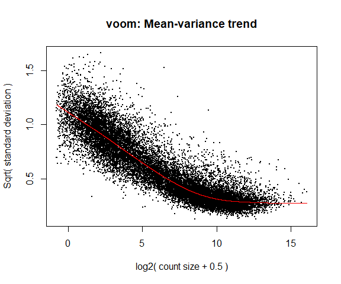
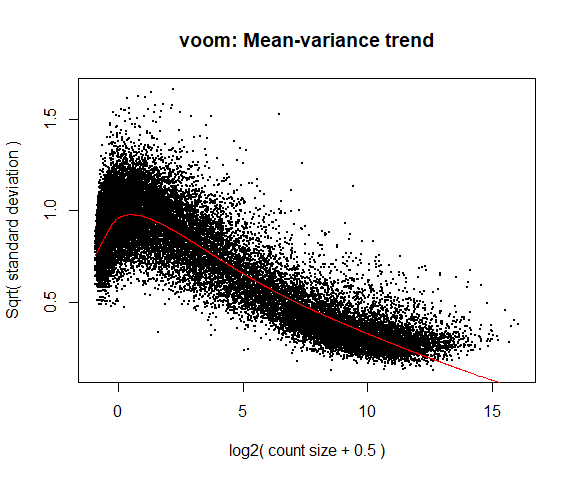
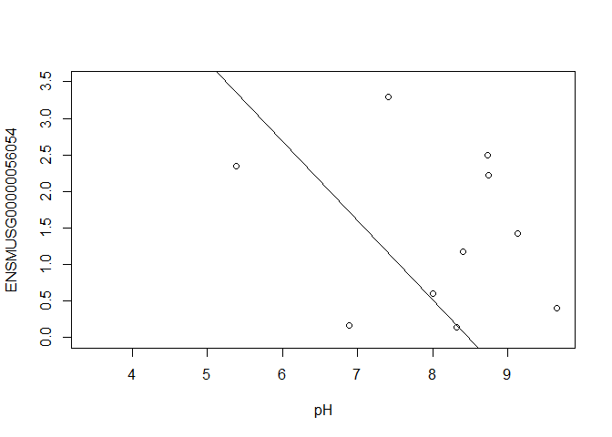
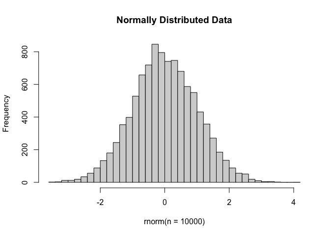
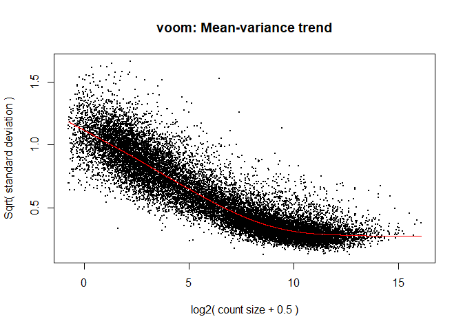
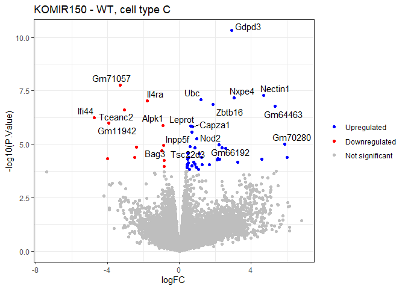
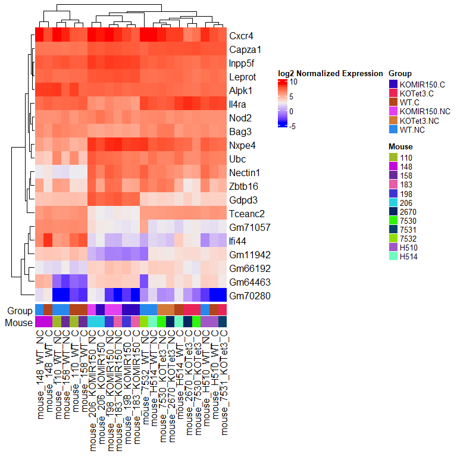
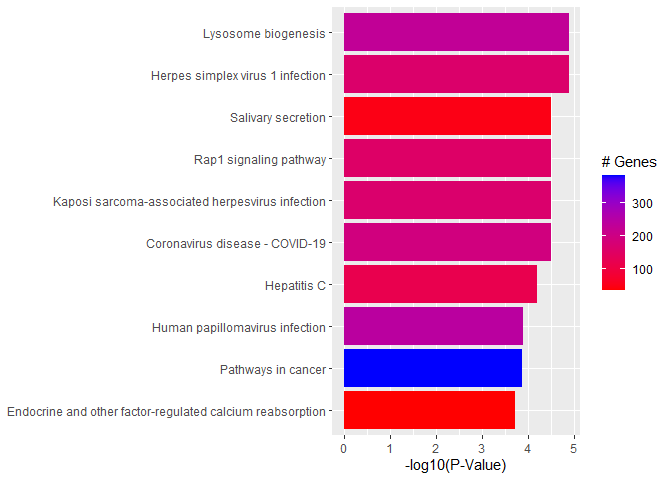

<script>
function buildQuiz(myq, qc){
  // variable to store the HTML output
  const output = [];

  // for each question...
  myq.forEach(
    (currentQuestion, questionNumber) => {

      // variable to store the list of possible answers
      const answers = [];

      // and for each available answer...
      for(letter in currentQuestion.answers){

        // ...add an HTML radio button
        answers.push(
          `<label>
            <input type="radio" name="question${questionNumber}" value="${letter}">
            ${letter} :
            ${currentQuestion.answers[letter]}
          </label><br/>`
        );
      }

      // add this question and its answers to the output
      output.push(
        `<div class="question"> ${currentQuestion.question} </div>
        <div class="answers"> ${answers.join('')} </div><br/>`
      );
    }
  );

  // finally combine our output list into one string of HTML and put it on the page
  qc.innerHTML = output.join('');
}

function showResults(myq, qc, rc){

  // gather answer containers from our quiz
  const answerContainers = qc.querySelectorAll('.answers');

  // keep track of user's answers
  let numCorrect = 0;

  // for each question...
  myq.forEach( (currentQuestion, questionNumber) => {

    // find selected answer
    const answerContainer = answerContainers[questionNumber];
    const selector = `input[name=question${questionNumber}]:checked`;
    const userAnswer = (answerContainer.querySelector(selector) || {}).value;

    // if answer is correct
    if(userAnswer === currentQuestion.correctAnswer){
      // add to the number of correct answers
      numCorrect++;

      // color the answers green
      answerContainers[questionNumber].style.color = 'lightgreen';
    }
    // if answer is wrong or blank
    else{
      // color the answers red
      answerContainers[questionNumber].style.color = 'red';
    }
  });

  // show number of correct answers out of total
  rc.innerHTML = `${numCorrect} out of ${myq.length}`;
}
</script>

# Differential Gene Expression Analysis in R

* Differential Expression (DE) between conditions is determined from count data
* Generally speaking differential expression analysis is performed in a very similar manner to metabolomics, proteomics, or DNA microarrays, once normalization and transformations have been performed.

A lot of RNA-seq analysis has been done in R and so there are many packages available to analyze and view this data. Two of the most commonly used are:
* DESeq2, developed by Simon Anders (also created htseq) in Wolfgang Huber’s group at EMBL
* edgeR and Voom (extension to Limma [microarrays] for RNA-seq), developed out of Gordon Smyth’s group from the Walter and Eliza Hall Institute of Medical Research in Australia

## Differential Expression Analysis with Limma-Voom

**limma** is an R package that was originally developed for differential expression (DE) analysis of gene expression microarray data.

**voom** is a function in the limma package that transforms RNA-Seq data for use with limma.

Together they allow fast, flexible, and powerful analyses of RNA-Seq data.  Limma-voom is _our_ tool of choice for DE analyses because it:

* Allows for incredibly flexible model specification (you can include multiple categorical and continuous variables, allowing incorporation of almost any kind of metadata).

* Based on simulation studies, maintains the false discovery rate at or below the nominal rate, unlike some other packages.

* Empirical Bayes smoothing of gene-wise standard deviations provides increased power.  

### Basic Steps of Differential Gene Expression
1. Read count data and annotation into R and preprocessing.
2. Calculate normalization factors (sample-specific adjustments)
3. Filter genes (uninteresting genes, e.g. unexpressed)
4. Account for expression-dependent variability by transformation, weighting, or modeling
5. Fitting a statistical model
6. Perform statistical comparisons of interest (using contrasts)
7. Adjust for multiple testing, Benjamini-Hochberg (BH) or q-value
8. Check results for confidence
9. Attach annotation if available and write tables


## 1. Read in the counts table and create our DGEList


``` r
counts <- read.delim("rnaseq_workshop_counts.txt", row.names = 1)
head(counts)
```

```
##                      mouse_110_WT_C mouse_110_WT_NC mouse_148_WT_C
## ENSMUSG00000102693.2              0               0              0
## ENSMUSG00000064842.3              0               0              0
## ENSMUSG00000051951.6              1               0              0
## ENSMUSG00000102851.2              0               0              0
## ENSMUSG00000103377.2              0               0              0
## ENSMUSG00000104017.2              0               0              0
##                      mouse_148_WT_NC mouse_158_WT_C mouse_158_WT_NC
## ENSMUSG00000102693.2               0              0               0
## ENSMUSG00000064842.3               0              0               0
## ENSMUSG00000051951.6               2              1               0
## ENSMUSG00000102851.2               0              0               0
## ENSMUSG00000103377.2               0              0               0
## ENSMUSG00000104017.2               0              0               0
##                      mouse_183_KOMIR150_C mouse_183_KOMIR150_NC
## ENSMUSG00000102693.2                    0                     0
## ENSMUSG00000064842.3                    0                     0
## ENSMUSG00000051951.6                    1                     1
## ENSMUSG00000102851.2                    0                     0
## ENSMUSG00000103377.2                    0                     0
## ENSMUSG00000104017.2                    0                     0
##                      mouse_198_KOMIR150_C mouse_198_KOMIR150_NC
## ENSMUSG00000102693.2                    0                     0
## ENSMUSG00000064842.3                    0                     0
## ENSMUSG00000051951.6                    1                     0
## ENSMUSG00000102851.2                    0                     0
## ENSMUSG00000103377.2                    0                     0
## ENSMUSG00000104017.2                    0                     0
##                      mouse_206_KOMIR150_C mouse_206_KOMIR150_NC
## ENSMUSG00000102693.2                    0                     0
## ENSMUSG00000064842.3                    0                     0
## ENSMUSG00000051951.6                    1                     0
## ENSMUSG00000102851.2                    0                     0
## ENSMUSG00000103377.2                    0                     0
## ENSMUSG00000104017.2                    0                     0
##                      mouse_2670_KOTet3_C mouse_2670_KOTet3_NC
## ENSMUSG00000102693.2                   0                    0
## ENSMUSG00000064842.3                   0                    0
## ENSMUSG00000051951.6                   0                    1
## ENSMUSG00000102851.2                   0                    0
## ENSMUSG00000103377.2                   0                    0
## ENSMUSG00000104017.2                   0                    0
##                      mouse_7530_KOTet3_C mouse_7530_KOTet3_NC
## ENSMUSG00000102693.2                   0                    0
## ENSMUSG00000064842.3                   0                    0
## ENSMUSG00000051951.6                   0                    1
## ENSMUSG00000102851.2                   0                    0
## ENSMUSG00000103377.2                   0                    0
## ENSMUSG00000104017.2                   0                    0
##                      mouse_7531_KOTet3_C mouse_7532_WT_NC mouse_H510_WT_C
## ENSMUSG00000102693.2                   0                0               0
## ENSMUSG00000064842.3                   0                0               0
## ENSMUSG00000051951.6                   1                0               0
## ENSMUSG00000102851.2                   0                0               0
## ENSMUSG00000103377.2                   0                0               0
## ENSMUSG00000104017.2                   0                0               0
##                      mouse_H510_WT_NC mouse_H514_WT_C mouse_H514_WT_NC
## ENSMUSG00000102693.2                0               0                0
## ENSMUSG00000064842.3                0               0                0
## ENSMUSG00000051951.6                1               0                1
## ENSMUSG00000102851.2                0               0                0
## ENSMUSG00000103377.2                0               0                0
## ENSMUSG00000104017.2                0               0                0
```

Create Differential Gene Expression List Object (DGEList) object 

A DGEList is an object in the package edgeR for storing count data, normalization factors, and other information


``` r
d0 <- DGEList(counts)
```
  
**1a\.** Read in Annotation

``` r
anno <- read.delim("ensembl_mm_115.txt")
dim(anno)
```

```
## [1] 78334     9
```

``` r
head(anno)
```

```
##       Gene.stable.ID Gene.stable.ID.version
## 1 ENSMUSG00000064336   ENSMUSG00000064336.1
## 2 ENSMUSG00000064337   ENSMUSG00000064337.1
## 3 ENSMUSG00000064338   ENSMUSG00000064338.1
## 4 ENSMUSG00000064339   ENSMUSG00000064339.1
## 5 ENSMUSG00000064340   ENSMUSG00000064340.1
## 6 ENSMUSG00000064341   ENSMUSG00000064341.1
##                                                                  Gene.description
## 1   mitochondrially encoded tRNA phenylalanine [Source:MGI Symbol;Acc:MGI:102487]
## 2             mitochondrially encoded 12S rRNA [Source:MGI Symbol;Acc:MGI:102493]
## 3          mitochondrially encoded tRNA valine [Source:MGI Symbol;Acc:MGI:102472]
## 4             mitochondrially encoded 16S rRNA [Source:MGI Symbol;Acc:MGI:102492]
## 5       mitochondrially encoded tRNA leucine 1 [Source:MGI Symbol;Acc:MGI:102482]
## 6 mitochondrially encoded NADH dehydrogenase 1 [Source:MGI Symbol;Acc:MGI:101787]
##   Chromosome.scaffold.name Gene.start..bp. Gene.end..bp. Gene.name
## 1                       MT               1            68     mt-Tf
## 2                       MT              70          1024   mt-Rnr1
## 3                       MT            1025          1093     mt-Tv
## 4                       MT            1094          2675   mt-Rnr2
## 5                       MT            2676          2750    mt-Tl1
## 6                       MT            2751          3707    mt-Nd1
##   Gene...GC.content      Gene.type
## 1             30.88        Mt_tRNA
## 2             35.81        Mt_rRNA
## 3             39.13        Mt_tRNA
## 4             35.40        Mt_rRNA
## 5             44.00        Mt_tRNA
## 6             37.62 protein_coding
```

``` r
tail(anno)
```

```
##           Gene.stable.ID Gene.stable.ID.version
## 78329 ENSMUSG00000086560   ENSMUSG00000086560.3
## 78330 ENSMUSG00000026835  ENSMUSG00000026835.16
## 78331 ENSMUSG00000085693   ENSMUSG00000085693.3
## 78332 ENSMUSG00000086425  ENSMUSG00000086425.10
## 78333 ENSMUSG00000128341   ENSMUSG00000128341.1
## 78334 ENSMUSG00000026833  ENSMUSG00000026833.19
##                                                     Gene.description
## 78329       predicted gene 13372 [Source:MGI Symbol;Acc:MGI:3650806]
## 78330                  ficolin B [Source:MGI Symbol;Acc:MGI:1341158]
## 78331       predicted gene 13371 [Source:MGI Symbol;Acc:MGI:3650807]
## 78332 RIKEN cDNA F730016J06 gene [Source:MGI Symbol;Acc:MGI:2443559]
## 78333      predicted gene, 74850 [Source:MGI Symbol;Acc:MGI:7832428]
## 78334             olfactomedin 1 [Source:MGI Symbol;Acc:MGI:1860437]
##       Chromosome.scaffold.name Gene.start..bp. Gene.end..bp.     Gene.name
## 78329                        2        27907755      27922139       Gm13372
## 78330                        2        27966390      27974897          Fcnb
## 78331                        2        27981431      27989471       Gm13371
## 78332                        2        27985443      28017753 F730016J06Rik
## 78333                        2        27998249      28083647       Gm74850
## 78334                        2        28083004      28120748         Olfm1
##       Gene...GC.content      Gene.type
## 78329             50.57         lncRNA
## 78330             50.16 protein_coding
## 78331             49.71         lncRNA
## 78332             49.39         lncRNA
## 78333             49.39         lncRNA
## 78334             52.31 protein_coding
```

``` r
any(duplicated(anno$Gene.stable.ID))
```

```
## [1] FALSE
```

**1b\.** Derive experiment metadata from the sample names

Our experiment has two factors, genotype ("WT", "KOMIR150", or "KOTet3") and cell type ("C" or "NC").

The sample names are "mouse" followed by an animal identifier, followed by the genotype, followed by the cell type.

``` r
sample_names <- colnames(counts)
metadata <- as.data.frame(strsplit2(sample_names, c("_"))[,2:4], row.names = sample_names)
colnames(metadata) <- c("mouse", "genotype", "cell_type")
```

Create a new variable "group" that combines genotype and cell type.

``` r
metadata$group <- interaction(metadata$genotype, metadata$cell_type)
table(metadata$group)
```

```
## 
##  KOMIR150.C    KOTet3.C        WT.C KOMIR150.NC   KOTet3.NC       WT.NC 
##           3           3           5           3           2           6
```

``` r
table(metadata$mouse)
```

```
## 
##  110  148  158  183  198  206 2670 7530 7531 7532 H510 H514 
##    2    2    2    2    2    2    2    2    1    1    2    2
```

Note: you can also enter group information manually, or read it in from an external file.  If you do this, it is $VERY, VERY, VERY$ important that you make sure the metadata is in the same order as the column names of the counts table.


## Quiz 1

<div id="quiz1" class="quiz"></div>
<button id="submit1">Submit Quiz</button>
<div id="results1" class="output"></div>
<script>
quizContainer1 = document.getElementById('quiz1');
resultsContainer1 = document.getElementById('results1');
submitButton1 = document.getElementById('submit1');

myQuestions1 = [
  {
    question: "How many genes are in the counts table",
    answers: {
      a: "22",
      b: "78,275",
      c: "368,125,139",
    },
    correctAnswer: "b"
  },
  {
    question: "How many samples are in the counts table",
    answers: {
      a: "22",
      b: "78,275",
      c: "368,125,139",
    },
    correctAnswer: "a"
  },
  {
    question: "What is the total count across all genes for sample mouse_110_WT_C",
    answers: {
      a: "10,000",
      b: "19,301,871",
      c: "12,298,872"
    },
    correctAnswer: "c"
  },
  {
    question: "'Extra-credit' question: How many genes have a count of 0 in every sample?",
    answers: {
      a: "36,966",
      b: "41,309",
      c: "78,275"
    },
    correctAnswer: "b"
  }
];

buildQuiz(myQuestions1, quizContainer1);
submitButton1.addEventListener('click', function() {showResults(myQuestions1, quizContainer1, resultsContainer1);});
</script>

## 2. Preprocessing and Normalization factors

In differential expression analysis, only sample-specific effects need to be normalized, we are NOT concerned with comparisons or quantification of absolute expression.

* Sequencing depth – is a sample specific effect and needs to be adjusted for.
* GC content – is NOT sample-specific (except when it is)
* Gene Length – is NOT sample-specific (except when it is)

In edgeR/limma, you calculate normalization factors to scale the raw library sizes (number of reads) using the function calcNormFactors, which by default uses TMM (weighted trimmed means of M values to the reference). Assumes most genes are not DE.

Proposed by Robinson and Oshlack (2010).


``` r
d0 <- calcNormFactors(d0)
d0$samples
```

```
##                       group lib.size norm.factors
## mouse_110_WT_C            1 12298872    0.9945246
## mouse_110_WT_NC           1 19301871    0.9861110
## mouse_148_WT_C            1 12572143    1.0056293
## mouse_148_WT_NC           1 14806702    1.0025388
## mouse_158_WT_C            1 28618183    1.0108604
## mouse_158_WT_NC           1 17165844    0.9685022
## mouse_183_KOMIR150_C      1  9740520    0.9969860
## mouse_183_KOMIR150_NC     1  6198686    0.9889737
## mouse_198_KOMIR150_C      1 18776098    1.0049975
## mouse_198_KOMIR150_NC     1 22297828    0.9711273
## mouse_206_KOMIR150_C      1  4213604    0.9494100
## mouse_206_KOMIR150_NC     1  2666494    0.9450449
## mouse_2670_KOTet3_C       1 27341488    1.0185502
## mouse_2670_KOTet3_NC      1 24381353    0.9928146
## mouse_7530_KOTet3_C       1 16655136    1.0250198
## mouse_7530_KOTet3_NC      1 36700953    1.0155220
## mouse_7531_KOTet3_C       1 22865927    1.0462934
## mouse_7532_WT_NC          1 15575527    1.0137927
## mouse_H510_WT_C           1 13944360    1.0352875
## mouse_H510_WT_NC          1 17858034    1.0502773
## mouse_H514_WT_C           1  8103791    0.9763722
## mouse_H514_WT_NC          1 16041725    1.0093725
```

**Note:** calcNormFactors doesn't _normalize_ the data, it just calculates normalization factors for use downstream.

## 3. Filtering genes

We filter genes based on non-experimental factors to reduce the number of genes/tests being conducted and therefor do not have to be accounted for in our transformation or multiple testing correction. Commonly we try to remove genes that are either a) unexpressed, or b) unchanging (low-variability).

Common filters include:
1. to remove genes with a max value (X) of less then Y.
2. to remove genes with fewer than X normalized read counts (cpm) across a certain number of samples. Ex: rowSums(cpms <=1) < 3 , require at least 1 cpm in at least 3 samples to keep.
3. A less used filter is for genes with minimum variance across all samples, so if a gene isn't changing (constant expression) its inherently not interesting therefore no need to test. 

We will use the built in function filterByExpr() to filter low-expressed genes.  filterByExpr uses the experimental design to determine how many samples a gene needs to be expressed in to stay.  Importantly, once this number of samples has been determined, the group information is not used in filtering.

Using filterByExpr requires specifying the model we will use to analysis our data.  

* The model you use will change for every experiment, and this step should be given the most time and attention.*

We use a model that includes group and (in order to account for the paired design) mouse.


``` r
group <- metadata$group
mouse <- metadata$mouse
mm <- model.matrix(~0 + group + mouse)
head(mm)
```

```
##   groupKOMIR150.C groupKOTet3.C groupWT.C groupKOMIR150.NC groupKOTet3.NC
## 1               0             0         1                0              0
## 2               0             0         0                0              0
## 3               0             0         1                0              0
## 4               0             0         0                0              0
## 5               0             0         1                0              0
## 6               0             0         0                0              0
##   groupWT.NC mouse148 mouse158 mouse183 mouse198 mouse206 mouse2670 mouse7530
## 1          0        0        0        0        0        0         0         0
## 2          1        0        0        0        0        0         0         0
## 3          0        1        0        0        0        0         0         0
## 4          1        1        0        0        0        0         0         0
## 5          0        0        1        0        0        0         0         0
## 6          1        0        1        0        0        0         0         0
##   mouse7531 mouse7532 mouseH510 mouseH514
## 1         0         0         0         0
## 2         0         0         0         0
## 3         0         0         0         0
## 4         0         0         0         0
## 5         0         0         0         0
## 6         0         0         0         0
```


``` r
keep <- filterByExpr(d0, mm)
sum(keep) # number of genes retained
```

```
## [1] 17247
```

``` r
d <- d0[keep,]
```
"Low-expressed" depends on the dataset and can be subjective.

Visualizing your data with a Multidimensional scaling (MDS) plot.

``` r
plotMDS(d, col = as.numeric(metadata$group), cex=1)
```

<!-- -->

The MDS plot tells you **A LOT** about what to expect from your experiment.

**3a\.** Extracting "normalized" expression table

### RPKM vs. FPKM vs. CPM and Model Based
* RPKM - Reads per kilobase per million mapped reads
* FPKM - Fragments per kilobase per million mapped reads
* logCPM – log Counts per million [ good for producing MDS plots, estimate of normalized values in model based ]
* Model based - original read counts are not themselves transformed, but rather correction factors are used in the DE model itself. 

We use the `cpm` function with log=TRUE to obtain log-transformed normalized expression data.  On the log scale, the data has less mean-dependent variability and is more suitable for plotting.

``` r
logcpm <- cpm(d, prior.count=2, log=TRUE)
write.table(logcpm,"rnaseq_workshop_normalized_counts.txt",sep="\t",quote=F)
```

## Quiz 2

<div id="quiz2" class="quiz"></div>
<button id="submit2">Submit Quiz</button>
<div id="results2" class="output"></div>
<script>
quizContainer2 = document.getElementById('quiz2');
resultsContainer2 = document.getElementById('results2');
submitButton2 = document.getElementById('submit2');

myQuestions2 = [
  {
    question: "Which sample has the largest normalization factor?",
    answers: {
      a: "mouse_206_KOMIR150_NC",
      b: "mouse_H510_WT_NC",
      c: "mouse_148_WT_C",
    },
    correctAnswer: "b"
  },
  {
    question: "Is the sample with the largest normalization factor the sample with the smallest total counts?",
    answers: {
      a: "TRUE",
      b: "FALSE"
    },
    correctAnswer: "b"
  },
  {
    question: "Based on the MDS plot, what is the biggest source of between-sample differences?",
    answers: {
      a: "Genotype",
      b: "Mouse",
      c: "Cell type"
    },
    correctAnswer: "c"
  },
  {
    question: "Make an MDS plot of the unfiltered data.  How does it differ from the MDS plot of the filtered data?",
    answers: {
      a: "The axis ranges are larger",
      b: "There is less separation",
      c: "The plots are nearly identical"
    },
    correctAnswer: "c"
  }
];

buildQuiz(myQuestions2, quizContainer2);
submitButton2.addEventListener('click', function() {showResults(myQuestions2, quizContainer2, resultsContainer2);});
</script>

## 4. Voom transformation and calculation of variance weights

**4a\.** **Voom**

``` r
y <- voom(d, mm, plot = T)
```

```
## Coefficients not estimable: mouse206 mouse7531
```

```
## Warning: Partial NA coefficients for 17247 probe(s)
```

<!-- -->

What is voom doing?

1. Counts are transformed to log2 counts per million reads (CPM), where "per million reads" is defined based on the normalization factors we calculated earlier.
2. A linear model is fitted to the log2 CPM for each gene, and the residuals are calculated.
3. A smoothed curve is fitted to the sqrt(residual standard deviation) by average expression.
(see red line in plot above)
4. The smoothed curve is used to obtain weights for each gene and sample that are passed into limma along with the log2 CPMs.

More details at "[voom: precision weights unlock linear model analysis tools for RNA-seq read counts](https://genomebiology.biomedcentral.com/articles/10.1186/gb-2014-15-2-r29)"

If your voom plot looks like the below (performed on the raw data), you might want to filter more:

``` r
tmp <- voom(d0, mm, plot = T)
```

```
## Coefficients not estimable: mouse206 mouse7531
```

```
## Warning: Partial NA coefficients for 78275 probe(s)
```

<!-- -->


## 5. Fitting linear models in limma

lmFit fits a linear model using weighted least squares for each gene:

``` r
fit <- lmFit(y, mm)
```

```
## Coefficients not estimable: mouse206 mouse7531
```

```
## Warning: Partial NA coefficients for 17247 probe(s)
```

``` r
head(coef(fit))
```

```
##                       groupKOMIR150.C groupKOTet3.C  groupWT.C groupKOMIR150.NC
## ENSMUSG00000098104.2        0.6526284    0.03429482  0.6532393        0.2375685
## ENSMUSG00000033845.14       5.0016151    4.88820902  4.9763191        4.9523900
## ENSMUSG00000102275.2       -1.6201198   -0.62621871 -1.1720818       -1.1545586
## ENSMUSG00000136002.1       -1.7493604   -3.99545252 -4.6159572       -0.7272189
## ENSMUSG00000025903.15       5.0171234    5.35253787  5.3640109        5.0940965
## ENSMUSG00000033813.16       5.8351608    5.70902755  5.9065931        5.9005442
##                       groupKOTet3.NC groupWT.NC    mouse148    mouse158
## ENSMUSG00000098104.2      -0.2821184  0.1145428 -1.33840403 -0.42895789
## ENSMUSG00000033845.14      4.5265223  4.7763369 -0.13990047 -0.02911518
## ENSMUSG00000102275.2      -1.4265519 -0.9890629 -0.38544983  0.23854851
## ENSMUSG00000136002.1      -4.4575453 -3.6632783 -0.66305680 -0.15374347
## ENSMUSG00000025903.15      5.2085162  5.1372357  0.09179694  0.07241885
## ENSMUSG00000033813.16      5.7608104  5.8639603 -0.05982270 -0.08716224
##                          mouse183    mouse198 mouse206   mouse2670   mouse7530
## ENSMUSG00000098104.2   0.05394482 -0.87462674       NA  0.09397075 -0.20998373
## ENSMUSG00000033845.14 -0.31899349  0.01742017       NA  0.29782480  0.16239232
## ENSMUSG00000102275.2   1.12573824  0.11338096       NA -0.29564348 -0.24659558
## ENSMUSG00000136002.1  -1.93612914 -4.12401794       NA -1.47722621 -1.43556356
## ENSMUSG00000025903.15  0.26706601  0.27411760       NA  0.12944314  0.04129559
## ENSMUSG00000033813.16 -0.12524254  0.04666020       NA  0.24615453  0.17242085
##                       mouse7531   mouse7532   mouseH510   mouseH514
## ENSMUSG00000098104.2         NA -0.84758713 -0.49815413 -0.21385373
## ENSMUSG00000033845.14        NA -0.03450118 -0.02768746 -0.02373714
## ENSMUSG00000102275.2         NA  1.05248519 -0.14210643 -0.21498534
## ENSMUSG00000136002.1         NA  1.00423457  1.50439685 -0.46944988
## ENSMUSG00000025903.15        NA  0.09975017  0.10131238  0.09983154
## ENSMUSG00000033813.16        NA -0.01441691 -0.01834807 -0.02829764
```

Comparisons between groups (log fold-changes) are obtained as _contrasts_ of these fitted linear models:

## 6. Specify which groups to compare using contrasts:

Comparison between cell types for genotype WT.

``` r
contr <- makeContrasts(groupWT.C - groupWT.NC, levels = colnames(coef(fit)))
contr
```

```
##                   Contrasts
## Levels             groupWT.C - groupWT.NC
##   groupKOMIR150.C                       0
##   groupKOTet3.C                         0
##   groupWT.C                             1
##   groupKOMIR150.NC                      0
##   groupKOTet3.NC                        0
##   groupWT.NC                           -1
##   mouse148                              0
##   mouse158                              0
##   mouse183                              0
##   mouse198                              0
##   mouse206                              0
##   mouse2670                             0
##   mouse7530                             0
##   mouse7531                             0
##   mouse7532                             0
##   mouseH510                             0
##   mouseH514                             0
```

**6a\.** Estimate contrast for each gene

``` r
tmp <- contrasts.fit(fit, contr)
```

The variance characteristics of low expressed genes are different from high expressed genes, if treated the same, the effect is to over represent low expressed genes in the DE list. This is corrected for by the log transformation and voom. However, some genes will have increased or decreased variance that is not a result of low expression, but due to other random factors. We are going to run empirical Bayes to adjust the variance of these genes.

Empirical Bayes smoothing of standard errors (shifts standard errors that are much larger or smaller than those from other genes towards the average standard error) (see "[Linear Models and Empirical Bayes Methods for Assessing Differential Expression in Microarray Experiments](https://www.degruyter.com/doi/10.2202/1544-6115.1027)"

**6b\.** Apply EBayes

``` r
tmp <- eBayes(tmp)
```

## 7. Multiple Testing Adjustment

The topTable listing results for the most significant genes. Implements adjustment for multiple testing using method of Benjamini & Hochberg (BH). "[Controlling the false discovery rate: a practical and powerful approach to multiple testing](http://www.jstor.org/stable/2346101).

here `n=Inf` says to produce the topTable for **all** genes. 

``` r
top.table <- topTable(tmp, adjust.method = "BH", sort.by = "P", n = Inf)
```

### Multiple Testing Correction

Multiple testing adjustment is the standard in the field and is required because testing thousands of genes makes the probability of having a raw p-value less than 0.05 for a gene that isn't truly different quite high.

Two common adjustment methods are:
  * [Benjamini-Hochberg](http://www.jstor.org/stable/2346101) (false discovery rate), such as Benjamini-Hochberg (1995).
  * [Qvalue](https://rss.onlinelibrary.wiley.com/doi/abs/10.1111/1467-9868.00346) - Storey (2002)

The FDR (or qvalue) is a statement about the list and is no longer about the gene (pvalue). So a FDR of 0.05, says you expect 5% false positives among the list of genes with an FDR of 0.05 or less.

The statement “Statistically significantly different” means FDR of 0.05 or less.

**7a\.** How many DE genes are there (false discovery rate corrected)?

``` r
length(which(top.table$adj.P.Val < 0.05))
```

```
## [1] 8627
```

## 8. Add annotation and write results to a file

``` r
top.table$Gene.stable.ID.version <- rownames(top.table)
top.table <- left_join(top.table, anno, by = "Gene.stable.ID.version")
top.table <- dplyr::select(top.table, Gene.stable.ID.version, Gene.name, everything())

head(top.table)
```

```
##   Gene.stable.ID.version Gene.name     logFC  AveExpr         t      P.Value
## 1   ENSMUSG00000020608.8      Smc6 -2.255446 7.932239 -50.52234 3.870865e-16
## 2  ENSMUSG00000051177.17     Plcb1  3.084390 5.208911  46.00282 1.279281e-15
## 3   ENSMUSG00000033530.9     Ttc7b -2.006080 5.738811 -45.20312 1.599773e-15
## 4  ENSMUSG00000049103.15      Ccr2  2.020877 9.789045  44.85466 1.765621e-15
## 5  ENSMUSG00000027508.16      Pag1 -1.767503 8.248818 -44.65535 1.868737e-15
## 6  ENSMUSG00000027215.14      Cd82 -2.445780 6.924080 -43.18180 2.865790e-15
##      adj.P.Val        B     Gene.stable.ID
## 1 6.446022e-12 27.54672 ENSMUSG00000020608
## 2 6.446022e-12 25.94154 ENSMUSG00000051177
## 3 6.446022e-12 25.97618 ENSMUSG00000033530
## 4 6.446022e-12 26.05348 ENSMUSG00000049103
## 5 6.446022e-12 26.00803 ENSMUSG00000027508
## 6 8.237714e-12 25.54339 ENSMUSG00000027215
##                                                                                      Gene.description
## 1                         structural maintenance of chromosomes 6 [Source:MGI Symbol;Acc:MGI:1914491]
## 2                                           phospholipase C, beta 1 [Source:MGI Symbol;Acc:MGI:97613]
## 3                              tetratricopeptide repeat domain 7B [Source:MGI Symbol;Acc:MGI:2144724]
## 4                                   C-C motif chemokine receptor 2 [Source:MGI Symbol;Acc:MGI:106185]
## 5 phosphoprotein associated with glycosphingolipid microdomains 1 [Source:MGI Symbol;Acc:MGI:2443160]
## 6                                                     CD82 antigen [Source:MGI Symbol;Acc:MGI:104651]
##   Chromosome.scaffold.name Gene.start..bp. Gene.end..bp. Gene...GC.content
## 1                       12        11315887      11369786             38.40
## 2                        2       134627987     135317178             40.03
## 3                       12       100267029     100487085             46.68
## 4                        9       123901987     123913594             38.86
## 5                        3         9752539       9898739             44.66
## 6                        2        93249456      93293485             53.35
##        Gene.type
## 1 protein_coding
## 2 protein_coding
## 3 protein_coding
## 4 protein_coding
## 5 protein_coding
## 6 protein_coding
```

``` r
write.table(top.table, file = "WT.C_v_WT.NC.txt", row.names = F, sep = "\t", quote = F)
```

## 9. Check your results for confidence.

You've conducted an experiment, you've seen a phenotype. Now check which genes are most differentially expressed (top rows of the table).  Look at their their description and ensure they relate to your experiment/phenotype. 


``` r
head(top.table, 50)
```

```
##    Gene.stable.ID.version     Gene.name     logFC   AveExpr         t
## 1    ENSMUSG00000020608.8          Smc6 -2.255446  7.932239 -50.52234
## 2   ENSMUSG00000051177.17         Plcb1  3.084390  5.208911  46.00282
## 3    ENSMUSG00000033530.9         Ttc7b -2.006080  5.738811 -45.20312
## 4   ENSMUSG00000049103.15          Ccr2  2.020877  9.789045  44.85466
## 5   ENSMUSG00000027508.16          Pag1 -1.767503  8.248818 -44.65535
## 6   ENSMUSG00000027215.14          Cd82 -2.445780  6.924080 -43.18180
## 7    ENSMUSG00000023827.9        Agpat4 -1.885349  6.558337 -42.19418
## 8    ENSMUSG00000028885.9       Smpdl3b -2.222591  7.157246 -41.34969
## 9   ENSMUSG00000020212.15          Mdm1 -2.094517  6.948277 -40.32362
## 10  ENSMUSG00000025701.13         Alox5 -2.493506  5.532559 -39.18977
## 11  ENSMUSG00000038147.15          Cd84  1.614521  7.236932  38.61553
## 12  ENSMUSG00000038807.20      Rap1gap2 -1.475501  9.084101 -38.10006
## 13   ENSMUSG00000030342.9           Cd9 -3.271726  6.049595 -37.45610
## 14  ENSMUSG00000021614.17          Vcan  5.633748  5.869198  37.04900
## 15  ENSMUSG00000028497.13         Hacd4  1.640309  6.280253  36.33552
## 16  ENSMUSG00000041268.18         Dmxl2  2.509018  5.023334  35.85499
## 17  ENSMUSG00000023809.12       Rps6ka2 -3.202249  5.027938 -35.41227
## 18  ENSMUSG00000024548.12        Setbp1 -4.725038  3.910886 -35.17259
## 19  ENSMUSG00000042700.17       Sipa1l1 -1.789441  6.244766 -34.54707
## 20   ENSMUSG00000024193.9          Phf1 -1.507601  6.226163 -34.20939
## 21  ENSMUSG00000054676.18 1600014C10Rik  2.232060  6.252724  34.03176
## 22   ENSMUSG00000052212.7         Cd177  4.361877  6.439880  33.88249
## 23  ENSMUSG00000030203.18        Dusp16 -4.027845  7.095270 -33.75995
## 24   ENSMUSG00000111792.2       Gm33858 -1.860894  5.927993 -33.71310
## 25  ENSMUSG00000020437.13         Myo1g -1.034009 10.158225 -33.15498
## 26  ENSMUSG00000009739.19        Pou6f1 -3.439800  3.339534 -33.04975
## 27   ENSMUSG00000020272.9         Stk10 -1.146535 10.393677 -32.75585
## 28  ENSMUSG00000022637.12          Cblb -1.315623  7.420380 -32.37730
## 29  ENSMUSG00000068329.13         Htra2 -1.450382  6.841535 -31.92893
## 30  ENSMUSG00000044783.17         Hjurp -1.581144  7.100040 -31.91921
## 31  ENSMUSG00000008496.20        Pou2f2 -1.335374  9.506884 -31.72927
## 32   ENSMUSG00000102418.2       Sh2d1b1 -2.506409  5.508368 -31.68975
## 33   ENSMUSG00000094626.2      Tmem121b -3.618551  3.554349 -30.58211
## 34  ENSMUSG00000045671.19        Spred2 -3.191486  4.850229 -30.43867
## 35  ENSMUSG00000016498.11      Pdcd1lg2 -4.372274  2.399295 -30.37044
## 36   ENSMUSG00000102037.2       Bcl2a1a -3.093686  3.442990 -30.23203
## 37  ENSMUSG00000053559.14         Smagp -3.190013  3.975328 -30.17834
## 38  ENSMUSG00000034731.12          Dgkh -1.723301  6.782529 -30.02391
## 39  ENSMUSG00000024164.16            C3  1.659072  9.850125  29.64685
## 40  ENSMUSG00000037820.16          Tgm2 -3.900276  7.273426 -29.56710
## 41  ENSMUSG00000037185.10         Krt80 -1.315903  9.421511 -29.55171
## 42  ENSMUSG00000033705.18        Stard9  1.667527  7.294146  29.52584
## 43   ENSMUSG00000030413.8       Pglyrp1 -2.312418  6.646511 -29.45155
## 44  ENSMUSG00000026193.16           Fn1  4.376526 10.194917  29.26433
## 45   ENSMUSG00000021728.9           Emb  1.561808  8.263769  28.97713
## 46  ENSMUSG00000059325.15          Hopx  2.349516  5.340871  28.96349
## 47   ENSMUSG00000060044.9        Tmem26 -3.206990  5.180667 -28.83488
## 48  ENSMUSG00000026923.16        Notch1  1.969499  6.821046  28.83408
## 49  ENSMUSG00000021242.10          Npc2  1.650083  8.853309  28.36747
## 50  ENSMUSG00000000440.13         Pparg -3.183919  5.413320 -28.35358
##         P.Value    adj.P.Val        B     Gene.stable.ID
## 1  3.870865e-16 6.446022e-12 27.54672 ENSMUSG00000020608
## 2  1.279281e-15 6.446022e-12 25.94154 ENSMUSG00000051177
## 3  1.599773e-15 6.446022e-12 25.97618 ENSMUSG00000033530
## 4  1.765621e-15 6.446022e-12 26.05348 ENSMUSG00000049103
## 5  1.868737e-15 6.446022e-12 26.00803 ENSMUSG00000027508
## 6  2.865790e-15 8.237714e-12 25.54339 ENSMUSG00000027215
## 7  3.848040e-15 9.481022e-12 25.24721 ENSMUSG00000023827
## 8  4.977964e-15 1.073187e-11 25.01517 ENSMUSG00000028885
## 9  6.854510e-15 1.313553e-11 24.70336 ENSMUSG00000020212
## 10 9.853799e-15 1.699485e-11 24.22203 ENSMUSG00000025701
## 11 1.188930e-14 1.864133e-11 24.16024 ENSMUSG00000038147
## 12 1.410540e-14 2.027298e-11 23.95512 ENSMUSG00000038807
## 13 1.751934e-14 2.324278e-11 23.70968 ENSMUSG00000030342
## 14 2.013029e-14 2.479908e-11 23.38163 ENSMUSG00000021614
## 15 2.577384e-14 2.963476e-11 23.38407 ENSMUSG00000028497
## 16 3.052368e-14 3.290262e-11 23.06239 ENSMUSG00000041268
## 17 3.574172e-14 3.626103e-11 22.86878 ENSMUSG00000023809
## 18 3.896123e-14 3.733135e-11 21.89341 ENSMUSG00000024548
## 19 4.893060e-14 4.441611e-11 22.74488 ENSMUSG00000042700
## 20 5.542816e-14 4.779847e-11 22.62303 ENSMUSG00000024193
## 21 5.921386e-14 4.794824e-11 22.55677 ENSMUSG00000054676
## 22 6.261112e-14 4.794824e-11 22.49966 ENSMUSG00000052212
## 23 6.555675e-14 4.794824e-11 22.45503 ENSMUSG00000030203
## 24 6.672220e-14 4.794824e-11 22.41499 ENSMUSG00000111792
## 25 8.246014e-14 5.688760e-11 22.07579 ENSMUSG00000020437
## 26 8.585272e-14 5.695007e-11 21.33816 ENSMUSG00000009739
## 27 9.615013e-14 6.141857e-11 21.90420 ENSMUSG00000020272
## 28 1.114183e-13 6.862969e-11 21.89103 ENSMUSG00000022637
## 29 1.329597e-13 7.673422e-11 21.73326 ENSMUSG00000068329
## 30 1.334740e-13 7.673422e-11 21.71944 ENSMUSG00000044783
## 31 1.439608e-13 7.882542e-11 21.52935 ENSMUSG00000008496
## 32 1.462523e-13 7.882542e-11 21.64040 ENSMUSG00000102418
## 33 2.295098e-13 1.199502e-10 20.78831 ENSMUSG00000094626
## 34 2.435845e-13 1.234898e-10 21.04861 ENSMUSG00000045671
## 35 2.506025e-13 1.234898e-10 19.37699 ENSMUSG00000016498
## 36 2.655183e-13 1.265831e-10 20.48676 ENSMUSG00000102037
## 37 2.715589e-13 1.265831e-10 20.71483 ENSMUSG00000053559
## 38 2.897742e-13 1.315194e-10 20.94126 ENSMUSG00000034731
## 39 3.400182e-13 1.470399e-10 20.61779 ENSMUSG00000024164
## 40 3.518042e-13 1.470399e-10 20.75982 ENSMUSG00000037820
## 41 3.541280e-13 1.470399e-10 20.59773 ENSMUSG00000037185
## 42 3.580724e-13 1.470399e-10 20.68724 ENSMUSG00000033705
## 43 3.696661e-13 1.482705e-10 20.70037 ENSMUSG00000030413
## 44 4.007142e-13 1.570708e-10 20.42168 ENSMUSG00000026193
## 45 4.539314e-13 1.712107e-10 20.40535 ENSMUSG00000021728
## 46 4.566413e-13 1.712107e-10 20.51799 ENSMUSG00000059325
## 47 4.830657e-13 1.736329e-10 20.45259 ENSMUSG00000060044
## 48 4.832365e-13 1.736329e-10 20.40033 ENSMUSG00000026923
## 49 5.938798e-13 2.061252e-10 20.08476 ENSMUSG00000021242
## 50 5.975683e-13 2.061252e-10 20.24884 ENSMUSG00000000440
##                                                                                       Gene.description
## 1                          structural maintenance of chromosomes 6 [Source:MGI Symbol;Acc:MGI:1914491]
## 2                                            phospholipase C, beta 1 [Source:MGI Symbol;Acc:MGI:97613]
## 3                               tetratricopeptide repeat domain 7B [Source:MGI Symbol;Acc:MGI:2144724]
## 4                                    C-C motif chemokine receptor 2 [Source:MGI Symbol;Acc:MGI:106185]
## 5  phosphoprotein associated with glycosphingolipid microdomains 1 [Source:MGI Symbol;Acc:MGI:2443160]
## 6                                                      CD82 antigen [Source:MGI Symbol;Acc:MGI:104651]
## 7                   1-acylglycerol-3-phosphate O-acyltransferase 4 [Source:MGI Symbol;Acc:MGI:1915512]
## 8                    sphingomyelin phosphodiesterase, acid-like 3B [Source:MGI Symbol;Acc:MGI:1916022]
## 9                                               MDM1 nuclear protein [Source:MGI Symbol;Acc:MGI:96951]
## 10                                       arachidonate 5-lipoxygenase [Source:MGI Symbol;Acc:MGI:87999]
## 11                                                    CD84 antigen [Source:MGI Symbol;Acc:MGI:1336885]
## 12                                RAP1 GTPase activating protein 2 [Source:MGI Symbol;Acc:MGI:3028623]
## 13                                                       CD9 antigen [Source:MGI Symbol;Acc:MGI:88348]
## 14                                                         versican [Source:MGI Symbol;Acc:MGI:102889]
## 15                                 3-hydroxyacyl-CoA dehydratase 4 [Source:MGI Symbol;Acc:MGI:1914025]
## 16                                                      Dmx-like 2 [Source:MGI Symbol;Acc:MGI:2444630]
## 17                      ribosomal protein S6 kinase, polypeptide 2 [Source:MGI Symbol;Acc:MGI:1342290]
## 18                                           SET binding protein 1 [Source:MGI Symbol;Acc:MGI:1933199]
## 19                signal-induced proliferation-associated 1 like 1 [Source:MGI Symbol;Acc:MGI:2443679]
## 20                                              PHD finger protein 1 [Source:MGI Symbol;Acc:MGI:98647]
## 21                                      RIKEN cDNA 1600014C10 gene [Source:MGI Symbol;Acc:MGI:1919494]
## 22                                                   CD177 antigen [Source:MGI Symbol;Acc:MGI:1916141]
## 23                                 dual specificity phosphatase 16 [Source:MGI Symbol;Acc:MGI:1917936]
## 24                                           predicted gene, 33858 [Source:MGI Symbol;Acc:MGI:5593017]
## 25                                                       myosin IG [Source:MGI Symbol;Acc:MGI:1927091]
## 26                      POU domain, class 6, transcription factor 1 [Source:MGI Symbol;Acc:MGI:102935]
## 27                                      serine/threonine kinase 10 [Source:MGI Symbol;Acc:MGI:1099439]
## 28                                    Casitas B-lineage lymphoma b [Source:MGI Symbol;Acc:MGI:2146430]
## 29                                         HtrA serine peptidase 2 [Source:MGI Symbol;Acc:MGI:1928676]
## 30                           Holliday junction recognition protein [Source:MGI Symbol;Acc:MGI:2685821]
## 31                      POU domain, class 2, transcription factor 2 [Source:MGI Symbol;Acc:MGI:101897]
## 32                                       SH2 domain containing 1B1 [Source:MGI Symbol;Acc:MGI:1349420]
## 33                                      transmembrane protein 121B [Source:MGI Symbol;Acc:MGI:2136977]
## 34                        sprouty-related EVH1 domain containing 2 [Source:MGI Symbol;Acc:MGI:2150019]
## 35                                programmed cell death 1 ligand 2 [Source:MGI Symbol;Acc:MGI:1930125]
## 36                   B cell leukemia/lymphoma 2 related protein A1a [Source:MGI Symbol;Acc:MGI:102687]
## 37                                small cell adhesion glycoprotein [Source:MGI Symbol;Acc:MGI:2448476]
## 38                                      diacylglycerol kinase, eta [Source:MGI Symbol;Acc:MGI:2444188]
## 39                                            complement component 3 [Source:MGI Symbol;Acc:MGI:88227]
## 40                                 transglutaminase 2, C polypeptide [Source:MGI Symbol;Acc:MGI:98731]
## 41                                                      keratin 80 [Source:MGI Symbol;Acc:MGI:1921377]
## 42                 StAR related lipid transfer domain containing 9 [Source:MGI Symbol;Acc:MGI:3045258]
## 43                             peptidoglycan recognition protein 1 [Source:MGI Symbol;Acc:MGI:1345092]
## 44                                                     fibronectin 1 [Source:MGI Symbol;Acc:MGI:95566]
## 45                                                           embigin [Source:MGI Symbol;Acc:MGI:95321]
## 46                                                    HOP homeobox [Source:MGI Symbol;Acc:MGI:1916782]
## 47                                        transmembrane protein 26 [Source:MGI Symbol;Acc:MGI:2143537]
## 48                                                           notch 1 [Source:MGI Symbol;Acc:MGI:97363]
## 49                     NPC intracellular cholesterol transporter 2 [Source:MGI Symbol;Acc:MGI:1915213]
## 50                  peroxisome proliferator activated receptor gamma [Source:MGI Symbol;Acc:MGI:97747]
##    Chromosome.scaffold.name Gene.start..bp. Gene.end..bp. Gene...GC.content
## 1                        12        11315887      11369786             38.40
## 2                         2       134627987     135317178             40.03
## 3                        12       100267029     100487085             46.68
## 4                         9       123901987     123913594             38.86
## 5                         3         9752539       9898739             44.66
## 6                         2        93249456      93293485             53.35
## 7                        17        12337591      12438532             47.10
## 8                         4       132460277     132484563             48.69
## 9                        10       117977716     118004902             45.09
## 10                        6       116387038     116438139             44.76
## 11                        1       171667265     171718285             40.92
## 12                       11        74274182      74501741             48.16
## 13                        6       125437229     125471754             50.16
## 14                       13        89803431      89890628             38.53
## 15                        4        88314381      88357165             40.13
## 16                        9        54272442      54408910             40.38
## 17                       17         7292942       7570726             47.80
## 18                       18        78793595      79152606             43.02
## 19                       12        82216094      82498560             44.03
## 20                       17        27152026      27156882             57.83
## 21                        7        37882642      37896992             49.30
## 22                        7        24443408      24459736             52.26
## 23                        6       134692431     134769588             41.74
## 24                        9       119898062     119899688             51.32
## 25                       11         6456548       6470965             52.16
## 26                       15       100473199     100497865             51.02
## 27                       11        32483305      32574587             50.40
## 28                       16        51851588      52028411             40.59
## 29                        6        83028247      83032254             54.84
## 30                        1        88190193      88205355             48.84
## 31                        7        24786769      24879151             51.78
## 32                        1       170104889     170114338             43.62
## 33                        6       120465900     120470768             59.33
## 34                       11        19874375      19974026             46.83
## 35                       19        29388319      29448561             43.41
## 36                        9        88838953      88844472             37.39
## 37                       15       100519220     100534821             49.37
## 38                       14        78796190      78970216             43.60
## 39                       17        57510970      57535136             52.01
## 40                        2       157958322     157988356             52.49
## 41                       15       101245325     101268043             52.83
## 42                        2       120459602     120562376             45.86
## 43                        7        18605256      18624384             49.04
## 44                        1        71624679      71692359             43.66
## 45                       13       117345072     117410951             41.92
## 46                        5        77234835      77262968             45.02
## 47                       10        68559476      68618480             40.56
## 48                        2        26347915      26406675             53.72
## 49                       12        84801336      84819926             47.51
## 50                        6       115337912     115467360             39.51
##         Gene.type
## 1  protein_coding
## 2  protein_coding
## 3  protein_coding
## 4  protein_coding
## 5  protein_coding
## 6  protein_coding
## 7  protein_coding
## 8  protein_coding
## 9  protein_coding
## 10 protein_coding
## 11 protein_coding
## 12 protein_coding
## 13 protein_coding
## 14 protein_coding
## 15 protein_coding
## 16 protein_coding
## 17 protein_coding
## 18 protein_coding
## 19 protein_coding
## 20 protein_coding
## 21 protein_coding
## 22 protein_coding
## 23 protein_coding
## 24         lncRNA
## 25 protein_coding
## 26 protein_coding
## 27 protein_coding
## 28 protein_coding
## 29 protein_coding
## 30 protein_coding
## 31 protein_coding
## 32 protein_coding
## 33 protein_coding
## 34 protein_coding
## 35 protein_coding
## 36 protein_coding
## 37 protein_coding
## 38 protein_coding
## 39 protein_coding
## 40 protein_coding
## 41 protein_coding
## 42 protein_coding
## 43 protein_coding
## 44 protein_coding
## 45 protein_coding
## 46 protein_coding
## 47 protein_coding
## 48 protein_coding
## 49 protein_coding
## 50 protein_coding
```
Columns are
* logFC: log2 fold change of WT.C/WT.NC
* AveExpr: Average expression across all samples, in log2 CPM
* t: logFC divided by its standard error
* P.Value: Raw p-value (based on t) from test that logFC differs from 0
* adj.P.Val: Benjamini-Hochberg false discovery rate adjusted p-value
* B: log-odds that gene is DE (arguably less useful than the other columns)

Smc6 has higher expression at WT NC than at WT C (logFC is negative).  
Plcb1 has higher expression at WT C than at WT NC (logFC is positive).

* The interpretation of the direction of the log fold change depends on how you set up the comparison in makeContrasts *

## Quiz 3

<div id="quiz3" class="quiz"></div>
<button id="submit3">Submit Quiz</button>
<div id="results3" class="output"></div>
<script>
quizContainer3 = document.getElementById('quiz3');
resultsContainer3 = document.getElementById('results3');
submitButton3 = document.getElementById('submit3');

myQuestions3 = [
  {
      question: "Based on the above model, how many genes are significantly differentially expressed between WT C and WT NC? (Significant = adjusted P < 0.05)",
    answers: {
      a: "9,544",
      b: "0",
      c: "8,627",
    },
    correctAnswer: "c"
  },
  {
    question: "Based on the above model, and without taking significance into account, how many genes have higher expression in WT C than in WT NC",
    answers: {
      a: "8,360",
      b: "4,215",
      c: "8,887",
    },
    correctAnswer: "a"
  },
  {
    question: "How many genes have an unadjusted p-value less than 0.05 for the comparison of WT C to WT NC in the above model",
    answers: {
      a: "9,544",
      b: "0",
      c: "8,627",
    },
    correctAnswer: "a"
  },
  {
    question: "What is the adjusted p-value for the last gene with unadjusted P < 0.05?  (This is the proportion of the genes with unadjusted P < 0.05 that, on average, would be expected to be false discoveries.)",
    answers: {
      a: "0.050",
      b: "0.511",
      c: "0.09"
    },
    correctAnswer: "c"
  },
  {
    question: "Which of these conditions is LEAST likely to indicate a problem with your analysis code?",
    answers: {
      a: "Every gene is differentially expressed",
      b: "No gene is differentially expressed",
      c: "The top of your gene list is dominated by antisense transcripts"
    },
    correctAnswer: "b"
  }
];

buildQuiz(myQuestions3, quizContainer3);
submitButton3.addEventListener('click', function() {showResults(myQuestions3, quizContainer3, resultsContainer3);});
</script>

# Linear models and contrasts

Let's say we want to compare genotypes for cell type C.  The only thing we have to change is the call to makeContrasts:

``` r
contr <- makeContrasts(groupWT.C - groupKOMIR150.C, levels = colnames(coef(fit)))
tmp <- contrasts.fit(fit, contr)
tmp <- eBayes(tmp)
top.table <- topTable(tmp, sort.by = "P", n = Inf)
head(top.table, 20)
```

```
##                            logFC   AveExpr          t      P.Value    adj.P.Val
## ENSMUSG00000030703.9  -2.9194381  4.674336 -19.992018 4.799425e-11 8.277568e-07
## ENSMUSG00000141370.1   3.2914333  3.418957  12.338454 1.739975e-08 1.500468e-04
## ENSMUSG00000032012.10 -4.7116503  5.272115 -11.259051 5.129565e-08 2.610370e-04
## ENSMUSG00000044229.10 -3.0637042  7.010473 -11.011062 6.656563e-08 2.610370e-04
## ENSMUSG00000008348.10 -1.1959831  6.062840 -10.816647 8.193086e-08 2.610370e-04
## ENSMUSG00000030748.10  1.8019351  7.188642  10.721362 9.081126e-08 2.610370e-04
## ENSMUSG00000066687.6  -1.8789903  5.116244 -10.353106 1.361290e-07 3.354025e-04
## ENSMUSG00000121395.2  -5.3218171  2.119605 -10.149530 1.711232e-07 3.689202e-04
## ENSMUSG00000028619.16  3.0731154  4.788141   9.849959 2.412317e-07 4.622803e-04
## ENSMUSG00000028037.14  4.7474704  2.890467   9.115861 5.799260e-07 1.000198e-03
## ENSMUSG00000094344.2   3.9406482  2.096236   8.670724 1.013461e-06 1.589015e-03
## ENSMUSG00000028028.12  0.9274642  7.335330   8.480652 1.294545e-06 1.860584e-03
## ENSMUSG00000035212.15 -0.6376350  7.171750  -8.394750 1.447867e-06 1.909302e-03
## ENSMUSG00000070372.12 -0.7170769  7.400887  -8.342820 1.549848e-06 1.909302e-03
## ENSMUSG00000042105.19 -0.6887919  7.561410  -7.938529 2.660613e-06 3.059173e-03
## ENSMUSG00000055994.16 -0.9524909  6.023635  -7.425583 5.430495e-06 5.853734e-03
## ENSMUSG00000142665.1  -5.8609136 -1.721250  -7.011604 9.891962e-06 1.003569e-02
## ENSMUSG00000141229.1  -2.1940583  2.961001  -6.966553 1.057312e-05 1.013081e-02
## ENSMUSG00000030847.9   0.8747695  5.792532   6.914761 1.141810e-05 1.036463e-02
## ENSMUSG00000031431.14 -0.5941060  8.740396  -6.858833 1.241145e-05 1.070301e-02
##                               B
## ENSMUSG00000030703.9  15.516312
## ENSMUSG00000141370.1   8.913339
## ENSMUSG00000032012.10  8.790166
## ENSMUSG00000044229.10  8.634119
## ENSMUSG00000008348.10  8.425523
## ENSMUSG00000030748.10  8.397860
## ENSMUSG00000066687.6   8.001396
## ENSMUSG00000121395.2   5.041235
## ENSMUSG00000028619.16  6.827465
## ENSMUSG00000028037.14  5.896506
## ENSMUSG00000094344.2   4.062191
## ENSMUSG00000028028.12  5.507374
## ENSMUSG00000035212.15  5.383447
## ENSMUSG00000070372.12  5.326448
## ENSMUSG00000042105.19  4.692763
## ENSMUSG00000055994.16  4.182911
## ENSMUSG00000142665.1   1.049400
## ENSMUSG00000141229.1   3.596209
## ENSMUSG00000030847.9   3.596380
## ENSMUSG00000031431.14  2.950392
```

``` r
length(which(top.table$adj.P.Val < 0.05)) # number of DE genes
```

```
## [1] 54
```

``` r
top.table$Gene <- rownames(top.table)
top.table <- top.table[,c("Gene", names(top.table)[1:6])]
top.table <- data.frame(top.table,anno[match(top.table$Gene,anno$Gene.stable.ID.version),],logcpm[match(top.table$Gene,rownames(logcpm)),])

write.table(top.table, file = "WT.C_v_KOMIR150.C.txt", row.names = F, sep = "\t", quote = F)
```

### More complicated models
Specifying a different model is simply a matter of changing the calls to model.matrix (and possibly to contrasts.fit).

What if we want to adjust for a continuous variable like some health score?
(We are making this data up here, but it would typically be a variable in your metadata.)

``` r
# Generate example health data
set.seed(99)
HScore <- rnorm(n = 22, mean = 7.5, sd = 1)
HScore
```

```
##  [1] 7.713963 7.979658 7.587829 7.943859 7.137162 7.622674 6.636155 7.989624
##  [9] 7.135883 6.205758 6.754231 8.421550 8.250054 4.991446 4.459066 7.500266
## [17] 7.105981 5.754972 7.998631 7.770954 8.598922 8.252513
```

Model adjusting for HScore score:

``` r
mm <- model.matrix(~0 + group + mouse + HScore)
y <- voom(d, mm, plot = F)
```

```
## Coefficients not estimable: mouse206 mouse7531
```

```
## Warning: Partial NA coefficients for 17247 probe(s)
```

``` r
fit <- lmFit(y, mm)
```

```
## Coefficients not estimable: mouse206 mouse7531
```

```
## Warning: Partial NA coefficients for 17247 probe(s)
```

``` r
contr <- makeContrasts(groupKOMIR150.NC - groupWT.NC,
                       levels = colnames(coef(fit)))
tmp <- contrasts.fit(fit, contr)
tmp <- eBayes(tmp)
top.table <- topTable(tmp, sort.by = "P", n = Inf)
head(top.table, 20)
```

```
##                            logFC   AveExpr          t      P.Value    adj.P.Val
## ENSMUSG00000030703.9   3.3697080  4.674336  28.305481 1.887065e-12 3.254620e-08
## ENSMUSG00000044229.10  2.9660044  7.010473  24.182296 1.235273e-11 1.065237e-07
## ENSMUSG00000032012.10  4.9862346  5.272115  19.632150 1.460160e-10 8.394459e-07
## ENSMUSG00000121395.2   5.3551750  2.119605  17.905245 4.309634e-10 1.858206e-06
## ENSMUSG00000008348.10  1.5313695  6.062840  16.436633 1.171436e-09 4.040750e-06
## ENSMUSG00000070372.12  0.9126391  7.400887  15.139517 3.041460e-09 8.742676e-06
## ENSMUSG00000030847.9  -1.2200778  5.792532 -14.829575 3.862487e-09 9.516616e-06
## ENSMUSG00000141370.1  -2.8778141  3.418957 -13.626035 1.021644e-08 2.202537e-05
## ENSMUSG00000028619.16 -2.8333506  4.788141 -13.324310 1.319480e-08 2.528564e-05
## ENSMUSG00000035212.15  0.7953298  7.171750  13.098953 1.602664e-08 2.764115e-05
## ENSMUSG00000060802.9   0.8051525 10.490506  11.977998 4.412492e-08 6.918387e-05
## ENSMUSG00000066687.6   1.8835020  5.116244  11.820502 5.120364e-08 7.359243e-05
## ENSMUSG00000142665.1   6.8364390 -1.721250  11.703164 5.726910e-08 7.558936e-05
## ENSMUSG00000028028.12 -0.9761127  7.335330 -11.631366 6.135856e-08 7.558936e-05
## ENSMUSG00000042105.19  0.6567193  7.561410  11.000310 1.143105e-07 1.314342e-04
## ENSMUSG00000094344.2  -3.3143358  2.096236 -10.637102 1.657766e-07 1.786969e-04
## ENSMUSG00000028173.11 -1.7099073  6.767370 -10.462589 1.989338e-07 2.018242e-04
## ENSMUSG00000141229.1   1.9362686  2.961001  10.209150 2.604023e-07 2.495088e-04
## ENSMUSG00000060126.15  0.6027445  9.691409   9.930599 3.522917e-07 3.150102e-04
## ENSMUSG00000042396.11 -0.8470088  6.610096  -9.897611 3.652928e-07 3.150102e-04
##                               B
## ENSMUSG00000030703.9  17.453377
## ENSMUSG00000044229.10 17.167312
## ENSMUSG00000032012.10 14.417237
## ENSMUSG00000121395.2  10.031807
## ENSMUSG00000008348.10 12.747302
## ENSMUSG00000070372.12 11.762973
## ENSMUSG00000030847.9  11.550802
## ENSMUSG00000141370.1   9.436274
## ENSMUSG00000028619.16  9.637239
## ENSMUSG00000035212.15 10.087418
## ENSMUSG00000060802.9   8.808369
## ENSMUSG00000066687.6   8.968405
## ENSMUSG00000142665.1   3.646139
## ENSMUSG00000028028.12  8.707508
## ENSMUSG00000042105.19  8.032779
## ENSMUSG00000094344.2   6.008150
## ENSMUSG00000028173.11  7.560533
## ENSMUSG00000141229.1   7.137772
## ENSMUSG00000060126.15  6.680188
## ENSMUSG00000042396.11  6.923373
```

``` r
length(which(top.table$adj.P.Val < 0.05))
```

```
## [1] 1299
```

What if we want to look at the correlation of gene expression with a continuous variable like pH?

``` r
# Generate example pH data
set.seed(99)
pH <- rnorm(n = 22, mean = 8, sd = 1.5)
pH
```

```
##  [1] 8.320944 8.719487 8.131743 8.665788 7.455743 8.184011 6.704232 8.734436
##  [9] 7.453825 6.058637 6.881346 9.382326 9.125082 4.237169 3.438599 8.000399
## [17] 7.408972 5.382459 8.747947 8.406431 9.648382 9.128770
```

Specify model matrix:

``` r
mm <- model.matrix(~pH)
head(mm)
```

```
##   (Intercept)       pH
## 1           1 8.320944
## 2           1 8.719487
## 3           1 8.131743
## 4           1 8.665788
## 5           1 7.455743
## 6           1 8.184011
```


``` r
y <- voom(d, mm, plot = F)
fit <- lmFit(y, mm)
tmp <- contrasts.fit(fit, coef = 2) # test "pH" coefficient
tmp <- eBayes(tmp)
top.table <- topTable(tmp, sort.by = "P", n = Inf)
head(top.table, 20)
```

```
##                             logFC    AveExpr         t      P.Value adj.P.Val
## ENSMUSG00000056054.10 -1.08046169  1.0238092 -4.722658 9.619382e-05 0.9999806
## ENSMUSG00000015312.10 -0.12400255  3.3720392 -4.151534 3.956791e-04 0.9999806
## ENSMUSG00000056071.13 -1.03901643  0.9189572 -4.008874 5.629665e-04 0.9999806
## ENSMUSG00000038331.16  0.13148729  3.5729036  3.848961 8.348857e-04 0.9999806
## ENSMUSG00000094497.2  -1.03912750 -1.7317220 -3.804161 9.320584e-04 0.9999806
## ENSMUSG00000023031.9  -0.32437788 -1.5409098 -3.775778 9.993151e-04 0.9999806
## ENSMUSG00000024222.19 -0.19679092  4.0027681 -3.658723 1.330987e-03 0.9999806
## ENSMUSG00000038539.16 -0.12560686  2.5045600 -3.579617 1.614212e-03 0.9999806
## ENSMUSG00000026822.15 -1.02855375  1.2810295 -3.573994 1.636456e-03 0.9999806
## ENSMUSG00000095457.4   0.47849814 -1.6979028  3.534552 1.801176e-03 0.9999806
## ENSMUSG00000039168.16 -0.06738600  6.6873541 -3.487869 2.017189e-03 0.9999806
## ENSMUSG00000039196.3  -0.57280362 -4.0577484 -3.454407 2.187420e-03 0.9999806
## ENSMUSG00000020311.18 -0.05829110  4.9175092 -3.424465 2.351580e-03 0.9999806
## ENSMUSG00000056673.15 -1.06071377  1.2014056 -3.409749 2.436607e-03 0.9999806
## ENSMUSG00000034723.12 -0.09544103  5.4403355 -3.394240 2.529464e-03 0.9999806
## ENSMUSG00000023903.9  -0.45906946 -0.4025828 -3.316345 3.050515e-03 0.9999806
## ENSMUSG00000085337.3   0.12833624  3.3314678  3.312827 3.076361e-03 0.9999806
## ENSMUSG00000068457.15 -1.05817263 -0.4391390 -3.228838 3.760521e-03 0.9999806
## ENSMUSG00000029648.14  0.30488869  6.3762885  3.205174 3.978538e-03 0.9999806
## ENSMUSG00000031843.3  -0.14235062  3.8273211 -3.191393 4.111089e-03 0.9999806
##                                 B
## ENSMUSG00000056054.10  0.62049791
## ENSMUSG00000015312.10 -0.01537085
## ENSMUSG00000056071.13 -0.70026597
## ENSMUSG00000038331.16 -0.66947106
## ENSMUSG00000094497.2  -2.03817036
## ENSMUSG00000023031.9  -2.53844021
## ENSMUSG00000024222.19 -0.92506033
## ENSMUSG00000038539.16 -1.29938678
## ENSMUSG00000026822.15 -1.35519579
## ENSMUSG00000095457.4  -3.37035178
## ENSMUSG00000039168.16 -1.29483121
## ENSMUSG00000039196.3  -3.49602431
## ENSMUSG00000020311.18 -1.40543740
## ENSMUSG00000056673.15 -1.58422547
## ENSMUSG00000034723.12 -1.47864509
## ENSMUSG00000023903.9  -2.45253610
## ENSMUSG00000085337.3  -1.72052522
## ENSMUSG00000068457.15 -2.28247228
## ENSMUSG00000029648.14 -1.88062558
## ENSMUSG00000031843.3  -1.87574276
```

``` r
length(which(top.table$adj.P.Val < 0.05))
```

```
## [1] 0
```

In this case, limma is fitting a linear regression model, which here is a straight line fit, with the slope and intercept defined by the model coefficients:

``` r
ENSMUSG00000056054 <- y$E["ENSMUSG00000056054.10",]
plot(ENSMUSG00000056054 ~ pH, ylim = c(0, 3.5))
intercept <- coef(fit)["ENSMUSG00000056054.10", "(Intercept)"]
slope <- coef(fit)["ENSMUSG00000056054.10", "pH"]
abline(a = intercept, b = slope)
```

<!-- -->

``` r
slope
```

```
## [1] -1.080462
```

In this example, the log fold change logFC is the slope of the line, or the change in gene expression (on the log2 CPM scale) for each unit increase in pH.

Here, a logFC of 0.20 means a 0.20 log2 CPM increase in gene expression for each unit increase in pH, or a 15% increase on the CPM scale (2^0.20 = 1.15).

### A bit more on linear models

Limma fits a linear model to each gene.

Linear models include analysis of variance (ANOVA) models, linear regression, and any model of the form

Y = &beta;<sub>0</sub> + &beta;<sub>1</sub>X<sub>1</sub> + &beta;<sub>2</sub>X<sub>2</sub> + ... + &beta;<sub>p</sub>X<sub>p</sub> + &epsilon;

The covariates X can be:

* a continuous variable (pH, HScore score, age, weight, temperature, etc.)
* Dummy variables coding a categorical covariate (like cell type, genotype, and group)

The &beta;'s are unknown parameters to be estimated.

In limma, the &beta;'s are the log fold changes.  

The error (residual) term &epsilon; is assumed to be normally distributed with a variance that is constant across the range of the data.

Normally distributed means the residuals come from a distribution that looks like this:
<!-- -->

The log2 transformation that voom applies to the counts makes the data "normal enough", but doesn't completely stabilize the variance:

``` r
mm <- model.matrix(~0 + group + mouse)
tmp <- voom(d, mm, plot = T)
```

```
## Coefficients not estimable: mouse206 mouse7531
```

```
## Warning: Partial NA coefficients for 17247 probe(s)
```

<!-- -->

The log2 counts per million are more variable at lower expression levels.  The variance weights calculated by voom address this situation.

### Both edgeR and limma have VERY comprehensive user manuals

The limma users' guide has great details on model specification.

* [Limma voom](https://bioconductor.org/packages/release/bioc/vignettes/limma/inst/doc/usersguide.pdf)

* [edgeR](http://bioconductor.org/packages/release/bioc/vignettes/edgeR/inst/doc/edgeRUsersGuide.pdf)


# Simple plotting


``` r
mm <- model.matrix(~0 + group + mouse)
colnames(mm) <- make.names(colnames(mm))
y <- voom(d, mm, plot = F)
```

```
## Coefficients not estimable: mouse206 mouse7531
```

```
## Warning: Partial NA coefficients for 17247 probe(s)
```

``` r
fit <- lmFit(y, mm)
```

```
## Coefficients not estimable: mouse206 mouse7531
```

```
## Warning: Partial NA coefficients for 17247 probe(s)
```

``` r
contrast.matrix <- makeContrasts(groupKOMIR150.C - groupWT.C, levels=colnames(coef(fit)))
fit2 <- contrasts.fit(fit, contrast.matrix)
fit2 <- eBayes(fit2)
top.table <- topTable(fit2, sort.by = "P", n = Inf)
top.table$Gene.stable.ID.version <- rownames(top.table)
top.table <- left_join(top.table, anno, by = "Gene.stable.ID.version")
```

## Volcano plot


``` r
plotdat <- top.table
plotdat$Category <- "Not significant"
plotdat$Category[plotdat$adj.P.Val < 0.05 & plotdat$logFC > 0] <- "Upregulated"
plotdat$Category[plotdat$adj.P.Val < 0.05 & plotdat$logFC < 0] <- "Downregulated"
plotdat$Category <- factor(plotdat$Category, levels = c("Upregulated", "Downregulated", "Not significant"))
labeldat <- plotdat[1:20,]
volcano <- ggplot(plotdat, aes(x = logFC, y = -log10(P.Value), color = Category)) + geom_point(show.legend = TRUE) + geom_text_repel(data = labeldat, aes(label = Gene.name), color = "black", max.overlaps = Inf) + scale_color_manual(values = c("blue", "red", "grey"), breaks = levels(plotdat$Category), drop = FALSE) + labs(color = NULL, title = "KOMIR150 - WT, cell type C") + theme_bw()
volcano
```

<!-- -->

## Heatmap
We will use the ComplexHeatmap R package to generate a heatmap of the top genes from the previous DE test.  ComplexHeatmap is capable of making some truly lovely figures, see the book [here](https://jokergoo.github.io/ComplexHeatmap-reference/book/)

``` r
# Select top 20 DE genes from the above DE analysis
genes.use <- top.table$Gene.stable.ID.version[1:20]
names.use <- top.table$Gene.name[1:20]
plotdat <- cpm(d, log = TRUE, prior.count = 1)
plotdat <- plotdat[genes.use,]
# Adding color bars showing metadata
set.seed(101) # annotation colors are random!
ha <- HeatmapAnnotation(Group = group, Mouse = mouse, annotation_name_side = "left")
ht <- Heatmap(plotdat, bottom_annotation = ha, name = "log2 Normalized Expression", row_labels = names.use)
draw(ht)
```

<!-- -->

## Venn diagram

We recommend using Venn diagrams cautiously.  Often, a question about the non-overlapping parts of a Venn diagram is better answered by testing an interaction effect.


``` r
mm <- model.matrix(~0 + group + mouse)
colnames(mm) <- make.names(colnames(mm))
y <- voom(d, mm, plot = F)
```

```
## Coefficients not estimable: mouse206 mouse7531
```

```
## Warning: Partial NA coefficients for 17247 probe(s)
```

``` r
fit <- lmFit(y, mm)
```

```
## Coefficients not estimable: mouse206 mouse7531
```

```
## Warning: Partial NA coefficients for 17247 probe(s)
```

``` r
contrast.matrix <- makeContrasts(groupKOMIR150.C - groupWT.C, groupKOMIR150.NC - groupWT.NC, levels=colnames(coef(fit)))
fit2 <- contrasts.fit(fit, contrast.matrix)
fit2 <- eBayes(fit2)

results <- decideTests(fit2)
vennDiagram(results, names = c("C", "NC"), main = "DE Genes Between KOMIR150 and WT by Cell Type", cex.main = 0.8)
```

<!-- -->

## Download the Enrichment Analysis R Markdown document

``` r
download.file("https://raw.githubusercontent.com/ucdavis-bioinformatics-training/2026-March-RNA-Seq-Analysis/master/data_analysis/enrichment_mm.Rmd", "enrichment_mm.Rmd")
```


``` r
sessionInfo()
```

```
## R version 4.5.3 (2026-03-11 ucrt)
## Platform: x86_64-w64-mingw32/x64
## Running under: Windows 11 x64 (build 26100)
## 
## Matrix products: default
##   LAPACK version 3.12.1
## 
## locale:
## [1] LC_COLLATE=English_United States.utf8 
## [2] LC_CTYPE=English_United States.utf8   
## [3] LC_MONETARY=English_United States.utf8
## [4] LC_NUMERIC=C                          
## [5] LC_TIME=English_United States.utf8    
## 
## time zone: America/Los_Angeles
## tzcode source: internal
## 
## attached base packages:
## [1] grid      stats     graphics  grDevices utils     datasets  methods  
## [8] base     
## 
## other attached packages:
## [1] ggrepel_0.9.8         ggplot2_4.0.2         ComplexHeatmap_2.24.1
## [4] dplyr_1.2.0           edgeR_4.6.3           limma_3.64.3         
## 
## loaded via a namespace (and not attached):
##  [1] sass_0.4.10         generics_0.1.4      shape_1.4.6.1      
##  [4] lattice_0.22-9      digest_0.6.39       magrittr_2.0.4     
##  [7] evaluate_1.0.5      RColorBrewer_1.1-3  iterators_1.0.14   
## [10] circlize_0.4.17     fastmap_1.2.0       foreach_1.5.2      
## [13] doParallel_1.0.17   jsonlite_2.0.0      GlobalOptions_0.1.3
## [16] scales_1.4.0        codetools_0.2-20    jquerylib_0.1.4    
## [19] cli_3.6.5           rlang_1.1.7         crayon_1.5.3       
## [22] withr_3.0.2         cachem_1.1.0        yaml_2.3.12        
## [25] otel_0.2.0          tools_4.5.3         parallel_4.5.3     
## [28] colorspace_2.1-2    locfit_1.5-9.12     GetoptLong_1.1.0   
## [31] BiocGenerics_0.54.1 vctrs_0.7.2         R6_2.6.1           
## [34] png_0.1-9           matrixStats_1.5.0   stats4_4.5.3       
## [37] lifecycle_1.0.5     S4Vectors_0.46.0    IRanges_2.42.0     
## [40] clue_0.3-67         cluster_2.1.8.2     pkgconfig_2.0.3    
## [43] gtable_0.3.6        pillar_1.11.1       bslib_0.10.0       
## [46] Rcpp_1.1.1          glue_1.8.0          statmod_1.5.1      
## [49] xfun_0.57           tibble_3.3.1        tidyselect_1.2.1   
## [52] rstudioapi_0.18.0   knitr_1.51          farver_2.1.2       
## [55] rjson_0.2.23        htmltools_0.5.9     labeling_0.4.3     
## [58] rmarkdown_2.30      compiler_4.5.3      S7_0.2.1
```
