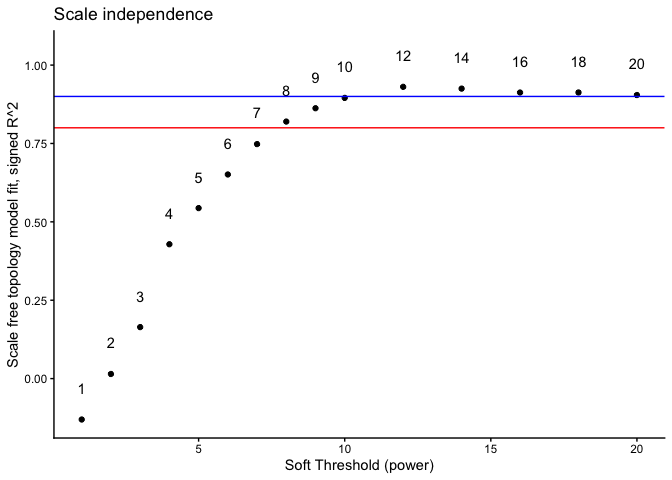
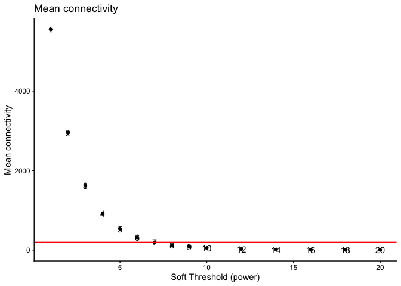
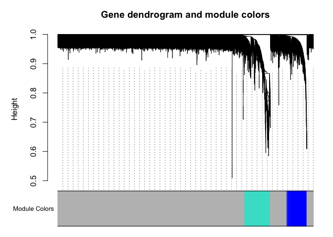
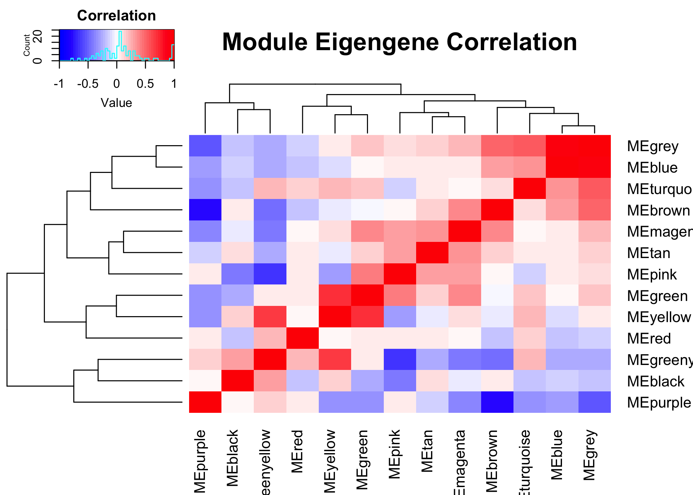
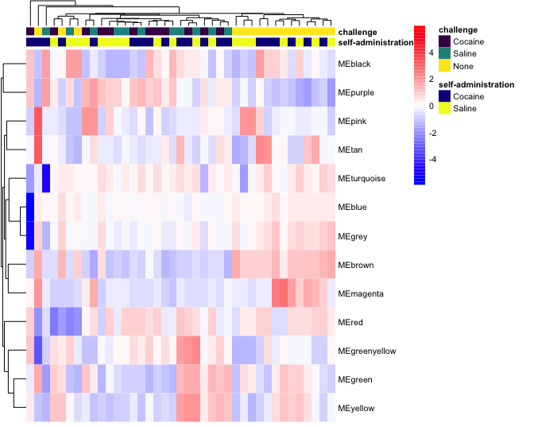

# Weighted Gene Correlation Network Analysis (WGCNA)

WGCNA analysis is an unsupervised machine learning technique. It is a powerful approach that captures the co-expression patterns from the correlation matrix. Rather than focusing on individual genes, such as in differential expression analysis we covered earlier in this workshop, it looks for clusters (modules) of genes that are connected based on the similarities in their expression patterns. These modules often correspond to biological pathways, disease states, cell types, tissue types,...


<table class="table table-striped table-hover table-condensed" style="width: auto !important; margin-left: auto; margin-right: auto;">
 <thead>
  <tr>
   <th style="text-align:left;"> Technique </th>
   <th style="text-align:left;"> Differential Expression </th>
   <th style="text-align:left;"> WGCNA </th>
  </tr>
 </thead>
<tbody>
  <tr>
   <td style="text-align:left;font-weight: bold;"> Approach </td>
   <td style="text-align:left;"> Compares gene expression between conditions </td>
   <td style="text-align:left;"> Identifies co-expressed gene modules </td>
  </tr>
  <tr>
   <td style="text-align:left;font-weight: bold;"> Base of analysis </td>
   <td style="text-align:left;"> Individual gene expression </td>
   <td style="text-align:left;"> Correlation of gene expressions </td>
  </tr>
  <tr>
   <td style="text-align:left;font-weight: bold;vertical-align: top !important;" rowspan="4"> Strengths </td>
   <td style="text-align:left;"> Straightforward interpretation with clear gene lists (ideally) </td>
   <td style="text-align:left;"> Systems-level view of gene relationships </td>
  </tr>
  <tr>
   
   <td style="text-align:left;"> Good for identifying specific biomarkers or drug targets </td>
   <td style="text-align:left;"> Dimensionality reduction which reduces multiple testing burden </td>
  </tr>
  <tr>
   
   <td style="text-align:left;"> Can work with smaller sample sizes </td>
   <td style="text-align:left;"> Module eigengenes are robust and less noisy </td>
  </tr>
  <tr>
   
   <td style="text-align:left;"> Easy to validate individual genes experimentally </td>
   <td style="text-align:left;"> Useful for discovering novel pathways </td>
  </tr>
  <tr>
   <td style="text-align:left;font-weight: bold;vertical-align: top !important;" rowspan="5"> Weaknesses </td>
   <td style="text-align:left;"> Treats genes independently, ignoring networks </td>
   <td style="text-align:left;"> Requires larger sample sizes (&gt;15-20) </td>
  </tr>
  <tr>
   
   <td style="text-align:left;"> Arbitrary cutoffs may miss subtle but meaningful changes </td>
   <td style="text-align:left;"> Sensitive to parameter choices </td>
  </tr>
  <tr>
   
   <td style="text-align:left;"> Doesn't reveal functional gene relationships </td>
   <td style="text-align:left;"> Correlation doesn't imply causation </td>
  </tr>
  <tr>
   
   <td style="text-align:left;"> Can produce overwhelming gene lists, or empty lists </td>
   <td style="text-align:left;"> Modules may be hard to interpret biologically </td>
  </tr>
  <tr>
   
   <td style="text-align:left;"> Sensitive to noise at individual gene level </td>
   <td style="text-align:left;"> Important non-co-expressing genes end up in 'grey' module </td>
  </tr>
  <tr>
   <td style="text-align:left;font-weight: bold;vertical-align: top !important;" rowspan="3"> Best for </td>
   <td style="text-align:left;"> Identifying specific genes that change between groups </td>
   <td style="text-align:left;"> Discovering gene network structure </td>
  </tr>
  <tr>
   
   <td style="text-align:left;"> Finding biomarkers </td>
   <td style="text-align:left;"> Understanding coordinated biological processes </td>
  </tr>
  <tr>
   
   <td style="text-align:left;"> Small sample sizes </td>
   <td style="text-align:left;"> Reduce data dimension </td>
  </tr>
</tbody>
</table>

## Basic Steps of WGCNA

   1. Normalization, variance stabilization and filtering
   2. Determine soft-thresholding power for network construction
   3. Build gene co-expression network
   4. Explore gene modules

Install necessary R packages.


``` r
if (!any(rownames(installed.packages()) == "WGCNA")){
  BiocManager::install("WGNCA")
}
library(WGCNA)

if (!any(rownames(installed.packages()) == "pheatmap")){
  BiocManager::install("pheatmap")
}
library(pheatmap)

if (!any(rownames(installed.packages()) == "viridisLite")){
  install.packages("viridisLite")
}
library(viridisLite)

if (!any(rownames(installed.packages()) == "matrixStats")){
  install.packages("matrixStats")
}
library(matrixStats)

if (!any(rownames(installed.packages()) == "gplots")){
  install.packages("gplots")
}
library(gplots)

library(edgeR)
library(ggplot2)
```

### 1. Read in expression table, normalization, variance stablization and filtering

We are going to use a different dataset for this exercise. The dataset has been used in 2 publications on study of cocaine's effect on gene expression: [1](https://www.sciencedirect.com/science/article/pii/S0006322318314471?via%3Dihub) and [2](https://www.science.org/doi/10.1126/sciadv.add8946?url_ver=Z39.88-2003&rfr_id=ori:rid:crossref.org&rfr_dat=cr_pub%20%200pubmed). The experiment assigned male mice to one of six groups: saline or cocaine SA + 24 hr WD; or saline/cocaine SA + 30 d WD + an acute saline/cocaine challenge within the previous drug-paired context. RNASeq was conducted on six interconnected brain reward regions. We are going to use the data from 1 brain region, nucleus accumbens.

First, we are going to download the counts table and the metadata table for this dataset.


``` r
download.file("https://raw.githubusercontent.com/ucdavis-bioinformatics-training/2026-March-RNA-Seq-Analysis/master/datasets/NAc_counts.txt.gz", "NAc_counts.txt.gz")
download.file("https://raw.githubusercontent.com/ucdavis-bioinformatics-training/2026-March-RNA-Seq-Analysis/master/datasets/NAc_metadata.txt.gz", "NAc_metadata.txt.gz")
counts <- read.table("NAc_counts.txt.gz", header = T, check.names = F)
metadata <- read.table("NAc_metadata.txt.gz", header = T, sep = "\t", check.names = F)
rownames(metadata) <- metadata$sample_names
identical(colnames(counts), metadata$sample_names)
```

```
## [1] TRUE
```

Then we are going to use the same approach that we have learned earlier to normalize the data and perform variance stablization.


``` r
d0 <- DGEList(counts)
d0 <- calcNormFactors(d0)
expr <- t(cpm(d0, log = T))
```

Next we will filter out low variance genes to remove potential noise.


``` r
vars <- colVars(expr)
expr <- expr[, vars > quantile(vars, 0.75)]
```

### 2. Select soft-thresholding power

The soft-thresholding power parameter is crucial for network construction. The goal of a good soft-thresholding power is to achive scale-free topology while maintaining reasonable connectivity within the network. Higher powers lead to higher suppression of weak correlations and create sparser networks with fewer but stronger connections. The optimal soft-thresholding power is dataset dependent because it reflects the underlying correlation structure of the data.

The recommended selection criteria is to achieve $R^2$ $g \ge f$ 0.8-0.9, as well as a reasonable mean connectivity (< 200-300). The function __pickSoftThreshold__ scans through a series of soft-thresholding powers and produces the corresponding network characteristics that can be used for the selection.


``` r
sft <- pickSoftThreshold(expr, dataIsExpr = T, corFnc = WGCNA::cor, networkType = "signed")
```

```
## Warning: executing %dopar% sequentially: no parallel backend registered
```

```
##    Power SFT.R.sq slope truncated.R.sq mean.k. median.k. max.k.
## 1      1   0.1300  7.27          0.966 5550.00   5560.00 6160.0
## 2      2   0.0147 -1.16          0.984 2950.00   2940.00 3690.0
## 3      3   0.1640 -2.77          0.963 1620.00   1600.00 2310.0
## 4      4   0.4290 -3.61          0.961  916.00    891.00 1500.0
## 5      5   0.5440 -3.45          0.948  534.00    509.00 1010.0
## 6      6   0.6510 -3.27          0.949  320.00    298.00  696.0
## 7      7   0.7480 -3.17          0.962  197.00    178.00  497.0
## 8      8   0.8200 -3.07          0.971  124.00    109.00  365.0
## 9      9   0.8620 -2.92          0.974   80.60     67.50  274.0
## 10    10   0.8950 -2.71          0.978   53.60     42.50  211.0
## 11    12   0.9310 -2.44          0.987   25.40     17.70  139.0
## 12    14   0.9250 -2.33          0.988   13.20      7.78  105.0
## 13    16   0.9130 -2.22          0.985    7.50      3.57   85.9
## 14    18   0.9130 -2.09          0.990    4.59      1.70   72.3
## 15    20   0.9050 -2.01          0.987    3.00      0.84   62.3
```

Let's plot $R^2$.


``` r
metrics <- data.frame(sft$fitIndices) %>% dplyr::mutate(model_fit = -sign(slope) * SFT.R.sq)
metrics
```

```
##    Power   SFT.R.sq     slope truncated.R.sq     mean.k.    median.k.
## 1      1 0.13049424  7.269767      0.9664377 5547.471243 5558.6095127
## 2      2 0.01471577 -1.164056      0.9842249 2946.010687 2939.0555861
## 3      3 0.16425435 -2.772620      0.9628614 1617.473701 1598.3702501
## 4      4 0.42857020 -3.613784      0.9609714  915.901929  891.0096967
## 5      5 0.54383087 -3.451015      0.9476328  533.930254  508.5984482
## 6      6 0.65110045 -3.272514      0.9493412  320.005050  297.5790963
## 7      7 0.74803818 -3.167442      0.9621424  196.982329  178.1180893
## 8      8 0.81989059 -3.067381      0.9711320  124.441662  108.8194333
## 9      9 0.86240655 -2.918048      0.9736141   80.633432   67.5196818
## 10    10 0.89535696 -2.710314      0.9776441   53.562006   42.5088228
## 11    12 0.93066393 -2.439179      0.9868113   25.412556   17.7432470
## 12    14 0.92499799 -2.327143      0.9878761   13.226605    7.7814835
## 13    16 0.91257213 -2.219168      0.9845067    7.499796    3.5666004
## 14    18 0.91269069 -2.094147      0.9900627    4.590270    1.7013379
## 15    20 0.90452884 -2.006706      0.9865086    3.000310    0.8401066
##        max.k.   model_fit
## 1  6158.10318 -0.13049424
## 2  3693.59913  0.01471577
## 3  2313.43458  0.16425435
## 4  1503.00028  0.42857020
## 5  1008.20435  0.54383087
## 6   695.91080  0.65110045
## 7   497.33979  0.74803818
## 8   365.11597  0.81989059
## 9   274.35562  0.86240655
## 10  210.51167  0.89535696
## 11  139.20651  0.93066393
## 12  105.35976  0.92499799
## 13   85.87197  0.91257213
## 14   72.31698  0.91269069
## 15   62.28456  0.90452884
```

``` r
ggplot(metrics, aes(x = Power, y = model_fit, label = Power)) +
	geom_point() + geom_text(nudge_y = 0.1) +
	geom_hline(yintercept = 0.8, col = "red") +
	geom_hline(yintercept = 0.9, col = "blue") +
	ylim(c(min(metrics$model_fit), 1.05)) + xlab("Soft Threshold (power)") +
	ylab("Scale free topology model fit, signed R^2") +
	ggtitle("Scale independence") + theme_classic()
```

<!-- -->

``` r
ggplot(metrics, aes(x = Power, y = mean.k., label = Power)) +
	geom_point() + geom_text(nudge_y = 0.1) +
	geom_hline(yintercept = 200, col = "red") +
	xlab("Soft Threshold (power)") +
	ylab("Mean connectivity") +
	ggtitle("Mean connectivity") + theme_classic()
```

<!-- -->

__Based on the above plot, we are going to pick the soft-thresholding power to be 12.__

### 3. Build gene co-expression network


``` r
nwk <- blockwiseModules(expr, power = 12, TOMType = "signed",
	minModuleSize = 30, 
	mergeCutHeight = 0.25, saveTOMs = T)
```

### 4. Explore the modules detected

First, let's visualize the gene network using a dendrogram


``` r
plotDendroAndColors(nwk$dendrograms[[1]], nwk$colors[nwk$blockGenes[[1]]], "Module Colors",
	dendroLabels = F, addGuide = T, main =  "Gene dendrogram and module colors")
```

<!-- -->

Let's take a look at the relationship among the modules by using the module eigengenes.


``` r
MEs <- orderMEs(nwk$MEs)
cor_MEs <- cor(MEs)
heatmap.2(cor_MEs, col = colorRampPalette(c("blue", "white", "red"))(50),
	key = T, key.title = "Correlation", key.xlab = "Value",
	trace = "none", main  = "Module Eigengene Correlation")
```



Let's take a look at samples at this reduced dimension using the module eigengenes.


``` r
admins <- unique(metadata$`self-administration`)
admin_colors <- setNames(plasma(length(admins)), admins)
challenges <- unique(metadata$challenge)
challenge_colors <- setNames(viridis(length(challenges)), challenges)
ann_colors <- list(`self-administration` = admin_colors,
	challenge = challenge_colors)
pheatmap::pheatmap(t(MEs), scale = "row", clustering_distance_cols = "euclidean",
	clustering_method = "average", annotation_col = metadata %>%
	dplyr::select(`self-administration`, challenge), 
	border_color = NA, treeheight_row = 20, treeheight_col = 20,
	annotation_colors = ann_colors, show_colnames = F,
		color = colorRampPalette(c("blue", "white", "red"))(50), fontsize = 8)
```




