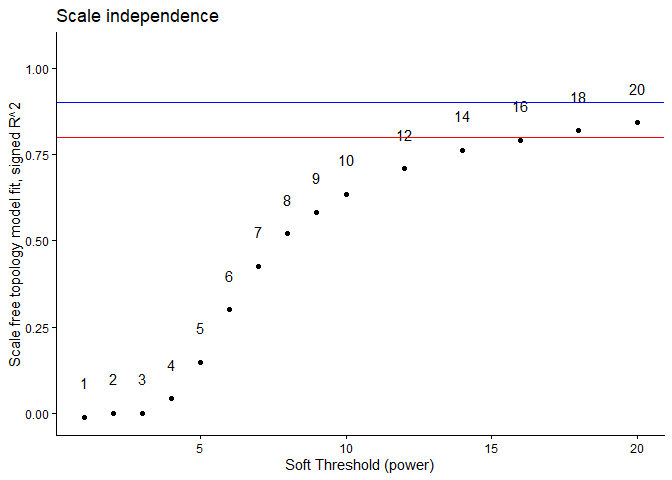
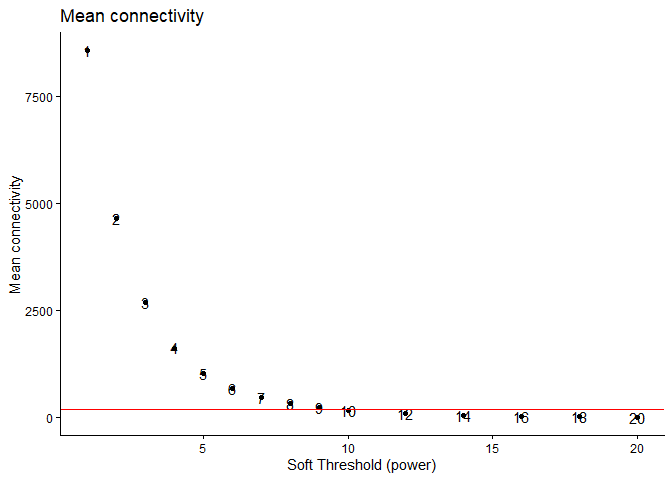
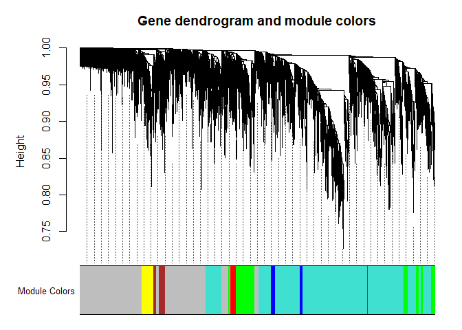
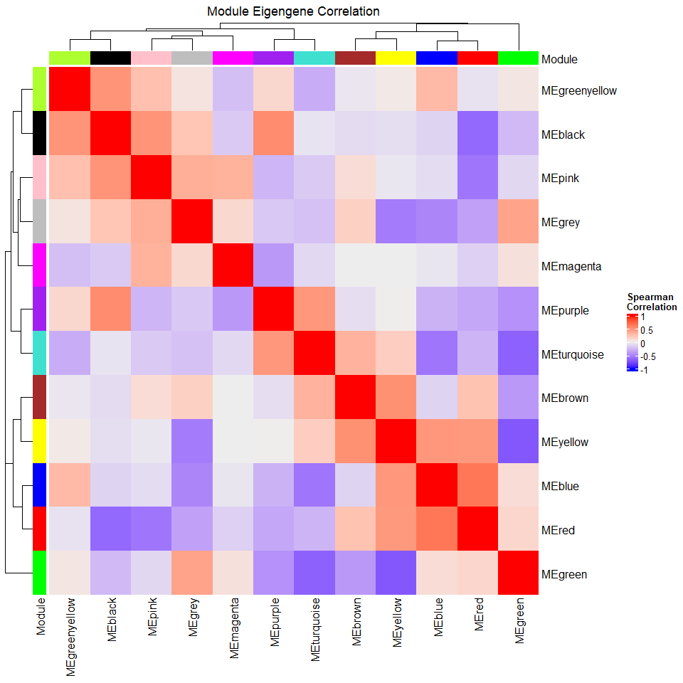
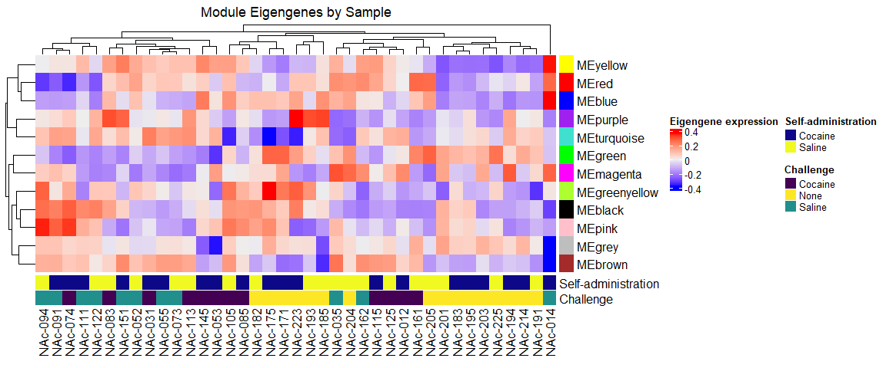
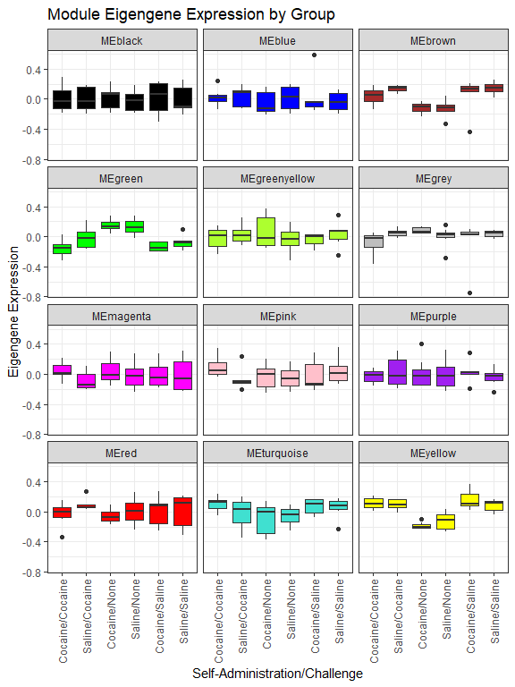

# Weighted Gene Correlation Network Analysis (WGCNA)

WGCNA analysis is an unsupervised machine learning technique. It is a powerful approach that captures the co-expression patterns from the correlation matrix. Rather than focusing on individual genes, such as in differential expression analysis we covered earlier in this workshop, it looks for clusters (modules) of genes that are connected based on the similarities in their expression patterns. These modules often correspond to biological pathways, disease states, cell types, tissue types,...

When applied to multiomics data, WGCNA can reduce each dataset down to a manageable number of features for a more interpretable analysis.


<table class="table table-striped table-hover table-condensed" style="width: auto !important; margin-left: auto; margin-right: auto;">
 <thead>
  <tr>
   <th style="text-align:left;"> Technique </th>
   <th style="text-align:left;"> Differential Expression </th>
   <th style="text-align:left;"> WGCNA </th>
  </tr>
 </thead>
<tbody>
  <tr>
   <td style="text-align:left;font-weight: bold;"> Approach </td>
   <td style="text-align:left;"> Compares gene expression between conditions </td>
   <td style="text-align:left;"> Identifies co-expressed gene modules </td>
  </tr>
  <tr>
   <td style="text-align:left;font-weight: bold;"> Base of analysis </td>
   <td style="text-align:left;"> Individual gene expression </td>
   <td style="text-align:left;"> Correlation of gene expression </td>
  </tr>
  <tr>
   <td style="text-align:left;font-weight: bold;vertical-align: top !important;" rowspan="4"> Strengths </td>
   <td style="text-align:left;"> Straightforward interpretation with clear gene lists (ideally) </td>
   <td style="text-align:left;"> Systems-level view of gene relationships </td>
  </tr>
  <tr>
   
   <td style="text-align:left;"> Good for identifying candidate biomarkers </td>
   <td style="text-align:left;"> Dimensionality reduction which reduces multiple testing burden </td>
  </tr>
  <tr>
   
   <td style="text-align:left;"> Can work with smaller sample sizes </td>
   <td style="text-align:left;"> Module eigengenes are robust and less noisy </td>
  </tr>
  <tr>
   
   <td style="text-align:left;"> Easy to validate individual genes experimentally </td>
   <td style="text-align:left;"> Useful for discovering novel pathways </td>
  </tr>
  <tr>
   <td style="text-align:left;font-weight: bold;vertical-align: top !important;" rowspan="5"> Weaknesses </td>
   <td style="text-align:left;"> Treats genes independently, ignoring networks </td>
   <td style="text-align:left;"> Requires larger sample sizes (&gt;15-20) </td>
  </tr>
  <tr>
   
   <td style="text-align:left;"> Arbitrary cutoffs may miss subtle but meaningful changes </td>
   <td style="text-align:left;"> Sensitive to parameter choices </td>
  </tr>
  <tr>
   
   <td style="text-align:left;"> Doesn't reveal functional gene relationships </td>
   <td style="text-align:left;"> Correlation doesn't imply causation </td>
  </tr>
  <tr>
   
   <td style="text-align:left;"> Can produce overwhelming gene lists, or empty lists </td>
   <td style="text-align:left;"> Modules may be hard to interpret biologically </td>
  </tr>
  <tr>
   
   <td style="text-align:left;"> Sensitive to noise at individual gene level </td>
   <td style="text-align:left;"> Important non-co-expressing genes end up in 'grey' module </td>
  </tr>
  <tr>
   <td style="text-align:left;font-weight: bold;vertical-align: top !important;" rowspan="3"> Best for </td>
   <td style="text-align:left;"> Identifying specific genes that change between groups </td>
   <td style="text-align:left;"> Discovering gene network structure </td>
  </tr>
  <tr>
   
   <td style="text-align:left;"> Finding candidate biomarkers </td>
   <td style="text-align:left;"> Understanding coordinated biological processes </td>
  </tr>
  <tr>
   
   <td style="text-align:left;"> Small sample sizes </td>
   <td style="text-align:left;"> Reduce data dimension </td>
  </tr>
</tbody>
</table>

## Basic Steps of WGCNA

   1. Normalization, variance stabilization and filtering
   2. Determine soft-thresholding power for network construction
   3. Build gene co-expression network
   4. Explore gene modules

Install necessary R packages.


``` r
library(WGCNA)
library(ComplexHeatmap)
library(viridisLite)
library(matrixStats)
library(edgeR)
library(ggplot2)
library(dplyr)
library(tidyr)
library(clusterProfiler)
```

### 1. Read in expression table, normalization, variance stablization and filtering

We are going to use a different dataset for this exercise. The dataset has been used in 2 publications on study of cocaine's effect on gene expression: [1](https://www.sciencedirect.com/science/article/pii/S0006322318314471?via%3Dihub) and [2](https://www.science.org/doi/10.1126/sciadv.add8946?url_ver=Z39.88-2003&rfr_id=ori:rid:crossref.org&rfr_dat=cr_pub%20%200pubmed). The experiment assigned male mice to one of six groups: saline or cocaine SA + 24 hr WD; or saline/cocaine SA + 30 d WD + an acute saline/cocaine challenge within the previous drug-paired context. RNASeq was conducted on six interconnected brain reward regions. We are going to use the data from 1 brain region, nucleus accumbens.

First, we are going to download the counts table and the metadata table for this dataset.


``` r
download.file("https://raw.githubusercontent.com/ucdavis-bioinformatics-training/2026-March-RNA-Seq-Analysis/master/datasets/NAc_counts.txt.gz", "NAc_counts.txt.gz")
download.file("https://raw.githubusercontent.com/ucdavis-bioinformatics-training/2026-March-RNA-Seq-Analysis/master/datasets/NAc_metadata.txt.gz", "NAc_metadata.txt.gz")
counts <- read.table("NAc_counts.txt.gz", header = T, check.names = F)
metadata <- read.table("NAc_metadata.txt.gz", header = T, sep = "\t", check.names = F)
rownames(metadata) <- metadata$sample_names
identical(colnames(counts), metadata$sample_names)
```

```
## [1] TRUE
```

Then we are going to use the same approach that we have learned earlier to normalize the data and perform variance stablization.


``` r
d0 <- DGEList(counts)
d0 <- calcNormFactors(d0)
expr0 <- cpm(d0, log = T)
```

Next we will filter out low expressed genes, using the filterByExpr function in edgeR.


``` r
keep <- filterByExpr(d0, model.matrix(~group, data = metadata))
expr0 <- expr0[keep,]
```

Unlike many other programs, WGCNA works on a matrix where the rows are samples and the columns are genes.

``` r
expr <- t(expr0)
```

### 2. Select soft-thresholding power

The soft-thresholding power parameter is crucial for network construction. The goal of a good soft-thresholding power is to achive scale-free topology while maintaining reasonable connectivity within the network. Higher powers lead to higher suppression of weak correlations and create sparser networks with fewer but stronger connections. The optimal soft-thresholding power is dataset dependent because it reflects the underlying correlation structure of the data.

In a scale-free network, most nodes (genes) have few connections and a few nodes have lots of connections.

The recommended selection criteria is to achieve $R^2$ $g \ge f$ 0.8-0.9, as well as a reasonable mean connectivity (< 200-300). The function __pickSoftThreshold__ scans through a series of soft-thresholding powers and produces the corresponding network characteristics that can be used for the selection.

We will use Tukey's robust biweight correlation to estimate correlations.


``` r
sft <- pickSoftThreshold(expr, dataIsExpr = T, networkType = "signed", corFnc = "bicor", RsquaredCut = 0.8)
```

```
## Warning: executing %dopar% sequentially: no parallel backend registered
```

```
##    Power SFT.R.sq    slope truncated.R.sq mean.k. median.k. max.k.
## 1      1 1.06e-02  3.56000          0.942  8560.0    8560.0   9130
## 2      2 3.52e-07 -0.00785          0.910  4650.0    4640.0   5340
## 3      3 4.40e-04 -0.15600          0.868  2680.0    2660.0   3410
## 4      4 4.31e-02 -0.99300          0.862  1630.0    1610.0   2360
## 5      5 1.49e-01 -1.27000          0.894  1040.0    1010.0   1710
## 6      6 3.00e-01 -1.55000          0.914   685.0     661.0   1310
## 7      7 4.27e-01 -1.75000          0.924   468.0     443.0   1040
## 8      8 5.20e-01 -1.85000          0.934   329.0     304.0    850
## 9      9 5.83e-01 -1.92000          0.938   237.0     213.0    706
## 10    10 6.35e-01 -1.97000          0.948   175.0     152.0    596
## 11    12 7.09e-01 -2.01000          0.965   101.0      81.9    441
## 12    14 7.63e-01 -2.04000          0.976    62.4      46.0    337
## 13    16 7.92e-01 -2.05000          0.981    40.4      27.1    265
## 14    18 8.19e-01 -2.05000          0.987    27.3      16.4    212
## 15    20 8.43e-01 -2.03000          0.990    19.0      10.3    172
```

Let's plot $R^2$.


``` r
metrics <- data.frame(sft$fitIndices) %>% dplyr::mutate(model_fit = -sign(slope) * SFT.R.sq)
metrics
```

```
##    Power     SFT.R.sq        slope truncated.R.sq    mean.k.  median.k.
## 1      1 1.062245e-02  3.564097269      0.9423160 8560.41223 8559.67003
## 2      2 3.521658e-07 -0.007847019      0.9098681 4650.34812 4638.36624
## 3      3 4.395832e-04 -0.155568601      0.8684206 2684.76028 2663.77189
## 4      4 4.310165e-02 -0.993358290      0.8617788 1631.87839 1608.28226
## 5      5 1.491049e-01 -1.274202968      0.8941794 1036.83887 1012.93505
## 6      6 3.000956e-01 -1.554853819      0.9135453  684.62787  660.57937
## 7      7 4.267064e-01 -1.748495279      0.9243824  467.53029  443.35711
## 8      8 5.201339e-01 -1.852753924      0.9337967  328.83526  304.46330
## 9      9 5.829592e-01 -1.920326235      0.9383803  237.36129  213.35742
## 10    10 6.348166e-01 -1.969297733      0.9480853  175.29177  152.40036
## 11    12 7.092466e-01 -2.006449010      0.9652948  101.32673   81.93968
## 12    14 7.625351e-01 -2.035140119      0.9762534   62.41645   46.02759
## 13    16 7.918794e-01 -2.054283628      0.9806997   40.44048   27.05765
## 14    18 8.192845e-01 -2.046627547      0.9868942   27.29113   16.42197
## 15    20 8.425328e-01 -2.032690202      0.9903099   19.04160   10.27170
##       max.k.     model_fit
## 1  9126.9845 -1.062245e-02
## 2  5337.4796  3.521658e-07
## 3  3413.1037  4.395832e-04
## 4  2356.7899  4.310165e-02
## 5  1710.1271  1.491049e-01
## 6  1308.6426  3.000956e-01
## 7  1041.6463  4.267064e-01
## 8   849.5948  5.201339e-01
## 9   706.4062  5.829592e-01
## 10  596.4715  6.348166e-01
## 11  440.6175  7.092466e-01
## 12  337.1290  7.625351e-01
## 13  264.6360  7.918794e-01
## 14  211.8230  8.192845e-01
## 15  172.1854  8.425328e-01
```

``` r
ggplot(metrics, aes(x = Power, y = model_fit, label = Power)) +
	geom_point() + geom_text(nudge_y = 0.1) +
	geom_hline(yintercept = 0.8, col = "red") +
	geom_hline(yintercept = 0.9, col = "blue") +
	ylim(c(min(metrics$model_fit), 1.05)) + xlab("Soft Threshold (power)") +
	ylab("Scale free topology model fit, signed R^2") +
	ggtitle("Scale independence") + theme_classic()
```

<!-- -->

``` r
ggplot(metrics, aes(x = Power, y = mean.k., label = Power)) +
	geom_point() + geom_text(nudge_y = 0.1) +
	geom_hline(yintercept = 200, col = "red") +
	xlab("Soft Threshold (power)") +
	ylab("Mean connectivity") +
	ggtitle("Mean connectivity") + theme_classic()
```

<!-- -->

__Based on the above plot, we are going to pick the soft-thresholding power to be 12.__ With a power of 12, the R^2 value is close to 0.8 while still maintaining a reasonable amount of connectivity.

### 3. Build gene co-expression network


``` r
nwk <- blockwiseModules(expr, power = 12, minModuleSize = 30, TOMType = "signed", corType = "bicor", mergeCutHeight = 0.4)
```

### 4. Explore the modules detected

First, let's visualize the gene network using a dendrogram


``` r
plotDendroAndColors(nwk$dendrograms[[1]], nwk$colors[nwk$blockGenes[[1]]], "Module Colors",
	dendroLabels = F, addGuide = T, main =  "Gene dendrogram and module colors")
```

<!-- -->


Let's look at what genes are in each module and merge in annotation information

``` r
module.members <- data.frame(Gene.stable.ID = names(nwk$colors), Module = nwk$colors)
anno <- read.delim("ensembl_mm_115.txt")
module.members <- left_join(module.members, anno, by = "Gene.stable.ID")
module.members <- arrange(module.members, Module)
head(module.members)
```

```
##       Gene.stable.ID Module Gene.stable.ID.version
## 1 ENSMUSG00000000296  black   ENSMUSG00000000296.9
## 2 ENSMUSG00000000552  black  ENSMUSG00000000552.11
## 3 ENSMUSG00000000753  black  ENSMUSG00000000753.16
## 4 ENSMUSG00000000792  black   ENSMUSG00000000792.3
## 5 ENSMUSG00000001507  black  ENSMUSG00000001507.17
## 6 ENSMUSG00000001870  black  ENSMUSG00000001870.17
##                                                                                  Gene.description
## 1                                    tumor protein D52-like 1 [Source:MGI Symbol;Acc:MGI:1298386]
## 2                                    zinc finger protein 385A [Source:MGI Symbol;Acc:MGI:1352495]
## 3  serine (or cysteine) peptidase inhibitor, clade F, member 1 [Source:MGI Symbol;Acc:MGI:108080]
## 4 solute carrier family 5 (sodium iodide symporter), member 5 [Source:MGI Symbol;Acc:MGI:2149330]
## 5                                              integrin alpha 3 [Source:MGI Symbol;Acc:MGI:96602]
## 6     latent transforming growth factor beta binding protein 1 [Source:MGI Symbol;Acc:MGI:109151]
##   Chromosome.scaffold.name Gene.start..bp. Gene.end..bp. Gene.name
## 1                       10        31208372      31321954   Tpd52l1
## 2                       15       103222322     103248520   Zfp385a
## 3                       11        75300595      75313527  Serpinf1
## 4                        8        71335533      71345401    Slc5a5
## 5                       11        94935300      94967627     Itga3
## 6                       17        75312563      75699507     Ltbp1
##   Gene...GC.content      Gene.type
## 1             40.19 protein_coding
## 2             50.68 protein_coding
## 3             49.44 protein_coding
## 4             54.85 protein_coding
## 5             50.82 protein_coding
## 6             42.66 protein_coding
```

``` r
write.table(module.members, file = "module_memberships.txt", sep = "\t", quote = FALSE, row.names = FALSE)
```

The function chooseTopHubInEachModule can be used to identify highly connected "hub" genes:

``` r
hubs <- chooseTopHubInEachModule(expr, colorh = nwk$colors)

# Make into a data frame and merge in annotation
hub.data <- data.frame(Module = names(hubs), TopHubGene = hubs) %>%
  left_join(anno, by = c("TopHubGene" = "Gene.stable.ID")) %>%
  select(Module, TopHubGene, Gene.name, Gene.description)
hub.data
```

```
##         Module         TopHubGene Gene.name
## 1        black ENSMUSG00000030268     Bcat1
## 2         blue ENSMUSG00000022452     Smdt1
## 3        brown ENSMUSG00000038170   Pde4dip
## 4        green ENSMUSG00000034156   Tspoap1
## 5  greenyellow ENSMUSG00000036634       Mag
## 6      magenta ENSMUSG00000043164   Tmem212
## 7         pink ENSMUSG00000062393      Dgkk
## 8       purple ENSMUSG00000026824     Kcnj3
## 9          red ENSMUSG00000029054     Gabrd
## 10   turquoise ENSMUSG00000027104      Atf2
## 11      yellow ENSMUSG00000030062      Rpn1
##                                                                                   Gene.description
## 1                  branched chain aminotransferase 1, cytosolic [Source:MGI Symbol;Acc:MGI:104861]
## 2      single-pass membrane protein with aspartate rich tail 1 [Source:MGI Symbol;Acc:MGI:1916279]
## 3        phosphodiesterase 4D interacting protein (myomegalin) [Source:MGI Symbol;Acc:MGI:1891434]
## 4                                    TSPO associated protein 1 [Source:MGI Symbol;Acc:MGI:2450877]
## 5                                 myelin-associated glycoprotein [Source:MGI Symbol;Acc:MGI:96912]
## 6                                    transmembrane protein 212 [Source:MGI Symbol;Acc:MGI:2685410]
## 7                                  diacylglycerol kinase kappa [Source:MGI Symbol;Acc:MGI:3580254]
## 8  potassium inwardly-rectifying channel, subfamily J, member 3 [Source:MGI Symbol;Acc:MGI:104742]
## 9       gamma-aminobutyric acid (GABA) A receptor, subunit delta [Source:MGI Symbol;Acc:MGI:95622]
## 10                            activating transcription factor 2 [Source:MGI Symbol;Acc:MGI:109349]
## 11                                                  ribophorin I [Source:MGI Symbol;Acc:MGI:98084]
```

Gene ontology enrichment can be used to characterize genes in a module. We use clusterProfiler here but topGO can also be used.


``` r
module.use <- "purple" 
module.genes <- names(nwk$colors)[nwk$colors == module.use]
module.genes.entrez <- bitr(module.genes, fromType = "ENSEMBL", toType = "ENTREZID", OrgDb = "org.Mm.eg.db")
```

```
## 
```

```
## 'select()' returned 1:many mapping between keys and columns
```

``` r
go <- enrichGO(module.genes.entrez$ENTREZID, OrgDb = "org.Mm.eg.db")
go <- setReadable(go, OrgDb = "org.Mm.eg.db")
as.data.frame(go)
```

```
##                    ID                      Description GeneRatio   BgRatio
## GO:0005179 GO:0005179                 hormone activity     6/137 146/23909
## GO:0051428 GO:0051428 peptide hormone receptor binding     3/137  21/23909
## GO:0000149 GO:0000149                    SNARE binding     5/137 118/23909
## GO:0005184 GO:0005184    neuropeptide hormone activity     3/137  29/23909
## GO:0045499 GO:0045499          chemorepellent activity     3/137  29/23909
## GO:0051427 GO:0051427         hormone receptor binding     3/137  30/23909
## GO:0160041 GO:0160041            neuropeptide activity     3/137  30/23909
## GO:0019905 GO:0019905                 syntaxin binding     4/137  71/23909
##            RichFactor FoldEnrichment   zScore       pvalue   p.adjust
## GO:0005179 0.04109589       7.171983 5.678708 0.0001993704 0.03397314
## GO:0051428 0.14285714      24.931178 8.328809 0.0002269615 0.03397314
## GO:0000149 0.04237288       7.394841 5.286442 0.0005981516 0.03397314
## GO:0005184 0.10344828      18.053612 6.975852 0.0006029920 0.03397314
## GO:0045499 0.10344828      18.053612 6.975852 0.0006029920 0.03397314
## GO:0051427 0.10000000      17.451825 6.844878 0.0006671929 0.03397314
## GO:0160041 0.10000000      17.451825 6.844878 0.0006671929 0.03397314
## GO:0019905 0.05633803       9.832014 5.657871 0.0007446167 0.03397314
##                qvalue                          geneID Count
## GO:0005179 0.02978467 Fndc5/Vip/Igf1/Adcyap1/Cck/Ccn3     6
## GO:0051428 0.02978467                 Vip/Adcyap1/Cck     3
## GO:0000149 0.02978467    Napb/Snap91/Cplx1/Syt1/Cplx3     5
## GO:0005184 0.02978467                 Vip/Adcyap1/Cck     3
## GO:0045499 0.02978467              Sema3a/Sema7a/Nrg3     3
## GO:0051427 0.02978467                 Vip/Adcyap1/Cck     3
## GO:0160041 0.02978467                 Vip/Adcyap1/Cck     3
## GO:0019905 0.02978467           Napb/Cplx1/Syt1/Cplx3     4
```

Let's take a look at the correlations among the modules by using the module eigengenes.  We use a Spearman (nonparametric) correlation.

All WGCNA module names are valid R color names that can be used in plotting. 


``` r
MEs <- orderMEs(nwk$MEs)
cor_MEs <- cor(MEs, method = "spearman")
colors <- gsub("ME", "", rownames(cor_MEs))
names(colors) <- rownames(cor_MEs)
ra <- rowAnnotation(Module = rownames(cor_MEs), col = list(Module = colors), show_legend = FALSE)
ca <- columnAnnotation(Module = rownames(cor_MEs), col = list(Module = colors), show_legend = FALSE)
ht <- Heatmap(cor_MEs, name = "Spearman\nCorrelation", column_title = "Module Eigengene Correlation", left_annotation = ra, top_annotation = ca)
draw(ht)
```

<!-- -->

*For the above plot, bear in mind that a simple correlation coefficient may not be appropriate if your data have repeated measures or other complications.  Any analysis on the eigengenes requires the same thoughtfulness as an analysis on your original data.*

Let's take a look at samples at this reduced dimension using the module eigengenes. We can plot a heatmap of the eigengenes by samples exactly as we would plot genes by samples for the original data.


``` r
admins <- unique(metadata$`self-administration`)
admin_colors <- setNames(plasma(length(admins)), admins)
challenges <- unique(metadata$challenge)
challenge_colors <- setNames(viridis(length(challenges)), challenges)
ann_colors <- list(`Self-administration` = admin_colors,
	Challenge = challenge_colors)

row_colors <- gsub("ME", "", colnames(MEs))
names(row_colors) <- colnames(MEs)

ca <- columnAnnotation(`Self-administration` = metadata$`self-administration`, Challenge = metadata$challenge, col = list(`Self-administration` = admin_colors,
	Challenge = challenge_colors))
ra <- rowAnnotation(Module = colnames(MEs), col = list(Module = row_colors), show_legend = FALSE, show_annotation_name = FALSE)
ht <- Heatmap(t(MEs), bottom_annotation = ca, right_annotation = ra, name = "Eigengene expression", column_title = "Module Eigengenes by Sample")
draw(ht)
```

<!-- -->

We can make boxplots of module eigengenes by experimental group:


``` r
# Turn MEs into long dataset for plotting
tmp <- MEs
tmp$sample_names <- rownames(tmp)
longMEs <- pivot_longer(tmp, cols = -sample_names, names_to = "Module", values_to = "Expression") %>%
# Merge in metadata
    left_join(metadata, by = "sample_names")
longMEs$group2 <- interaction(longMEs$`self-administration`, longMEs$challenge, sep = "/")
ggplot(longMEs, aes(x = group2, y = Expression, fill = Module)) + 
  geom_boxplot() + 
  facet_wrap(~Module, nrow = 4) + 
  scale_fill_manual(breaks = colnames(MEs), values = gsub("ME", "", colnames(MEs))) + labs(x = "Self-Administration/Challenge", y = "Eigengene Expression", title = "Module Eigengene Expression by Group") + 
  theme_bw() + 
  theme(legend.position = "none", axis.text.x = element_text(angle = 90, vjust = 0.5, hjust = 1)) 
```

<!-- -->

Multiomics analysis

For multiomics analyses, WGCNA can be useful for reducing each dataset to a few features before combining them.  If, for example, you had transcriptomics and metabolomics data, you might do the following:

1. Perform WGCNA on your transcriptomics data as shown in this document

2. Separately, perform WGCNA on your metabolomics data as shown in this document EXCEPT doing normalization and filtering appropriate for metabolomics data.

3. Use the module eigengenes (eigenmetabolites?) from the transcriptomics data and metabolomics data in an integrated analysis.  For example, you could look at the correlation between the eigengenes from each dataset.
