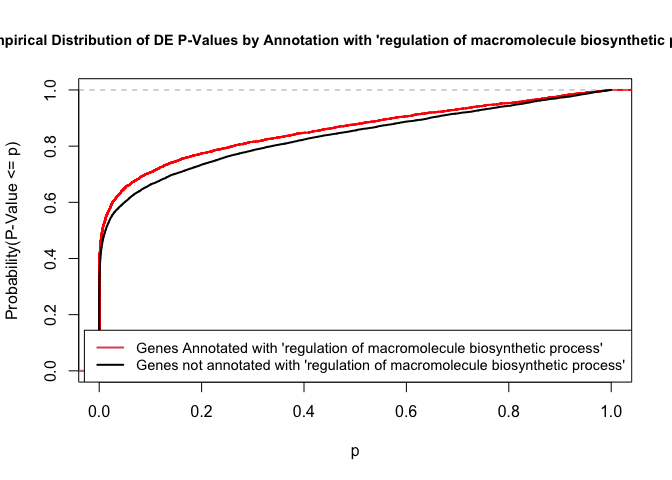
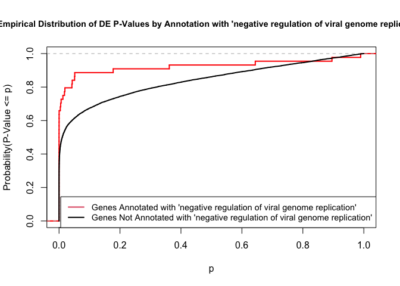
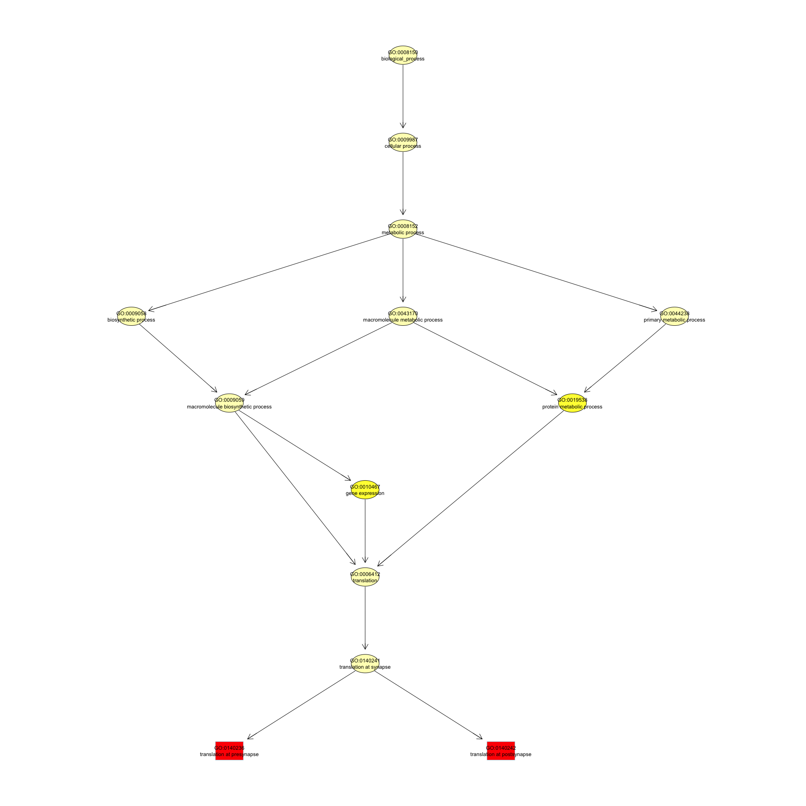
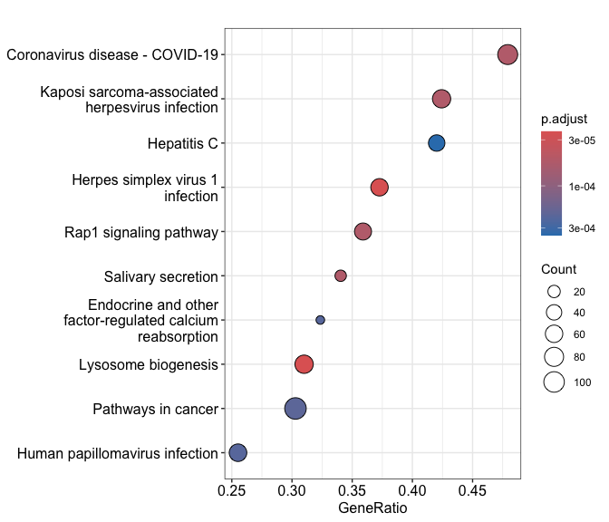
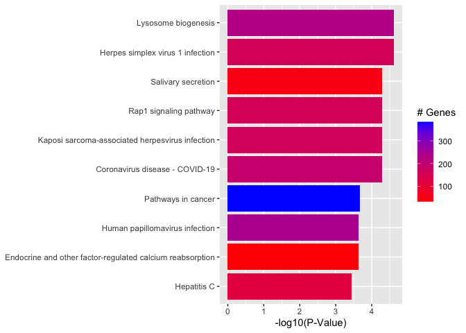

<script>
function buildQuiz(myq, qc){
  // variable to store the HTML output
  const output = [];

  // for each question...
  myq.forEach(
    (currentQuestion, questionNumber) => {

      // variable to store the list of possible answers
      const answers = [];

      // and for each available answer...
      for(letter in currentQuestion.answers){

        // ...add an HTML radio button
        answers.push(
          `<label>
            <input type="radio" name="question${questionNumber}" value="${letter}">
            ${letter} :
            ${currentQuestion.answers[letter]}
          </label><br/>`
        );
      }

      // add this question and its answers to the output
      output.push(
        `<div class="question"> ${currentQuestion.question} </div>
        <div class="answers"> ${answers.join('')} </div><br/>`
      );
    }
  );

  // finally combine our output list into one string of HTML and put it on the page
  qc.innerHTML = output.join('');
}

function showResults(myq, qc, rc){

  // gather answer containers from our quiz
  const answerContainers = qc.querySelectorAll('.answers');

  // keep track of user's answers
  let numCorrect = 0;

  // for each question...
  myq.forEach( (currentQuestion, questionNumber) => {

    // find selected answer
    const answerContainer = answerContainers[questionNumber];
    const selector = `input[name=question${questionNumber}]:checked`;
    const userAnswer = (answerContainer.querySelector(selector) || {}).value;

    // if answer is correct
    if(userAnswer === currentQuestion.correctAnswer){
      // add to the number of correct answers
      numCorrect++;

      // color the answers green
      answerContainers[questionNumber].style.color = 'lightgreen';
    }
    // if answer is wrong or blank
    else{
      // color the answers red
      answerContainers[questionNumber].style.color = 'red';
    }
  });

  // show number of correct answers out of total
  rc.innerHTML = `${numCorrect} out of ${myq.length}`;
}
</script>


# GO AND KEGG Enrichment Analysis

Load libraries

``` r
library(topGO)
library(org.Mm.eg.db)
library(clusterProfiler)
library(pathview)
library(enrichplot)
library(ggplot2)
library(dplyr)
```

Files for examples were created in the DE analysis.

## Gene Ontology (GO) Enrichment

[Gene ontology](http://www.geneontology.org/) provides a controlled vocabulary for describing biological processes (BP ontology), molecular functions (MF ontology) and cellular components (CC ontology)

The GO ontologies themselves are organism-independent; terms are associated with genes for a specific organism through direct experimentation or through sequence homology with another organism and its GO annotation.

Terms are related to other terms through parent-child relationships in a directed acylic graph.

Enrichment analysis provides one way of drawing conclusions about a set of differential expression results.

**1\.** topGO Example Using Kolmogorov-Smirnov Testing
Our first example uses Kolmogorov-Smirnov Testing for enrichment testing of our mouse DE results, with GO annotation obtained from the Bioconductor database org.Mm.eg.db.

The first step in each topGO analysis is to create a topGOdata object.  This contains the genes, the score for each gene (here we use the p-value from the DE test), the GO terms associated with each gene, and the ontology to be used (here we use the biological process ontology)

``` r
infile <- "WT.C_v_WT.NC.txt"
DE <- read.delim(infile)

## Add entrezgene IDs to top table
tmp <- bitr(DE$Gene.stable.ID, fromType = "ENSEMBL", toType = "ENTREZID", OrgDb = org.Mm.eg.db)
```

```
## 'select()' returned 1:many mapping between keys and columns
```

```
## Warning in bitr(DE$Gene.stable.ID, fromType = "ENSEMBL", toType = "ENTREZID", :
## 20.42% of input gene IDs are fail to map...
```

``` r
id.conv <- subset(tmp, !duplicated(tmp$ENSEMBL))
DE <- left_join(DE, id.conv, by = c("Gene.stable.ID" = "ENSEMBL"))

# Make gene list
DE.nodupENTREZ <- subset(DE, !is.na(ENTREZID) & !duplicated(ENTREZID))
geneList <- DE.nodupENTREZ$P.Value
names(geneList) <- DE.nodupENTREZ$ENTREZID
head(geneList)
```

```
##        67241        18795       104718        12521        94212        12772 
## 4.109222e-16 7.877908e-16 1.094372e-15 2.224431e-15 2.256262e-15 2.467758e-15
```

``` r
# Create topGOData object
GOdata <- new("topGOdata",
	ontology = "BP",
	allGenes = geneList,
	geneSelectionFun = function(x)x,
	annot = annFUN.org , mapping = "org.Mm.eg.db")
```

```
## 
## Building most specific GOs .....
```

```
## 	( 11080 GO terms found. )
```

```
## 
## Build GO DAG topology ..........
```

```
## 	( 14033 GO terms and 30925 relations. )
```

```
## 
## Annotating nodes ...............
```

```
## 	( 12273 genes annotated to the GO terms. )
```

**2\.** The topGOdata object is then used as input for enrichment testing:

``` r
# Kolmogorov-Smirnov testing
resultKS <- runTest(GOdata, algorithm = "weight01", statistic = "ks")
```

```
## 
## 			 -- Weight01 Algorithm -- 
## 
## 		 the algorithm is scoring 14033 nontrivial nodes
## 		 parameters: 
## 			 test statistic: ks
## 			 score order: increasing
```

```
## 
## 	 Level 19:	2 nodes to be scored	(0 eliminated genes)
```

```
## 
## 	 Level 18:	27 nodes to be scored	(0 eliminated genes)
```

```
## 
## 	 Level 17:	57 nodes to be scored	(46 eliminated genes)
```

```
## 
## 	 Level 16:	100 nodes to be scored	(115 eliminated genes)
```

```
## 
## 	 Level 15:	141 nodes to be scored	(239 eliminated genes)
```

```
## 
## 	 Level 14:	255 nodes to be scored	(587 eliminated genes)
```

```
## 
## 	 Level 13:	580 nodes to be scored	(1036 eliminated genes)
```

```
## 
## 	 Level 12:	1028 nodes to be scored	(1681 eliminated genes)
```

```
## 
## 	 Level 11:	1568 nodes to be scored	(2913 eliminated genes)
```

```
## 
## 	 Level 10:	1841 nodes to be scored	(5037 eliminated genes)
```

```
## 
## 	 Level 9:	2063 nodes to be scored	(6865 eliminated genes)
```

```
## 
## 	 Level 8:	1936 nodes to be scored	(8367 eliminated genes)
```

```
## 
## 	 Level 7:	1713 nodes to be scored	(9542 eliminated genes)
```

```
## 
## 	 Level 6:	1367 nodes to be scored	(10370 eliminated genes)
```

```
## 
## 	 Level 5:	853 nodes to be scored	(10841 eliminated genes)
```

```
## 
## 	 Level 4:	383 nodes to be scored	(11167 eliminated genes)
```

```
## 
## 	 Level 3:	101 nodes to be scored	(11323 eliminated genes)
```

```
## 
## 	 Level 2:	17 nodes to be scored	(11415 eliminated genes)
```

```
## 
## 	 Level 1:	1 nodes to be scored	(11449 eliminated genes)
```

``` r
tab <- GenTable(GOdata, raw.p.value = resultKS, topNodes = length(resultKS@score), numChar = 120)
```

topGO by default preferentially tests more specific terms, utilizing the topology of the GO graph. The algorithms used are described in detail [here](https://academic.oup.com/bioinformatics/article/22/13/1600/193669).


``` r
head(tab, 15)
```

```
##         GO.ID
## 1  GO:0140242
## 2  GO:0140236
## 3  GO:0002181
## 4  GO:0006002
## 5  GO:0002218
## 6  GO:0045071
## 7  GO:0032760
## 8  GO:0035458
## 9  GO:0050680
## 10 GO:0036151
## 11 GO:0072672
## 12 GO:1901224
## 13 GO:0001525
## 14 GO:0045944
## 15 GO:0042776
##                                                                  Term Annotated
## 1                                          translation at postsynapse        48
## 2                                           translation at presynapse        47
## 3                                             cytoplasmic translation       193
## 4                              fructose 6-phosphate metabolic process        12
## 5                                activation of innate immune response       336
## 6                     negative regulation of viral genome replication        44
## 7             positive regulation of tumor necrosis factor production       102
## 8                                cellular response to interferon-beta        59
## 9                negative regulation of epithelial cell proliferation       110
## 10                          phosphatidylcholine acyl-chain remodeling         9
## 11                                           neutrophil extravasation        15
## 12 positive regulation of non-canonical NF-kappaB signal transduction        52
## 13                                                       angiogenesis       401
## 14          positive regulation of transcription by RNA polymerase II       928
## 15             proton motive force-driven mitochondrial ATP synthesis        64
##    Significant Expected raw.p.value
## 1           48       48     1.3e-08
## 2           47       47     2.5e-08
## 3          193      193     3.3e-07
## 4           12       12     1.8e-06
## 5          336      336     1.9e-06
## 6           44       44     2.5e-06
## 7          102      102     4.3e-06
## 8           59       59     1.1e-05
## 9          110      110     2.2e-05
## 10           9        9     3.0e-05
## 11          15       15     4.3e-05
## 12          52       52     5.2e-05
## 13         401      401     5.5e-05
## 14         928      928     7.5e-05
## 15          64       64     8.5e-05
```

* Annotated: number of genes (in our gene list) that are annotated with the term
* Significant: n/a for this example, same as Annotated here
* Expected: n/a for this example, same as Annotated here
* raw.p.value: P-value from Kolomogorov-Smirnov test that DE p-values annotated with the term are smaller (i.e. more significant) than those not annotated with the term.

The Kolmogorov-Smirnov test directly compares two probability distributions based on their maximum distance.  

To illustrate the KS test, we plot probability distributions of p-values that are and that are not annotated with the term GO:0010556 "regulation of macromolecule biosynthetic process" (2344 genes) p-value 1.00.  (This won't exactly match what topGO does due to their elimination algorithm):


``` r
rna.pp.terms <- genesInTerm(GOdata)[["GO:0010556"]] # get genes associated with term
p.values.in <- geneList[names(geneList) %in% rna.pp.terms]
p.values.out <- geneList[!(names(geneList) %in% rna.pp.terms)]
plot.ecdf(p.values.in, verticals = T, do.points = F, col = "red", lwd = 2, xlim = c(0,1),
          main = "Empirical Distribution of DE P-Values by Annotation with 'regulation of macromolecule biosynthetic process'",
          cex.main = 0.9, xlab = "p", ylab = "Probability(P-Value <= p)")
ecdf.out <- ecdf(p.values.out)
xx <- unique(sort(c(seq(0, 1, length = 201), knots(ecdf.out))))
lines(xx, ecdf.out(xx), col = "black", lwd = 2)
legend("bottomright", legend = c("Genes Annotated with 'regulation of macromolecule biosynthetic process'", "Genes not annotated with 'regulation of macromolecule biosynthetic process'"), lwd = 2, col = 2:1, cex = 0.9)
```

<!-- -->

versus the probability distributions of p-values that are and that are not annotated with the term GO:0045071 "negative regulation of viral genome replication" (54 genes) p-value 3.3x10-9.


``` r
rna.pp.terms <- genesInTerm(GOdata)[["GO:0045071"]] # get genes associated with term
p.values.in <- geneList[names(geneList) %in% rna.pp.terms]
p.values.out <- geneList[!(names(geneList) %in% rna.pp.terms)]
plot.ecdf(p.values.in, verticals = T, do.points = F, col = "red", lwd = 2, xlim = c(0,1),
          main = "Empirical Distribution of DE P-Values by Annotation with 'negative regulation of viral genome replication'",
          cex.main = 0.9, xlab = "p", ylab = "Probability(P-Value <= p)")
ecdf.out <- ecdf(p.values.out)
xx <- unique(sort(c(seq(0, 1, length = 201), knots(ecdf.out))))
lines(xx, ecdf.out(xx), col = "black", lwd = 2)
legend("bottomright", legend = c("Genes Annotated with 'negative regulation of viral genome replication'", "Genes Not Annotated with 'negative regulation of viral genome replication'"), lwd = 2, col = 2:1, cex = 0.9)
```

<!-- -->


We can use the function showSigOfNodes to plot the GO graph for the 2 most significant terms and their parents, color coded by enrichment p-value (red is most significant):

``` r
par(cex = 0.3)
showSigOfNodes(GOdata, score(resultKS), firstSigNodes = 2, useInfo = "def", .NO.CHAR = 40)
```

```
## Loading required package: Rgraphviz
```

```
## Loading required package: grid
```

```
## 
## Attaching package: 'grid'
```

```
## The following object is masked from 'package:topGO':
## 
##     depth
```

```
## 
## Attaching package: 'Rgraphviz'
```

```
## The following objects are masked from 'package:IRanges':
## 
##     from, to
```

```
## The following objects are masked from 'package:S4Vectors':
## 
##     from, to
```

<!-- -->

```
## $dag
## A graphNEL graph with directed edges
## Number of Nodes = 13 
## Number of Edges = 16 
## 
## $complete.dag
## [1] "A graph with 13 nodes."
```

``` r
par(cex = 1)
```

**3\.** topGO Example Using Fisher's Exact Test

Next, we use Fisher's exact test to test for GO enrichment among significantly DE genes.

Create topGOdata object:

``` r
geneList <- DE.nodupENTREZ$adj.P.Val
names(geneList) <- DE.nodupENTREZ$ENTREZID

# Create topGOData object
GOdata <- new("topGOdata",
	ontology = "BP",
	allGenes = geneList,
	geneSelectionFun = function(x) (x < 0.05),
	annot = annFUN.org , mapping = "org.Mm.eg.db")
```

```
## 
## Building most specific GOs .....
```

```
## 	( 11080 GO terms found. )
```

```
## 
## Build GO DAG topology ..........
```

```
## 	( 14033 GO terms and 30925 relations. )
```

```
## 
## Annotating nodes ...............
```

```
## 	( 12273 genes annotated to the GO terms. )
```

Run Fisher's Exact Test:

``` r
resultFisher <- runTest(GOdata, algorithm = "elim", statistic = "fisher")
```

```
## 
## 			 -- Elim Algorithm -- 
## 
## 		 the algorithm is scoring 12785 nontrivial nodes
## 		 parameters: 
## 			 test statistic: fisher
## 			 cutOff: 0.01
```

```
## 
## 	 Level 19:	2 nodes to be scored	(0 eliminated genes)
```

```
## 
## 	 Level 18:	22 nodes to be scored	(0 eliminated genes)
```

```
## 
## 	 Level 17:	50 nodes to be scored	(0 eliminated genes)
```

```
## 
## 	 Level 16:	90 nodes to be scored	(0 eliminated genes)
```

```
## 
## 	 Level 15:	121 nodes to be scored	(65 eliminated genes)
```

```
## 
## 	 Level 14:	213 nodes to be scored	(105 eliminated genes)
```

```
## 
## 	 Level 13:	492 nodes to be scored	(190 eliminated genes)
```

```
## 
## 	 Level 12:	913 nodes to be scored	(200 eliminated genes)
```

```
## 
## 	 Level 11:	1391 nodes to be scored	(1319 eliminated genes)
```

```
## 
## 	 Level 10:	1670 nodes to be scored	(1602 eliminated genes)
```

```
## 
## 	 Level 9:	1881 nodes to be scored	(2085 eliminated genes)
```

```
## 
## 	 Level 8:	1802 nodes to be scored	(2886 eliminated genes)
```

```
## 
## 	 Level 7:	1578 nodes to be scored	(3988 eliminated genes)
```

```
## 
## 	 Level 6:	1281 nodes to be scored	(4825 eliminated genes)
```

```
## 
## 	 Level 5:	794 nodes to be scored	(6015 eliminated genes)
```

```
## 
## 	 Level 4:	369 nodes to be scored	(6418 eliminated genes)
```

```
## 
## 	 Level 3:	98 nodes to be scored	(7074 eliminated genes)
```

```
## 
## 	 Level 2:	17 nodes to be scored	(7158 eliminated genes)
```

```
## 
## 	 Level 1:	1 nodes to be scored	(7166 eliminated genes)
```

``` r
tab <- GenTable(GOdata, raw.p.value = resultFisher, topNodes = length(resultFisher@score),
				numChar = 120)
head(tab)
```

```
##        GO.ID                                 Term Annotated Significant
## 1 GO:0140242           translation at postsynapse        48          44
## 2 GO:0140236            translation at presynapse        47          43
## 3 GO:0002181              cytoplasmic translation       193         144
## 4 GO:0046718        symbiont entry into host cell        72          58
## 5 GO:0001525                         angiogenesis       401         278
## 6 GO:0035458 cellular response to interferon-beta        59          48
##   Expected raw.p.value
## 1    28.35     5.2e-07
## 2    27.76     8.1e-07
## 3   113.98     3.8e-06
## 4    42.52     8.6e-05
## 5   236.82     0.00016
## 6    34.84     0.00022
```
* Annotated: number of genes (in our gene list) that are annotated with the term
* Significant: Number of significantly DE genes annotated with that term (i.e. genes where geneList = 1)
* Expected: Under random chance, number of genes that would be expected to be significantly DE and annotated with that term
* raw.p.value: P-value from Fisher's Exact Test, testing for association between significance and pathway membership.

Fisher's Exact Test is applied to the table:

**Significance/Annotation**|**Annotated With GO Term**|**Not Annotated With GO Term**
:-----:|:-----:|:-----:
**Significantly DE**|n1|n3
**Not Significantly DE**|n2|n4

and compares the probability of the observed table, conditional on the row and column sums, to what would be expected under random chance.  

Advantages over KS (or Wilcoxon) Tests:

* Ease of interpretation

* Can be applied when you just have a gene list without associated p-values, etc.

Disadvantages:

* Relies on significant/non-significant dichotomy (an interesting gene could have an adjusted p-value of 0.051 and be counted as non-significant)
* Less powerful
* May be less useful if there are very few (or a large number of) significant genes

## Quiz 1

<div id="quiz1" class="quiz"></div>
<button id="submit1">Submit Quiz</button>
<div id="results1" class="output"></div>
<script>
quizContainer1 = document.getElementById('quiz1');
resultsContainer1 = document.getElementById('results1');
submitButton1 = document.getElementById('submit1');

myQuestions1 = [
  {
    question: "Rerun the KS test analysis using the molecular function (MF) ontology.  What is the top GO term listed?",
    answers: {
      a: "structural constituent of ribosome",
      b: "angiogenesis",
      c: "calcium ion binding"
    },
    correctAnswer: "a"
  },
  {
      question: "How many genes from the top table are annotated with the term 'actin filament binding'",
    answers: {
      a: "150",
      b: "5,846",
      c: "164"
    },
    correctAnswer: "c"
  },
  {
      question: "Based on the graph above generated by showSigOfNodes, what is one parent term of 'negative regulation of viral genome replication'?",
    answers: {
      a: "metabolic process",
      b: "regulation of viral genome replication",
      c: "angiogenesis"
    },
    correctAnswer: "b"
  }
];

buildQuiz(myQuestions1, quizContainer1);
submitButton1.addEventListener('click', function() {showResults(myQuestions1, quizContainer1, resultsContainer1);});
</script>

## KEGG Pathway Enrichment Testing With clusterProfiler

KEGG, the Kyoto Encyclopedia of Genes and Genomes (https://www.genome.jp/kegg/), provides assignment of genes for many organisms into pathways.

We will conduct KEGG enrichment testing using the Bioconductor package [clusterProfiler](https://doi.org/10.1016/j.xinn.2021.100141). clusterProfiler implements an algorithm very similar to that used by [GSEA](https://www.gsea-msigdb.org/gsea/index.jsp).

Cluster profiler can do much more than KEGG enrichment, check out the [clusterProfiler book](https://yulab-smu.top/biomedical-knowledge-mining-book/index.html).

We will base our KEGG enrichment analysis on the t statistics from differential expression, which allows for directional testing.


``` r
geneList.KEGG <- DE.nodupENTREZ$t                   
geneList.KEGG <- sort(geneList.KEGG, decreasing = TRUE)
names(geneList.KEGG) <- DE.nodupENTREZ$ENTREZID
head(geneList.KEGG)
```

```
##    67241    18795   104718    12521    94212    12772 
## 46.54613 42.60381 38.54763 37.46686 36.69806 36.23871
```


``` r
set.seed(99)
KEGG.results <- gseKEGG(gene = geneList.KEGG, organism = "mmu", pvalueCutoff = 1)
```

```
## Reading KEGG annotation online: "https://rest.kegg.jp/link/mmu/pathway"...
```

```
## Reading KEGG annotation online: "https://rest.kegg.jp/list/pathway/mmu"...
```

```
## using 'fgsea' for GSEA analysis, please cite Korotkevich et al (2019).
```

```
## preparing geneSet collections...
```

```
## GSEA analysis...
```

```
## leading edge analysis...
```

```
## done...
```

``` r
KEGG.results <- setReadable(KEGG.results, OrgDb = "org.Mm.eg.db", keyType = "ENTREZID")
outdat <- as.data.frame(KEGG.results)
head(outdat)
```

```
##                ID                                     Description setSize
## mmu05168 mmu05168                Herpes simplex virus 1 infection     161
## mmu04142 mmu04142                             Lysosome biogenesis     229
## mmu04970 mmu04970                              Salivary secretion      47
## mmu04015 mmu04015                          Rap1 signaling pathway     156
## mmu05167 mmu05167 Kaposi sarcoma-associated herpesvirus infection     165
## mmu05171 mmu05171                  Coronavirus disease - COVID-19     192
##          enrichmentScore      NES       pvalue     p.adjust       qvalue rank
## mmu05168       0.4932393 1.969290 7.746185e-08 2.413723e-05 1.409035e-05 2285
## mmu04142       0.4476375 1.871709 1.424025e-07 2.413723e-05 1.409035e-05 2313
## mmu04970       0.6675045 2.204193 7.118902e-07 5.229088e-05 3.052534e-05 1115
## mmu04015       0.4736077 1.890515 6.815805e-07 5.229088e-05 3.052534e-05 2568
## mmu05167       0.4665886 1.875059 8.946845e-07 5.229088e-05 3.052534e-05 3321
## mmu05171       0.4511957 1.844313 9.255023e-07 5.229088e-05 3.052534e-05 3262
##                            leading_edge
## mmu05168 tags=37%, list=17%, signal=31%
## mmu04142 tags=31%, list=17%, signal=26%
## mmu04970  tags=34%, list=8%, signal=31%
## mmu04015 tags=36%, list=19%, signal=30%
## mmu05167 tags=42%, list=24%, signal=33%
## mmu05171 tags=48%, list=24%, signal=37%
##                                                                                                                                                                                                                                                                                                                                                                                                                                                                                                                                            core_enrichment
## mmu05168                                                                                                                                                                                 Pou2f2/C3/H2-Q6/Pilrb2/Ptpn11/Bcl2/Ppp1cb/Daxx/Nxf1/Sp100/Apaf1/Pilra/Tyk2/Ifih1/Sting1/Rnasel/Pilrb1/H2-Q7/Ccl2/H2-K1/Stat2/Itga5/Bad/Bst2/Traf3/Casp8/Tnfsf14/H2-Q4/Hcfc2/H2-T10/Eif2ak2/Oas1a/Tnfrsf14/Fas/H2-Ob/Jak2/Rigi/Eif2b2/Pik3r2/Tlr9/Nfkb1/Socs3/B2m/Oas2/Pik3cd/H2-T24/Tap2/Ikbke/Mavs/H2-D1/Oas3/Nfkbia/Irf3/Akt3/Hcfc1/Irf7/Tapbpl/Tlr2/Chuk/Traf2
## mmu04142                                                                                              Dmxl2/Npc2/Slc29a1/Galns/Lamtor4/Igf2r/Ap2a2/Atp6v1b2/Atp6v1a/Gpr155/Acp2/Ctsc/Mitf/Ctsh/Slc36a1/Lamp2/Ctsb/Slc11a1/Acp5/Glb1/Tpcn2/Hexa/Psap/Clta/Slc29a3/Naga/Asah1/Manba/Ncoa7/Tti1/Atp6v0c/Slc36a4/Lamp1/Gnptab/Borcs6/Scarb2/Laptm4a/Slc15a4/Cltb/Cln3/Npc1/Hexb/Slc17a5/Galc/Gnptg/Arsg/Rraga/Ctsl/Ap5s1/Atp6v1g1/Tlr9/Borcs5/Gla/Vps13c/Slc2a6/Ap2s1/Aga/Vps26b/Tcirg1/Cln5/Clcn7/Hgsnat/Tfeb/Ap3m1/Ctns/Vps16/Wdr7/Kxd1/Lamtor2/Atp6v1d/Tlr7
## mmu04970                                                                                                                                                                                                                                                                                                                                                                                                                                                  Plcb1/Gnaq/Adrb1/Adcy7/Slc12a2/Atp2b1/Bst1/Atp1a1/Adrb2/Calm1/Lyz2/Itpr1/Prkacb/Cst3/Prkcb/Adcy9
## mmu04015                                                                                                                                                                                                         Plcb1/Sipa1l1/Gnaq/P2ry1/Tiam1/Met/Adcy7/Itgb1/Pdgfb/Rassf5/Afdn/Vegfc/Raf1/Itgal/Insr/Fpr1/Prkd2/Thbs1/Vasp/Rasgrp2/Evl/Rras/Cdh1/Calm1/Rap1b/Sipa1l3/Rapgef5/Pdgfrb/Prkcb/Itgb2/Adcy9/Rap1a/Ralb/Map2k1/Pik3r2/Prkci/Calml4/Crk/Pik3cd/Hgf/Rgs14/Kras/Rapgef1/Vav3/Arap3/Tln2/Akt3/Actg1/Fgfr1/Csf1r/Lpar4/Lcp2/Adcy4/Apbb1ip/Akt1/Rac1
## mmu05167                                                                                                                        C3/H2-Q6/Pik3r6/Ccr1/Nfatc3/Pdgfb/Rcan1/Gng2/Rb1/Raf1/Tcf7l2/Tyk2/E2f2/Calm1/H2-Q7/H2-K1/Itpr1/Stat2/Il6st/Traf3/Casp8/H2-Q4/H2-T10/Eif2ak2/Hck/Fas/Gngt2/Cdk6/Ppp3r1/Jak2/Map2k1/Pik3r2/Cd200r1/Calml4/Nfkb1/Pik3cd/H2-T24/Stat3/Kras/Ikbke/H2-D1/Ppp3ca/Nfkbia/Gng10/Irf3/Akt3/Irf7/Nfatc1/E2f3/Chuk/Traf2/Gng12/Ppp3cb/Akt1/Hif1a/Gnb1/Rac1/Fos/Map2k6/Rps27a/Itpr3/Mapk3/Hras/Mapk11/Ccr3/Angpt2/Cycs/Ifnar1/Ccnd1/Bid
## mmu05171 C3/F13a1/Rpl3l/Vwf/Tyk2/C1ra/Isg15/Ifih1/Sting1/Rps9/Nrp1/Ccl2/Rpl28/Rplp0/Stat2/Il6st/C4b/Rpl7a/Rpl41/Ace/Traf3/Mx1/Prkcb/Cxcl10/Eif2ak2/Oas1a/Rpl31/Rpl32/Rpl10a/Rigi/C5ar1/Rpl22/Pik3r2/Mx2/Rpl10/Nfkb1/Oas2/Pik3cd/Rps12/Stat3/Ikbke/Rps26/Mavs/Rpl29/Rps27l/Rpsa/Rps5/Rps18/Rpl13/Rpl14/Oas3/Nfkbia/Irf3/Rpl3/Rpl23a/Rpl15/Nlrp3/Rpl18/Tlr2/Chuk/Rps6/Rpl27a/Tlr7/Rpl11/Rps7/Rps17/Rps28/Rps3/Rps20/Rpl35/Tnf/Rpl37/Fos/Rps4x/Rpl19/Rpl17/Rpl4/Rpl34/Rpl39/Rps27a/Rps2/Rpl6/Rpl36a/Mapk3/Rps15a/Rpl9/Mapk11/Rsl24d1/Rpl13a/Rpl21/Rpl7/Ifnar1
```

Gene set enrichment analysis output includes the following columns:

* setSize: Number of genes in pathway

* enrichmentScore: [GSEA enrichment score](https://www.gsea-msigdb.org/gsea/doc/GSEAUserGuideTEXT.htm#_Enrichment_Score_(ES)), a statistic reflecting the degree to which a pathway is overrepresented at the top or bottom of the gene list (the gene list here consists of the t-statistics from the DE test).

* NES: [Normalized enrichment score](https://www.gsea-msigdb.org/gsea/doc/GSEAUserGuideTEXT.htm#_Normalized_Enrichment_Score)

* pvalue: Raw p-value from permutation test of enrichment score

* p.adjust: Benjamini-Hochberg false discovery rate adjusted p-value

* qvalue: Storey false discovery rate adjusted p-value 

* rank: Position in ranked list at which maximum enrichment score occurred

* leading_edge: [Statistics from leading edge analysis](https://www.gsea-msigdb.org/gsea/doc/GSEAUserGuideTEXT.htm#_Detailed_Enrichment_Results)

### Dotplot of enrichment results
Gene.ratio = (count of core enrichment genes)/(count of pathway genes)

Core enrichment genes = subset of genes that contribute most to the enrichment result ("leading edge subset")


``` r
dotplot(KEGG.results)
```

<!-- -->

### Pathview plot of log fold changes on KEGG diagram


``` r
foldChangeList <- DE$logFC
xx <- as.list(org.Mm.egENSEMBL2EG)
names(foldChangeList) <- xx[sapply(strsplit(DE$Gene,split="\\."),"[[", 1L)]
head(foldChangeList)
```

```
##     67241     18795    104718     12521     94212     12772 
## -2.258712  3.084665 -2.006122 -2.446067 -1.767470  2.024618
```

``` r
mmu04015 <- pathview(gene.data  = foldChangeList,
                     pathway.id = "mmu04015",
                     species    = "mmu",
                     limit      = list(gene=max(abs(foldChangeList)), cpd=1))
```

```
## Info: Downloading xml files for mmu04015, 1/1 pathways..
```

```
## Info: Downloading png files for mmu04015, 1/1 pathways..
```

```
## 'select()' returned 1:1 mapping between keys and columns
```

```
## Info: Working in directory /Users/jli/Jessie/Research/BioInfo/Courses/Mar-2026
```

```
## Info: Writing image file mmu04015.pathview.png
```


### Barplot of p-values for top pathways
A barplot of -log10(p-value) for the top pathways/terms can be used for any type of enrichment analysis.


``` r
plotdat <- outdat[1:10,]
plotdat$nice.name <- gsub(" - Mus musculus (house mouse)", "", plotdat$Description, fixed = TRUE)

ggplot(plotdat, aes(x = -log10(p.adjust), y = reorder(nice.name, -log10(p.adjust)), fill = setSize)) + geom_bar(stat = "identity") + labs(x = "-log10(P-Value)", y = NULL, fill = "# Genes") + scale_fill_gradient(low = "red", high = "blue")
```

<!-- -->
## Quiz 2

<div id="quiz2" class="quiz"></div>
<button id="submit2">Submit Quiz</button>
<div id="results2" class="output"></div>
<script>
quizContainer2 = document.getElementById('quiz2');
resultsContainer2 = document.getElementById('results2');
submitButton2 = document.getElementById('submit2');

myQuestions2 = [
  {
    question: "How many pathways have an adjusted p-value less than 0.05?",
    answers: {
      a: "112",
      b: "339",
      c: "146"
    },
    correctAnswer: "a"
  },
  {
      question: "Which pathway has the most genes annotated to it?'",
    answers: {
      a: "N-Glycan biosynthesis",
      b: "Virion - Herpesvirus",
      c: "Pathways in cancer"
    },
    correctAnswer: "c"
  },
  {
      question: "Make a pathview diagram for mmu05171, and locate the file mmu05171.pathview.png on your computer.  What sign does the log fold change for MAPK have?",
    answers: {
      a: "Positive",
      b: "Negative"
    },
    correctAnswer: "b"
  }
];

buildQuiz(myQuestions2, quizContainer2);
submitButton2.addEventListener('click', function() {showResults(myQuestions2, quizContainer2, resultsContainer2);});
</script>


``` r
sessionInfo()
```

```
## R version 4.5.2 (2025-10-31)
## Platform: aarch64-apple-darwin20
## Running under: macOS Tahoe 26.0.1
## 
## Matrix products: default
## BLAS:   /System/Library/Frameworks/Accelerate.framework/Versions/A/Frameworks/vecLib.framework/Versions/A/libBLAS.dylib 
## LAPACK: /Library/Frameworks/R.framework/Versions/4.5-arm64/Resources/lib/libRlapack.dylib;  LAPACK version 3.12.1
## 
## locale:
## [1] en_US.UTF-8/en_US.UTF-8/en_US.UTF-8/C/en_US.UTF-8/en_US.UTF-8
## 
## time zone: America/Los_Angeles
## tzcode source: internal
## 
## attached base packages:
## [1] grid      stats4    stats     graphics  grDevices utils     datasets 
## [8] methods   base     
## 
## other attached packages:
##  [1] Rgraphviz_2.54.0       dplyr_1.2.0            ggplot2_4.0.2         
##  [4] enrichplot_1.30.5      pathview_1.50.0        clusterProfiler_4.18.4
##  [7] org.Mm.eg.db_3.22.0    topGO_2.62.0           SparseM_1.84-2        
## [10] GO.db_3.22.0           AnnotationDbi_1.72.0   IRanges_2.44.0        
## [13] S4Vectors_0.48.0       Biobase_2.70.0         graph_1.88.1          
## [16] BiocGenerics_0.56.0    generics_0.1.4        
## 
## loaded via a namespace (and not attached):
##   [1] RColorBrewer_1.1-3      rstudioapi_0.18.0       jsonlite_2.0.0         
##   [4] tidydr_0.0.6            magrittr_2.0.4          ggtangle_0.1.1         
##   [7] farver_2.1.2            rmarkdown_2.30          fs_1.6.6               
##  [10] vctrs_0.7.1             memoise_2.0.1           RCurl_1.98-1.17        
##  [13] ggtree_4.0.4            htmltools_0.5.9         gridGraphics_0.5-1     
##  [16] sass_0.4.10             bslib_0.10.0            htmlwidgets_1.6.4      
##  [19] plyr_1.8.9              cachem_1.1.0            igraph_2.2.1           
##  [22] lifecycle_1.0.5         pkgconfig_2.0.3         Matrix_1.7-4           
##  [25] R6_2.6.1                fastmap_1.2.0           gson_0.1.0             
##  [28] digest_0.6.39           aplot_0.2.9             ggnewscale_0.5.2       
##  [31] patchwork_1.3.2         RSQLite_2.4.6           org.Hs.eg.db_3.22.0    
##  [34] labeling_0.4.3          httr_1.4.7              polyclip_1.10-7        
##  [37] compiler_4.5.2          bit64_4.6.0-1           fontquiver_0.2.1       
##  [40] withr_3.0.2             S7_0.2.1                BiocParallel_1.44.0    
##  [43] DBI_1.2.3               ggforce_0.5.0           R.utils_2.13.0         
##  [46] MASS_7.3-65             rappdirs_0.3.4          tools_4.5.2            
##  [49] otel_0.2.0              ape_5.8-1               scatterpie_0.2.6       
##  [52] R.oo_1.27.1             glue_1.8.0              nlme_3.1-168           
##  [55] GOSemSim_2.36.0         cluster_2.1.8.2         reshape2_1.4.5         
##  [58] fgsea_1.37.4            gtable_0.3.6            R.methodsS3_1.8.2      
##  [61] tidyr_1.3.2             data.table_1.18.2.1     XVector_0.50.0         
##  [64] ggrepel_0.9.6           pillar_1.11.1           stringr_1.6.0          
##  [67] yulab.utils_0.2.4       splines_4.5.2           tweenr_2.0.3           
##  [70] treeio_1.34.0           lattice_0.22-9          bit_4.6.0              
##  [73] tidyselect_1.2.1        fontLiberation_0.1.0    Biostrings_2.78.0      
##  [76] knitr_1.51              fontBitstreamVera_0.1.1 Seqinfo_1.0.0          
##  [79] xfun_0.56               matrixStats_1.5.0       KEGGgraph_1.70.0       
##  [82] stringi_1.8.7           lazyeval_0.2.2          ggfun_0.2.0            
##  [85] yaml_2.3.12             evaluate_1.0.5          codetools_0.2-20       
##  [88] gdtools_0.5.0           tibble_3.3.1            qvalue_2.42.0          
##  [91] ggplotify_0.1.3         cli_3.6.5               systemfonts_1.3.1      
##  [94] jquerylib_0.1.4         Rcpp_1.1.1              png_0.1-8              
##  [97] XML_3.99-0.22           parallel_4.5.2          blob_1.3.0             
## [100] DOSE_4.4.0              bitops_1.0-9            tidytree_0.4.7         
## [103] ggiraph_0.9.6           scales_1.4.0            purrr_1.2.1            
## [106] crayon_1.5.3            rlang_1.1.7             cowplot_1.2.0          
## [109] fastmatch_1.1-8         KEGGREST_1.50.0
```
